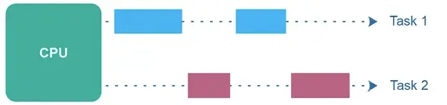
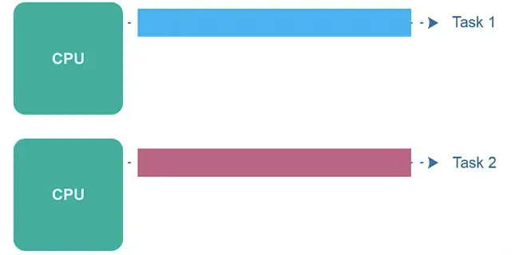
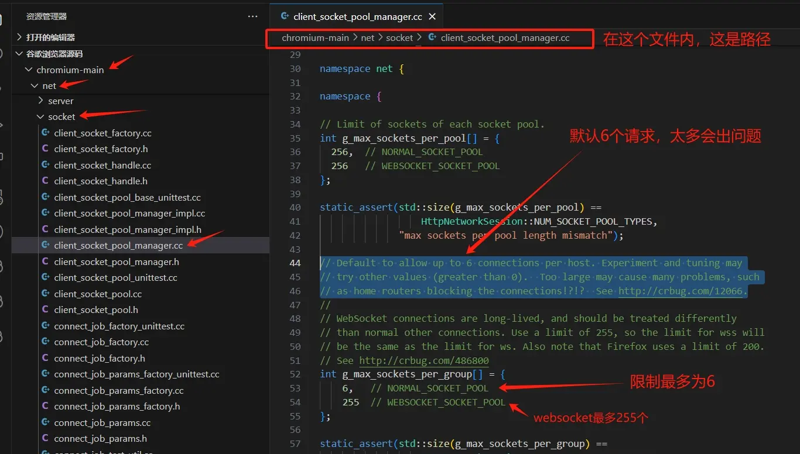
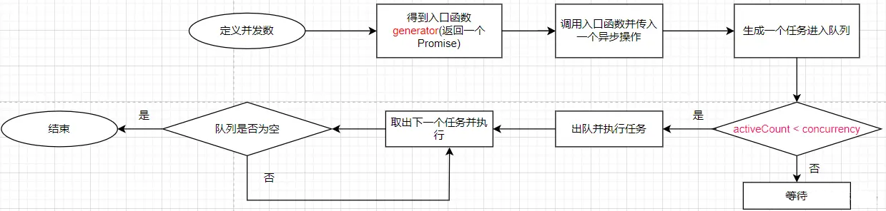

# 10、性能优化相关

## 10.1 控制高并发请求

参考：https://juejin.cn/post/7373715366766657587
https://juejin.cn/post/7363305974276522036
https://juejin.cn/post/7376575006534860837
https://juejin.cn/post/7257410574853603385
https://juejin.cn/post/7090072797397352462

**并发的概念**

并发是指一个时间段中有几个程序都处于已启动运行到运行完毕之间，且这几个程序都是在同一个处理机上运行，但任一个时刻点上只有一个程序在处理机上运行。

**并行的概念**

并行是指一个时间段中有几个程序都处于已启动运行到运行完毕之间，通过同时使用多个处理器或计算资源来执行多个任务或处理多个。

综上，并行是指两个或者多个事件在同一时刻发生；而并发是指两个或多个事件在同一时间间隔内发生。

**同步与异步**

* 同步就是顺序执行，执行完一个再执行下一个，后一个需要等待前一个。
* 异步就是彼此独立，在等待的时候可以做自己的事情。

`JavaScript `的语言执行环境是单线程，一次只能完成一件任务。如果有多个任务，当前没有执行的任务就需要排队。

为了解决这个问题，`JavaScript `将任务的执行模式分为了同步和异步。异步就是一个任务分成两段，先执行第一段，然后转而执行其他任务，等准备好了再执行第二段。
这样排在异步任务后面的代码就不用等待异步任务的结束而是可以提前执行。在`JavaScript `中像网络请求，读取文件之类的操作都是异步的。

**并发控制的必要**

浏览器对于同一域名下的并发请求数量有限制，比如谷歌浏览器中只允许`6`个并发请求，多出来的请求只能排队，等待发送。在`HTTP2`
协议中，浏览器不再限制并发请求数量。对于服务端，多个并发请求可能会对服务端产生压力。

此外，完整的网络请求过程需要经过`DNS`寻址、与服务器建立连接、发送数据、等待服务器响应、接收数据这样一个漫长而复杂的过程，
如果等待时间过长则可能造成不好的用户体验。综上，对并发异步请求进行限制是十分有必要的。

众所周知，浏览器发起的请求最大并发数量一般都是`6`~`8`个。因为浏览器会限制同一域名下的并发请求数量，以避免对服务器造成过大的压力。

谷歌浏览器控制并发数是`6`。谷歌浏览器源码：https://github.com/chromium/chromium

通过查看谷歌浏览器源码，我们可以了解并发数是通过如下参数进行设置的。

### 10.1.1 Promise模拟任务队列实现请求池

假如现在有几十、上百个请求，我们该如何去控制高并发请求呢？此场景有很多，比如 图片或文件批量下载、`RSSHub`高速抓取内容等。

我们可以利用`Promise`模拟任务队列，从而实现请求池效果。详见`requestLimit.vue`和`requestLimit.js`文件。

注意：`Promise.all`本身并不提供直接的并发控制功能，并不限制同时进行的操作数量，它会立即启动所有传入的`Promise`。

### 10.1.2 使用p-limit库

`p-limit`是一个用于限制并发操作的包，它可以控制同时执行的异步操作数量。它提供了一种简单的方式来管理并发操作，以避免系统资源过度占用和性能下降。

`p-limit`的工作原理是使用一个计数器来跟踪当前正在执行的操作数量。当有新的操作需要执行时，它会检查当前的计数器值，如果小于设定的并发限制数，
则立即执行操作并将计数器加一。如果计数器已达到并发限制数，则将操作加入等待队列，直到有空闲的位置。

`p-limit`的使用方法，详见`requestConcurrency.vue`文件。

对`p-limit`的`6.2.0`版本源码进行分析，详见`p-limit-v6.2.0.js`文件。其中使用到的`yocto-queue`
是模拟队列数据类型，详见`yocto-queue-v1.1.1.js`文件。
