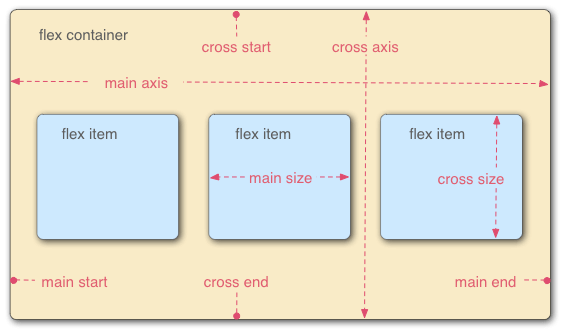
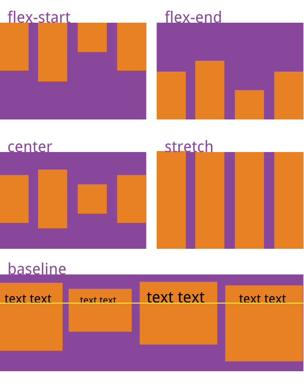
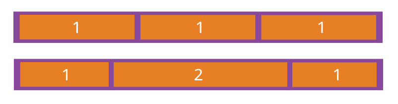

# 1、CSS相关

## 1.1 实现淡入淡出、透明度、过度

```vue

<template>
  <div class="transition-box">
    <div :class="{transition:true,isShow:isShow}" @click="isShow = !isShow">
      <span style="font-size: 28px;font-weight: 600">点击切换</span>
    </div>
  </div>
</template>

<script>
  export default {
    data() {
      return {
        isShow: false
      };
    },
  }
</script>

<style scoped lang="scss">
  .transition-box {
    width: 150px;
    display: flex;
    flex-direction: column;
    align-items: center;

    .transition {
      width: 150px;
      height: 80px;
      line-height: 80px;
      text-align: center;
      background-color: #E6A23C;
      border-radius: 30px;
      cursor: pointer;
      transition: all 1s;
      opacity: 0.3;
    }

    .isShow {
      height: 150px;
      line-height: 150px;
      border-radius: 0;
      opacity: 1;
    }
  }
</style>
```

## 1.2 svg中text标签基础使用

参考网址：https://blog.csdn.net/weixin_40779234/article/details/113701444

## 1.3 HTML跳转到页面指定位置的几种方法

### 1.3.1 利用 id 为标记的锚点，这里作为锚点的标签可以是任意元素。

```html
<a href="#aa">跳转到 id 为 aa 标记的锚点</a>
<div id="aa">id 为 aa 标记的锚点</div>
```

### 1.3.2 利用 a 标签的 name 属性作为锚点，这里作为锚点的标签只能是 a 标签。

```html
<a href="#bb">跳转到 name 为 bb 标记的锚点</a>
<a name="bb">name 为 bb 标记的锚点</a>
```

注意：当以`a`标签`name`属性作为锚点和利用`id`为标记的锚点同时出现（即以`name`为锚点和以`id`为锚点名字相同时），会将后者作为锚点。

### 1.3.3 利用 scrollTo()，window.scrollTo 滚动到文档中的某个坐标。

```html
<a id="linkDom">平滑移动到cc</a>
<div id="cc">cc</div>
```

```javascript
const linkDom = document.getElementById("linkDom")
const cc = document.getElementById("cc")

function toTargetDom(el) {
    const bridge = el
    const body = document.body
    const height = 0
    // 计算该 DOM 节点到 body 顶部距离
    do {
        height += bridge.offsetTop
        bridge = bridge.offsetParent
    } while (bridge != body)
    // 滚动到指定位置
    window.scrollTo({
        top: height,
        behavior: "smooth"
    })
}

linkDom.addEventListener("click", function () {
    toTargetDom(cc)
})
```

### 1.3.4 利用 scrollIntoView()，Element.scrollIntoView() 方法让当前的元素滚动到浏览器窗口的可视区域内。

```html
<a id="linkDom">移动到dd</a>
<div id="dd">dd</div>
```

```javascript
const linkDom = document.getElementById("linkDom")
const dd = document.getElementById("dd")

function toTargetDom(el) {
    el.scrollIntoView()
}

linkDom.addEventListener("click", function () {
    toTargetDom(dd)
})
```

### 1.3.5 利用 scrollIntoView()，跳转到指定页面的指定位置。

```javascript
const scrollTo = (behavior = "smooth", block = "start", inline = "nearest", item) => {
    // 跳转到指定页面
    // pageIns.value.scrollIntoView({ behavior, block, inline });
    if (item) {
        /* 数据示例
        {
            "key": 979,
            "label": "第五条 抵押财产的保险",
            "pageIndex": 7,
            "position": {
                "x": 0.1914,
                "y": 0.1983
            },
            "children": []
        }
        */
        const targetPos = document.createElement("div");
        targetPos.style.width = "100px";
        targetPos.style.height = "100px";
        targetPos.style.position = "absolute";
        targetPos.style.top = item.position.y * 100 + "%";
        // pageIns是指定页面的ref
        pageIns.value.appendChild(targetPos);
        console.log("targetPos", targetPos);
        // 跳转到指定页面的指定位置
        targetPos.scrollIntoView({behavior: "smooth"});
        pageIns.value.removeChild(targetPos)
    }
};
```

## 1.4 实现回到页面顶部功能

参考网址：https://segmentfault.com/a/1190000041750000
动态显示滚动按钮
“回到顶部”并不是一直显示的，而是滚动到一定值才出现的，因此应该在window.onscroll里定义一个判断事件。

```javascript
window.onscroll = function () {
  const currentHeight = document.documentElement.scrollTop || window.pageYOffset || document.body.scrollTop;
  // 页面滚动超过300px就显示
  if (currentHeight > 300) {
    document.getElementById('backtop').style.display = 'block'
  } else {
    document.getElementById('backtop').style.display = 'none'
  }
}
```

### 1.4.1 使用锚点实现

```html
<a href="#top">回到顶部</a>
<div id="top"></div>
```

### 1.4.2 scrollTo函数

控制滚动条回到指定位置，第一个参数是距离页面左端的距离，第二个参数是距离页面顶部的距离。

```html
<a href="javascript:scrollTo(0, 0)">回到顶部</a>
```

### 1.4.3 scrollTop函数

控制滚动条垂直偏移。

```javascript
<a onclick="byScrollTop()">回到顶部</a>

function byScrollTop() {
    document.documentElement.scrollTop = 0;
    window.pageYOffset = 0; // 兼容ios
    document.body.scrollTop = 0; // 兼容低版本ie
}
```

### 1.4.4 scrollBy函数

该方法可把内容滚动指定的像素数。第一个参数指向右滚动的像素，第二个参数指向下滚动的参数，负数可使方向相反。

```javascript
<a onclick="byScrollBy()">回到顶部</a>

function byScrollBy() {
  const topHeight = document.documentElement.scrollTop || window.pageYOffset || document.body.scrollTop;
  scrollBy(0, -topHeight);
}
```

### 1.4.4 间接回到顶部

定时器实现滚动动画。通过定时器实现固定速度的自动滚动动画效果。但是这样会有个问题，就是当页面内容十分多的时候，这个时候离顶部已经有很长一段距离了。如果还是一个固定速度的话，可能会长达10秒钟，这对用户体验来说是不友好的。

```javascript
<a onclick="scrollToTop()">回到顶部</a>

function scrollToTop() {
  const topHeight = document.documentElement.scrollTop || window.pageYOffset || document.body.scrollTop;
  scrollBy(0, -100);
  // 模拟鼠标向上滚动事件
  scrollDelay = setTimeout('scrollToTop()', 50);
  // 清除滚动事件，避免无法向下移动
  if (topHeight === 0) {
    clearTimeout(scrollDelay);
    scrollDelay = null;
  }
}
```

定时器实现滚动动画-改良版

```javascript
function scrollToTop() {
  const topHeight = document.documentElement.scrollTop || window.pageYOffset || document.body.scrollTop;
  const speed = topHeight / 10 > 100 ? topHeight / 10 : 100;
  scrollBy(0, -speed);
  // 模拟鼠标向上滚动事件
  scrollDelay = setTimeout('scrollToTop()', 50);
  // 清除滚动事件，避免无法向下移动
  if (topHeight === 0) {
    clearTimeout(scrollDelay);
    scrollDelay = null;
  }
}
```

## 1.5 鼠标悬停时显示元素

通过`hover`伪类给鼠标悬停后需要展示的元素添加display:block属性实现

```vue

<template>
  <div class="info-item">
    <div class="default-wrap">
      default-wrap
    </div>
    <div class="hover-wrap">
      hover-wrap
    </div>
  </div>
</template>

<script>
  export default {
    data() {
      return {};
    },
  }
</script>

<style scoped lang="scss">
  .info-item {
    width: 500px;
    height: 200px;

    .hover-wrap {
      display: none;
    }

    &:hover .default-wrap {
      display: none;
    }

    &:hover .hover-wrap {
      display: block;
    }
  }
</style>
```

## 1.6 CSS实现自动换行、强制换行、强制不换行的属性

* 自动换行：

```vue

<style lang="scss">
  * {
    word-break: normal;
    word-wrap: break-word;
  }
</style>
```

* 强制换行：

```vue

<style lang="scss">
  * {
    /* 按字符截断换行，支持IE和chrome，FF不支持 */
    word-break: break-all;
    /* 按英文单词整体截断换行，以上三个浏览器均支持 */
    word-wrap: break-word;
  }
</style>
```

**注意：单词换行需要父盒子为块级元素**

* 强制不换行：

```vue

<style lang="scss">
  * {
    white-space: nowrap;
  }
</style>
```

```text
word-break : normal | break-all | keep-all
    normal 使用浏览器默认的换行规则，允许字内换行。
    break-all 允许在单词内换行。
    keep-all 只能在半角空格或连字符处换行。
    
word-wrap : normal | break-word
    normal : 允许内容顶开指定的容器边界，允许字内换行。
    break-word : 内容将在边界内换行，允许单词换行。
    
white-space:normal | nowrap | pre-wrap
    normal : 连续的空白符会被合并。源码中的换行符会被当作空白符来处理。并根据填充行框盒子的需要来换行。
    nowrap : 和 normal 一样合并空白符，但阻止源码中的文本换行。
    break-word : 连续的空白符会被保留。在遇到换行符或 <br> 元素时，或者根据填充行框盒子的需要换行。
```

## 1.7 实用的CSS background-image小技巧

参考网址：https://blog.csdn.net/qq_43067585/article/details/109462517

### 1.7.1 将背景图完美适配视口

```css
body {
    background-image: url("https://1.jpg");
    background-attachment: fixed;
    background-position: center;
    background-repeat: no-repeat;
    background-size: cover;
    -webkit-background-size: cover;
    -moz-background-size: cover;
    -o-background-size: cover;
}
```

### 1.7.2 在CSS中使用多个背景图

```css
body {
    background-image: url("https://1.jpg"), url("https://2.jpg");
    background-position: center, top;
    background-repeat: repeat, no-repeat;
    background-size: contain, cover;
}
```

### 1.7.3 创建三角背景图

参考：https://developer.mozilla.org/zh-CN/docs/Web/CSS/clip-path

```vue

<template>
  <div class="wrap">
    <div class="day-wrap">
    </div>
    <div class="night-wrap">
    </div>
  </div>
</template>

<script>
  export default {
    data() {
      return {};
    },
  }
</script>

<style scoped lang="scss">
  .wrap {
    position: absolute;
    width: 500px;
    height: 200px;

    .day {
      background-image: url("https://1.jpg");
      background-position: center;
      background-repeat: no-repeat;
      background-size: cover;
    }

    .night {
      background-image: url("https://2.jpg");
      background-position: center;
      background-repeat: no-repeat;
      background-size: cover;
      clip-path: polygon(500px 0, 0 0, 500px 200px);
    }
  }
</style>
```

### 1.7.4 在背景图上添加叠加渐变

```css
body {
    background-image: linear-gradient(4deg, rgb(11, 12, 13) 30%, rgb(22, 23, 24) 50%, rgb(33, 34, 35) 100%,), url("https://1.jpg");
    background-attachment: fixed;
    background-position: center;
    background-repeat: no-repeat;
    background-size: cover;
}
```

### 1.7.5 创建变色背景图动画

```css
@keyframes background-overlay-animation {
    0% {
        background-image: linear-gradient(4deg, rgb(11, 12, 13) 30%, rgb(22, 23, 24) 50%, rgb(33, 34, 35) 100%,), url("https://1.jpg");
    }
    25% {
        background-image: linear-gradient(4deg, rgb(33, 33, 33) 30%, rgb(22, 23, 24) 50%, rgb(33, 34, 35) 100%,), url("https://1.jpg");
    }
    50% {
        background-image: linear-gradient(4deg, rgb(99, 99, 99) 30%, rgb(22, 23, 24) 50%, rgb(33, 34, 35) 100%,), url("https://1.jpg");
    }
    100% {
        background-image: linear-gradient(4deg, rgb(111, 111, 111) 30%, rgb(22, 23, 24) 50%, rgb(33, 34, 35) 100%,), url("https://1.jpg");
    }
}

@-webkit-keyframes background-overlay-animation {
    0% {
        background-image: linear-gradient(4deg, rgb(11, 12, 13) 30%, rgb(22, 23, 24) 50%, rgb(33, 34, 35) 100%,), url("https://1.jpg");
    }
    25% {
        background-image: linear-gradient(4deg, rgb(33, 33, 33) 30%, rgb(22, 23, 24) 50%, rgb(33, 34, 35) 100%,), url("https://1.jpg");
    }
    50% {
        background-image: linear-gradient(4deg, rgb(99, 99, 99) 30%, rgb(22, 23, 24) 50%, rgb(33, 34, 35) 100%,), url("https://1.jpg");
    }
    100% {
        background-image: linear-gradient(4deg, rgb(111, 111, 111) 30%, rgb(22, 23, 24) 50%, rgb(33, 34, 35) 100%,), url("https://1.jpg");
    }
}

body {
    background-image: url("https://1.jpg");
    background-attachment: fixed;
    background-position: center;
    background-repeat: no-repeat;
    background-size: cover;
    animation-name: background-overlay-animation;
    animation-delay: 5s;
    animation-iteration-count: infinite;
    animation-direction: alternate;
    animation-timing-function: linear;
}
```

### 1.7.6 制作网格背景图

```vue

<template>
  <div class="wrap">
    <div class="itemImag"></div>
    <div class="item"></div>
    <div class="itemImag"></div>
    <div class="item"></div>
    <div class="item"></div>
    <div class="itemImag"></div>
    <div class="item"></div>
    <div class="itemImag"></div>
    <div class="item"></div>
    <div class="item"></div>
    <div class="itemImag"></div>
    <div class="item"></div>
    <div class="itemImag"></div>
    <div class="item"></div>
    <div class="itemImag"></div>
    <div class="item"></div>
  </div>
</template>

<script>
  export default {
    data() {
      return {};
    },
  }
</script>

<style scoped lang="scss">
  .wrap {
    position: absolute;
    width: 500px;
    height: 500px;
    background-color: black;
    display: grid;
    grid-template-columns: 25fr 30fr 40fr 15fr;
    grid-template-rows: 20fr 45fr 5fr 30fr;
    grid-gap: 20px;

    .itemImag {
      background-image: url("https://1.jpg");
      background-attachment: fixed;
      background-position: center;
      background-repeat: no-repeat;
      background-size: cover;
    }
  }
</style>
```

### 1.7.7 将背景图设置为文本填充

参考：https://developer.mozilla.org/zh-CN/docs/Web/CSS/background-clip

```vue

<template>
  <div class="wrap">
    hello world
  </div>
</template>

<script>
  export default {
    data() {
      return {};
    },
  }
</script>

<style scoped lang="scss">
  .wrap {
    position: absolute;
    width: 500px;
    height: 500px;
    background-image: url("https://1.jpg");
    background-attachment: fixed;
    background-position: center;
    background-repeat: no-repeat;
    background-size: cover;
    background-clip: text;
    -webkit-background-clip: text;
    color: transparent;
  }
</style>
```

## 1.8 图解 e.clientX,e.clientY e.pageX e.pageY e.offsetX e.offsetY

```text
event.clientX、event.clientY
鼠标相对于浏览器窗口可视区域的X，Y坐标（窗口坐标），可视区域不包括工具栏和滚动条。IE事件和标准事件都定义了这2个属性

event.pageX、event.pageY
类似于event.clientX、event.clientY，但它们使用的是文档坐标而非窗口坐标。这2个属性不是标准属性，但得到了广泛支持。IE事件中没有这2个属性。

event.offsetX、event.offsetY
鼠标相对于事件源元素（srcElement）的X,Y坐标，只有IE事件有这2个属性，标准事件没有对应的属性。

event.screenX、event.screenY
鼠标相对于用户显示器屏幕左上角的X,Y坐标。标准事件和IE事件都定义了这2个属性
```


## 1.9 按钮Button、图标Svg等点击之后出现黑框的原因及解决办法

按钮Button、图标Svg等点击之后出现黑框，是因为`:focus`伪类添加了如下默认的轮廓样式

```css
:focus {
    outline: -webkit-focus-ring-color auto 5px;
}
```

解放方案：将`outline`样式设置为`none`即可

```css
svg {
    outline: none;
}
```

## 1.10 flex布局

参考：https://ruanyifeng.com/blog/2015/07/flex-grammar.html

Flex 布局是什么？
Flex 是 Flexible Box 的缩写，意为"弹性布局"，用来为盒状模型提供最大的灵活性。
任何一个容器都可以指定为 Flex 布局。

```css
.box {
    display: flex;
}
```

行内元素也可以使用 Flex 布局。

```css
.box {
    display: inline-flex;
}
```

Webkit 内核的浏览器，必须加上-webkit前缀。

```css
.box {
    display: -webkit-flex; /* Safari */
    display: flex;
}
```

注意，设为 Flex 布局以后，子元素的float、clear和vertical-align属性将失效。

采用 Flex 布局的元素，称为 Flex 容器（flex container），简称"容器"。它的所有子元素自动成为容器成员，称为 Flex 项目（flex
item），简称"项目"。
容器默认存在两根轴：水平的主轴（main axis）和垂直的交叉轴（cross axis）。主轴的开始位置（与边框的交叉点）叫做main
start，结束位置叫做main end；
交叉轴的开始位置叫做cross start，结束位置叫做cross end。项目默认沿主轴排列。单个项目占据的主轴空间叫做main
size，占据的交叉轴空间叫做cross size。



### 容器的属性：

* flex-direction
* flex-wrap
* flex-flow
* justify-content
* align-items
* align-content

### 1.10.1 flex-direction属性

flex-direction属性决定主轴的方向（即项目的排列方向）。

```css
.box {
    flex-direction: row;
}

/*
    row（默认值）：主轴为水平方向，起点在左端。
    row-reverse：主轴为水平方向，起点在右端。
    column：主轴为垂直方向，起点在上沿。
    column-reverse：主轴为垂直方向，起点在下沿。
*/
```


### 1.10.2 flex-wrap属性

默认情况下，项目都排在一条线（又称"轴线"）上。flex-wrap属性定义，如果一条轴线排不下，如何换行。

```css
.box {
    flex-wrap: nowrap;
}

/*
    nowrap（默认）：不换行。
    wrap：换行，第一行在上方。
    wrap-reverse：换行，第一行在下方。
*/
```


### 1.10.3 flex-flow属性

flex-flow属性是flex-direction属性和flex-wrap属性的简写形式，默认值为row nowrap。

```css
.box {
    flex-flow: row nowrap;
}
```

### 1.10.4 justify-content属性

justify-content属性定义了项目在主轴上的对齐方式。

```css
.box {
    justify-content: flex-start;
}

/*
    它可能取5个值，具体对齐方式与轴的方向有关。下面假设主轴为从左到右。
    flex-start（默认值）：左对齐
    flex-end：右对齐
    center： 居中
    space-between：两端对齐，项目之间的间隔都相等。
    space-around：每个项目两侧的间隔相等。所以，项目之间的间隔比项目与边框的间隔大一倍。
*/
```


### 1.10.5 align-items属性

align-items属性定义项目在交叉轴上如何对齐。

```css
.box {
    align-items: flex-start;
}

/*
    它可能取5个值。具体的对齐方式与交叉轴的方向有关，下面假设交叉轴从上到下。
    flex-start：交叉轴的起点对齐。
    flex-end：交叉轴的终点对齐。
    center：交叉轴的中点对齐。
    baseline: 项目的第一行文字的基线对齐。
    stretch（默认值）：如果项目未设置高度或设为auto，将占满整个容器的高度。
*/
```



### 1.10.6 align-content属性

align-content属性定义了多根轴线的对齐方式。如果项目只有一根轴线，该属性不起作用。

```css
.box {
    align-content: stretch;
}

/*
    flex-start：与交叉轴的起点对齐。
    flex-end：与交叉轴的终点对齐。
    center：与交叉轴的中点对齐。
    space-between：与交叉轴两端对齐，轴线之间的间隔平均分布。
    space-around：每根轴线两侧的间隔都相等。所以，轴线之间的间隔比轴线与边框的间隔大一倍。
    stretch（默认值）：轴线占满整个交叉轴。
*/
```


### 项目的属性：

* order
* flex-grow
* flex-shrink
* flex-basis
* flex
* align-self

### 1.10.7 order属性

order属性定义项目的排列顺序。数值越小，排列越靠前，默认为0。

```css
.item {
    order: 0;
}
```


### 1.10.8 flex-grow属性

flex-grow属性定义项目的放大比例，默认为0，即如果存在剩余空间，也不放大。
如果所有项目的flex-grow属性都为1，则它们将等分剩余空间（如果有的话）。如果一个项目的flex-grow属性为2，其他项目都为1，则前者占据的剩余空间将比其他项多一倍。

```css
.item {
    flex-grow: 0;
}
```



### 1.10.9  flex-shrink属性

flex-shrink属性定义了项目的缩小比例，默认为1，即如果空间不足，该项目将缩小。
如果所有项目的flex-shrink属性都为1，当空间不足时，都将等比例缩小。如果一个项目的flex-shrink属性为0，其他项目都为1，则空间不足时，前者不缩小。
负值对该属性无效。

```css
.item {
    flex-shrink: 1;
}
```


### 1.10.10  flex-basis属性

flex-basis属性定义了在分配多余空间之前，项目占据的主轴空间（main size）。浏览器根据这个属性，计算主轴是否有多余空间。它的默认值为auto，即项目的本来大小。
它可以设为跟width或height属性一样的值（比如350px），则项目将占据固定空间。

```css
.item {
    flex-basis: auto;
}
```

### 1.10.11  flex属性

flex属性是flex-grow, flex-shrink 和 flex-basis的简写，默认值为0 1 auto。后两个属性可选。
该属性有两个快捷值：auto (1 1 auto) 和 none (0 0 auto)。
建议优先使用这个属性，而不是单独写三个分离的属性，因为浏览器会推算相关值。

```css
.item {
    flex: 0 1 auto
}
```

### 1.10.12  align-self属性

align-self属性允许单个项目有与其他项目不一样的对齐方式，可覆盖align-items属性。默认值为auto，表示继承父元素的align-items属性，如果没有父元素，则等同于stretch。

```css
.item {
    align-self: auto;
}

/*
    该属性可能取6个值，除了auto，其他都与align-items属性完全一致。
    auto：表示继承父元素的align-items属性，如果没有父元素，则等同于stretch。
    flex-start：交叉轴的起点对齐。
    flex-end：交叉轴的终点对齐。
    center：交叉轴的中点对齐。
    baseline: 项目的第一行文字的基线对齐。
    stretch（默认值）：如果项目未设置高度或设为auto，将占满整个容器的高度。
*/
```


## 1.11 Vue移动端 / PC端适配解决方案：postcss-px-to-viewport

参考：https://juejin.cn/post/7018433228591595550

postcss-px-to-viewport就是这样一款优秀、高效、简洁的解决方案，它能完美解决上面的三个痛点，高效的将代码中px单位转为rm、rem、vw等视口单位，一份配置文件完美解决适配问题。

### 1.11.1 开发环境`npm`安装插件

```shell
npm install postcss-px-to-viewport --save-dev
```

### 1.11.2 项目根目录添加配置文件 postcss.config.js

### 1.11.3 添加配置

```javascript
module.exports = {
    plugins: {
        'postcss-px-to-viewport': {
            unitToConvert: 'px', // 需要转换的单位，默认为"px"
            viewportWidth: 1920, // 设计稿的视口宽度
            unitPrecision: 5, // 单位转换后保留的精度
            propList: ['*'], // 能转化为vw的属性列表
            viewportUnit: 'vw', // 希望使用的视口单位
            fontViewportUnit: 'vw', // 字体使用的视口单位
            selectorBlackList: [], // 需要忽略的CSS选择器，不会转为视口单位，使用原有的px等单位。
            minPixelValue: 1, // 设置最小的转换数值，如果为1的话，只有大于1的值会被转换
            mediaQuery: false, // 媒体查询里的单位是否需要转换单位
            replace: true, //  是否直接更换属性值，而不添加备用属性
            exclude: undefined, // 忽略某些文件夹下的文件或特定文件，例如 'node_modules' 下的文件
            include: undefined, // 如果设置了include，那将只有匹配到的文件才会被转换
            landscape: false, // 是否添加根据 landscapeWidth 生成的媒体查询条件 @media (orientation: landscape)
            landscapeUnit: 'vw', // 横屏时使用的单位
            landscapeWidth: 1920 // 横屏时使用的视口宽度
        }
    }
}
```

### 1.11.4 重新运行项目，触发配置文件生效

## 1.12 标准盒模型和怪异盒子模型的区别

参考：https://blog.csdn.net/karlaofsky/article/details/140264692

盒模型描述了一个 HTML 元素所占用的空间，由内容（content）、内边距（padding）、边框（border）和外边距（margin）组成。

```text
可以通过修改元素的box-sizing属性来改变元素的盒模型：
box-sizing: content-box; 表示标准盒模型（默认值）
box-sizing: border-box; 表示IE盒模型（怪异盒模型）
```

### 1.12.1 标准盒模型

标准盒模型中，元素的宽度和高度只计算内容的宽度和高度，内边距、边框和外边距不包含在元素的宽度和高度之内。

### 1.12.1 怪异盒模型

怪异盒模型（IE 盒模型）中，元素的宽度和高度包含了内容、内边距和边框， 外边距不包含在内。

例如，一个设置了宽度高度为 200px，内边距为 10px，边框为 2px ，外边距为 20px 的元素：


在怪异盒模型下，元素在页面上占据的总宽度就是设置的 200px ，因为内边距和边框都包含在这 200px 之内。


当需要精确控制元素的尺寸，且不希望添加内边距（padding）或边框（border）时导致元素的实际占用空间发生变化的情况下，可以使用怪异盒子模型（IE
盒模型），即设置`box-sizing: border-box;`。

## 1.13 获取浏览器可视区域的宽度和高度

参考：https://blog.csdn.net/lifangfang0607/article/details/107376369

```javascript
const width = window.innerWidth || document.documentElement.clientWidth || document.body.clientWidth;
const width = window.innerHeight || document.documentElement.clientHeight || document.body.clientHeight;
```

## 1.14 样式穿刺，深度选择器

参考：https://juejin.cn/post/7413669480624357386
https://segmentfault.com/a/1190000015932467

在`Vue`项目中，尤其是在使用组件化开发时，有时需要对组件内部的某些样式进行调整，但`Vue`的样式封装特性`scoped`
会阻止外部样式直接作用于组件内部。为了应对解决这个问题，`Vue`引入了深度选择器（也称为穿透选择器或阴影穿透选择器），让我们能够跨越组件的封装边界，对内部元素进行样式定制。

深度选择器允许我们从父组件中穿透到子组件内部，直接修改子组件的样式。这在需要定制第三方`UI`库组件样式时尤为实用。

`scoped`的实现原理

`Vue`中的`scoped`属性的效果主要是通过`PostCss`实现的。以下是转译前的代码:

```vue

<style scoped lang="less">
  .example {
    color: red;
  }
</style>
<template>
  <div class="example">scoped测试案例</div>
</template>
```

转译后:

```vue

<style>
  .example[data-v-5558831a] {
    color: red;
  }
</style>
<template>
  <div class="example" data-v-5558831a>scoped测试案例</div>
</template>
```

`PostCSS`给一个组件中的所有dom添加了一个独一无二的动态属性，给`CSS`选择器额外添加一个对应的属性选择器，来选择组件中的`DOM`
,这种做法使得样式只作用于含有该属性的`DOM`元素（组件内部的`DOM`）。

`scoped`的渲染规则：
给`HTML`的`DOM`节点添加一个不重复的`data`属性（例如：`data-v-5558831a`）来唯一标识这个`DOM`元素在每句`CSS`选择器的末尾（
编译后生成的`CSS`语句）加一个当前组件的`data`属性选择器(例如：`[data-v-5558831a]`)来私有化样式

### 1.14.1 深度选择器种类

#### 1.14.1.1 原生深度选择器

`>>>`是`CSS`原生中的深度选择器语法，用于穿透样式封装。

* 兼容性：仅在某些特定环境（如`Webpack`的`css-loader`配置中）和原生`CSS`中有效，`Vue`单文件组件中通常需要特定配置才能使用。
* 注意：在`Vue`单文件组件中，我们通常会搭配`CSS`预处理器使用。但`Sass`之类的预处理器无法正确解析`>>>`，所以不推荐使用`>>>`
  ，可以使用`/deep/`或`::v-deep`操作符取而代之，两者都是`>>>`的别名，同样可以正常工作。

```css
.parent >>> .child {
  /* 样式规则 */
}
```

#### 1.14.1.2 /deep/深度选择器

`/deep/`曾经是`CSS`中实际提出的新增功能，但之后被删除，所以不建议使用。

* 兼容性：支持`CSS`预处理器（如`Sass`、`Less`）和`CSS`原生样式。
* 注意：在`Vue3`中，`/deep/`不再被官方直接支持，虽然一些构建工具或库可能仍然兼容，但不推荐使用，使用后编译时控制台会输出警告信息。

```css
.parent /deep/ .child {
  /* 样式规则 */
}
```

#### 1.14.1.3 ::v-deep深度选择器

`::v-deep`是`/deep/`的别名深度选择器。

* 兼容性：支持`Vue2`，但在`Vue3`中不推荐使用。
* 注意：在`Vue3`中，`::v-deep`也不再被官方直接支持，虽然一些构建工具或库可能仍然兼容，但不推荐使用，使用后编译时控制台会输出警告信息。

```css
.parent /deep/ .child {
  /* 样式规则 */
}
```

#### 1.14.1.4 ::v-deep()深度选择器

`::v-deep()`是深度选择器从`Vue2`向`Vue3`演化过程中的一个过渡性组合器。

用法：支持`Vue3`，但编译时视为已弃用并会引发警告。

```css
.parent ::v-deep(.child) {
  /* 样式规则 */
}
```

#### 1.14.1.5 :deep()深度选择器

`:deep()`是`Vue3`官方推荐的深度选择器，不建议使用`>>>`，`/deep/`，`::v-deep`及`::v-deep()`。

* 兼容性：支持`Vue3`，但在`Vue2`中不可使用。
* 文档：https://cn.vuejs.org/api/sfc-css-features#style-scoped

```css
.parent :deep(.child) {
  /* 样式规则 */
}
```

### 1.14.2 演变过程

参考：https://github.com/vuejs/rfcs/blob/scoped-styles-changes/active-rfcs/0023-scoped-styles-changes.md#deep-selectors

最初我们支持`>>>`组合器，以使选择器“更深入”。但是，由于这不是官方的`CSS`组合器，因此某些`CSS`预处理器（如`SASS`）在解析它时会遇到问题。
后来改用了`/deep/`，它曾是`CSS`中实际提出的新增功能（`Chrome`原生支持）但后来删除了。这给用户带来了困惑，因为他们担心`/deep/`
在`Vue SFC`中使用会导致他们的代码在已删除该功能的浏览器中不受支持。但是，就像`>>>`一样，`/deep/`它仅被`Vue`的`SFC`
编译器用作编译时提示来重写选择器，并在最终的`CSS`中被删除。

为了避免因删除组合器而产生的混淆/deep/，我们引入了另一个自定义组合器，`::v-deep`这次更明确地表明这是一个特定于`Vue`
的扩展，并使用伪元素语法，以便任何预处理器都应该能够解析它。出于兼容性原因，当前`Vue2 SFC`
编译器仍支持深度组合器的先前版本，这又会让用户感到困惑。在`Vue3`中，我们不再支持`>>>`和`/deep/`。

当我们在为`Vue3`开发新的`SFC`编译器时，我们注意到`CSS`伪元素实际上在语义上不是组合器。伪元素接受参数更符合惯用的`CSS`
，因此我们也以`::v-deep()`这种方式进行工作。目前仍支持将作为组合器的`::v-deep`用法，但会视为已弃用并会引发警告。

`>>>` → `/deep/` → `::v-deep` → `::v-deep()` → `:deep()`

可以明显看到深度选择器的演化趋势：**关系选择器 → 伪元素 → 伪类**

### 1.14.3 使用场景

1. 在`Vue2`中使用`::v-deep`。
2. 在`Vue3`中使用`:deep()`。
3. `/deep/`需要与特定浏览器版本搭配使用，不推荐使用。
4. 部分`CSS`预处理器对`>>>`支持不佳，在不使用`CSS`预处理器时可使用，否则不推荐使用。
