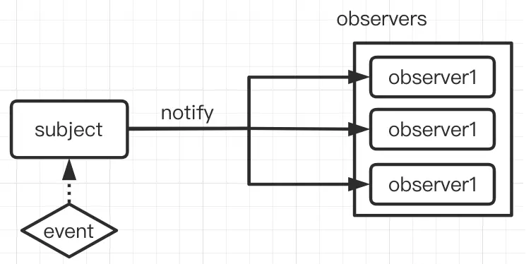
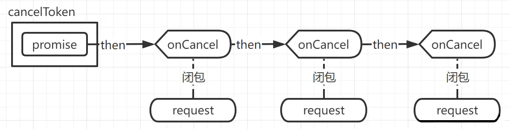

# 2、JavaScript相关

## 2.1 获取图片实际宽高

```javascript
const img_url = "13643608813441.jpg"
const img = new Image()
img.src = img_url
if (img.complete) {
    // 判断是否有缓存
  alert("from:complete : width:" + img.width + ",height:" + img.height)
} else {
    // 加载完成执行
    img.onload = function () {
      alert("width:" + img.width + ",height:" + img.height)
    }
}
```

## 2.2 JavaScript中封装手机触屏判断滑动方向和滑动距离

参考：https://blog.csdn.net/qq_39460057/article/details/134651637

```javascript
export const onTouchMove = (el, callback) => {
  let [startX, startY, moveEndX, moveEndY] = [0, 0, 0, 0]
  el.addEventListener("touchstart", e => {
    console.log(`changedTouches: ${e.changedTouches}`)
    startX = e.changedTouches[0].pageX
    startY = e.changedTouches[0].pageY
  })
  el.addEventListener("touchmove", e => {
    // 阻止默认滚动行为
    e.preventDefault()
  })
  el.addEventListener("touchend", e => {
    moveEndX = e.changedTouches[0].pageX
    moveEndY = e.changedTouches[0].pageY
    const [disX, disY] = [moveEndX - startX, moveEndY - startY]
    let [direction, distance] = ["", 0]
    if (Math.abs(disX) > Math.abs((disY))) {
      direction = disX > 0 ? "right" : "left"
      distance = disX
    } else if (Math.abs(disX) < Math.abs((disY))) {
      direction = disY > 0 ? "down" : "up"
      distance = disY
    }
    callback({direction, distance})
  })
}

// 调用方式
onTouchMove(el, info => {
  console.log(info)
})
```

## 2.3 函数节流和函数防抖及其区别

参考：https://juejin.cn/post/7103365414776176648

浏览器中总是有一些操作非常耗费性能。所以就有了函数节流和函数防抖来提高浏览器性能。

```text
函数节流：频繁触发一个事件时候，每隔一段时间，函数只会执行一次。
函数防抖：当触发一个时间后的n秒内，如果该事件没有被第二次触发，则执行。否，则重新开始计时。
```

### 2.3.1 函数节流

函数节流应用场景：滚动条滚动事件，dom的拖拽事件等

例： 我们都知道滚动条滚动的时候触发事件的频率极其地频繁。监控滚动条的滚动事件，滚动一次该事件可以触发上百次。很显然，有时候，我们并不需要触发如此多的次数。函数节流，由此而生。在固定的时间内，只触发一次。

```javascript
// 节流函数。callback 需要节流的函数，time 节流间隔时间点，默认值 300 毫秒
export const onScroll = (callback, time = 300) => {
  let state = true;
  // 判断如否有函数传入
  if (typeof callback !== "function") {
    throw "第一个入参必须是函数,需要被节流的函数"
  }
  return () => {
    if (state) {
      callback();
      state = false;
      setTimeout(() => {
        state = true;
      }, time)
    }
  }
}
```

调用方式

```vue

<template>
  <div class="wrap" @scroll="onScroll(callback,300)">
  </div>
</template>

<script>
  export default {
    data() {
      return {};
    },
    methods: {
      callback() {
        console.log("节流函数")
      }
    }
  }
</script>

<style scoped lang="scss">
</style>
```

### 2.3.2 函数防抖

函数防抖应用场景:搜索框的搜索事件等

例：搜索框实际上是监控搜索框内容改变，请求后台搜索查询。 比如我们输入一个`search`单词，搜索框内部的`change`
事件会触发六次，每输入一个字母触发一次`change`事件。但是，我们真的需要发送六个请求去查询吗？完全不必要。
实际上我们只需要在`search`单词输入完毕后查询一次即可。函数防抖，由此而生。在规定时间内，受防抖的函数被触发第二次时候后，上一次触发销毁，下一次重新开始计时，计时完毕后触发执行。

```javascript
// 防抖函数。callback 需要节流的函数，time 节流间隔时间点，默认值 300 毫秒
export const onchange = (callback, time = 300) => {
  let asyncFun;
  if (typeof callback !== "function") {
    throw "第一个入参必须是函数,需要进行防抖的函数"
  }
  return () => {
    // 在上一个函数被触发前，销毁他
    if (asyncFun !== undefined) clearTimeout(asyncFun);
    asyncFun = setTimeout(() => {
      callback();
    }, time)
  }
}
```

调用方式

```vue

<template>
  <input @input="onchange(callback,300)">
</template>

<script>
  export default {
    data() {
      return {};
    },
    methods: {
      callback() {
        console.log("防抖函数")
      }
    }
  }
</script>

<style scoped lang="scss">
</style>
```

不论是函数防抖还是函数节流，都是性能优化的一种手段，都是为阻止函数无意义的执行，减小dom压力，避免不必要的性能浪费。

## 2.4 JavaScript删除对象属性及判定是否包含某属性

### 2.4.1 删除对象属性

#### 2.4.1.1 delete

```text
语法： delete 对象.属性名
```

```javascript
const obj = {name: "zhangsan", age: 18}
delete obj.name
console.log(obj)
// {age:18}
delete obj["name"]
console.log(obj)
// {age:18}
```

#### 2.4.1.2 ES6解构赋值

```text
语法： const {属性名1,属性名2...} = 对象
```

```javascript
const obj = {name: "zhangsan", age: 18}
const {name, ...newObj} = obj
console.log(newObj)
// {age:18}
```

#### 2.4.1.3 ES6反射

```text
语法： Reflect.defineProperty(对象,属性名)
```

```javascript
const obj = {name: "zhangsan", age: 18}
Reflect.defineProperty(obj, "name")
console.log(obj)
// {age:18}
```

### 2.4.2 对象是否包含某属性

#### 2.4.2.1 delete

```text
语法： obj.hasOwnProperty(属性名)
```

```javascript
const obj = {name: "zhangsan", age: 18}
console.log(obj.hasOwnProperty("name"))
// true
console.log(obj.hasOwnProperty("sex"))
// false
```

#### 2.4.2.2 属性判断

```text
语法： 对象.属性名 !== undefined
```

```javascript
const obj = {name: "zhangsan", age: 18}
console.log(obj.name !== undefined)
// true
console.log(obj.sex !== undefined)
// false
```

#### 2.4.2.3 Object.keys

```text
语法： Object.keys(对象).indexOf(属性名) !== -1
```

```javascript
const obj = {name: "zhangsan", age: 18}
console.log(Object.keys(obj).indexOf("name") !== -1)
// true
console.log(Object.keys(obj).indexOf("sex") !== -1)
// false
```

#### 2.4.2.4 ES6属性名in对象

```text
语法： 属性名 in 对象
```

```javascript
const obj = {name: "zhangsan", age: 18}
console.log("name" in obj)
// true
console.log("sex" in obj)
// false
```

## 2.5 forEach和map的区别

参考：https://juejin.cn/post/7271846986998054971

map会返回一个新的数组，而forEach不会，实际上是因为forEach不会返回任何值（实际上返回的是undefined），而map 是有返回值的，是一个新数组

上述说法是错误的，是否改变原数组，取决于循环中的item是引用类型还是基础类型，引用类型都会发生变化。因为引用类型的元素实际上存储的是引用（内存地址），而非值本身。所以引用类型元素的修改会直接反映在原始数组中。而number,string,Boolean,null,undefined这些基础类型是在栈内存中直接存储变量与值

foreach可以使用return跳出本次循环，而map不能。foreach不支持链式调用，而map支持链式调用，可以继续对返回的新数组进行操作。

**注意：不能使用break语句来中断循环。break语句用于中断循环的功能只适用于for循环或while循环**

## 2.6 JavaScript 中使用媒体查询

参考：https://juejin.cn/post/7206134581744435258

媒体查询想必大家最先想到的都是CSS中@media。没错，这是我们最常用的媒体查询方法，主要用来为我们的网站做适配处理。

```css
h1 {
  font-size: 2rem;
  color: green;
}

@media (min-width: 600px) {
  h1 {
    font-size: 4rem;
  }
}

/* 标题需要为绿色，字体大小为 2rem。但是当屏幕宽度超过 600px 时，字体大小需要增加到 4rem */
```

**在JavaScript中使用媒体查询**

我们可以在`JavaScript`代码中使用与上面相同的媒体查询。主要API就是 `Window.matchMedia()`

`Window`的`matchMedia()`方法返回一个新的`MediaQueryList`对象，表示指定的媒体查询`(en-US)`
字符串解析后的结果。返回的`MediaQueryList`可被用于判定`Document`是否匹配媒体查询，或者监控一个`Document`
来判定它匹配了或者停止匹配了此媒体查询。

**语法**

```javascript
mqList = window.matchMedia(mediaQueryString)
```

**参数**

matchMedia()方法接受单个参数作为其值，即您要检查的媒体查询。

mediaQueryString：一个被用于媒体查询解析的字符串。

**返回值**

一个用来媒体查询的新的MediaQueryList对象
它包含两个属性：

* media，它将媒体查询存储为序列化字符串

* matches，它基本上是一个布尔值，如果我们作为参数提供的媒体查询与文档匹配则返回true

```vue

<template>
  <div>
    <div id="home"></div>
    <div id="home2"></div>
  </div>
</template>

<script>
  export default {
    data() {
      return {};
    },
    methods: {
      watchWidthMedia(target, mqList, cnt) {
        if (mqList.matches) {
          target.innerHTML = `<p> >600px ${cnt}次</p>`;
        } else {
          target.innerHTML = `<p> <=600px ${cnt}次</p>`;
        }
      },
      watchWidthChange(target, cnt) {
        if (window.innerWidth > 600) {
          target.innerHTML = `<p> >600px ${cnt}次</p>`;
        } else {
          target.innerHTML = `<p> <=600px ${cnt}次</p>`;
        }
      },
    },
    mounted() {
      let cnt = 0
      const target = document.getElementById("home")
      const mqList = window.matchMedia("(min-width: 600px)")
      mqList.onchange = (e) => {
        cnt++
        this.watchWidthMedia(target, e, cnt)
      }
      this.watchWidthMedia(target, mqList, cnt)

      let cnt2 = 0
      const target2 = document.getElementById("home2")
      window.addEventListener("resize", e => {
        cnt2++
        this.watchWidthChange(target2, cnt2)
      });
      this.watchWidthChange(target2, cnt2);
    }
  }
</script>

<style scoped lang="scss">
</style>
```

**性能对比**

每次调整窗口大小时，`resize`事件侦听器都会触发`watchWidthChange`函数。这仅在某些情况下需要响应窗口大小更改的每个实例，例如更新画布。
但在只有当宽度或高度达到某个阈值时才需要发生某些事情，例如文本更新。在这种情况下，`matchMedia`
将会获得更好的性能，因为它仅在媒体查询条件的实际更改时触发回调。

## 2.7 从生成器函数Generator角度思考async await

参考：https://juejin.cn/post/7412487295729139712
https://zhuanlan.zhihu.com/p/558431779
https://github.com/Sunny-lucking/blog/issues/6

### 2.7.1 Generator函数基础

所谓 Generator 函数，最大特点就是可以交出函数的执行权（即拥有暂停函数执行的效果）。

```javascript
function* gen() {
  yield "a"
  yield "b"
}

const g = gen()
g.next()
// {"value": "a", "done": false}
g.next()
// {"value": "b", "done": false}
g.next()
// {"value": undefined, "done": true}
```

调用生成器函数会返回一个`Generator{}`生成器实例对象。返回的`g`生成器对象可以近似地理解成为下面的对象结构:

```javascript
{
  next: () => {
    return {
      value: VALUE, // value表示生成器函数本次调用返回的值
      done: Boolean, // done表示生成器函数是否执行完毕
    }
  }
}
```

`let g = gen()`调用生成器函数创建了一个生成器对象`g`，`g`拥有上述结构的`next`方法。然后生成器对象中的`next`
方法每次调用会返回一次`{ value: VALUE, done: boolean }`的`gObject`对象。

`yield`关键字会停止函数执行并将`yield`后的值返回作为本次调用`next`的`value`进行返回。如果本次调用`g.next()`
导致生成器函数执行完毕，那么此时`done`会变成`true`表示该函数执行完毕，反之则为`false`。

**注意：当生成器函数执行完毕时，再调用`next`，`done`会变为`true`。同时因为函数不存在返回值，`value`为`undefined`。**

### 2.7.2 Generator函数返回值

```javascript
function* gen() {
  const a = yield "a"
  console.log(`step ${a}`)
  const b = yield "b"
  console.log(`step ${b}`)
}

const g = gen()
g.next()
// {"value": "a", "done": false}
g.next("A")
// {"value": "b", "done": false}
g.next("B")
// {"value": undefined, "done": true}

// 控制台打印结果如下：
// step A
// step B
```

`yield`关键字会暂停函数的运行。第一次调用`next`方法，函数执行到`yield a`语句，此时函数会被暂停。第二次调用`next`
方法，生成器函数会从上一次暂停的语句继续执行。

**注意：当生成器函数恢复执行时，因为上一次执行到`const a = yield a`语句的右半段并没有给`const a`进行赋值。**

`g.next("A")`的参数`A`会作为上一次`yield a`的返回值进行执行。即调用`g.next("A")`时，将生成器函数中的`const a = yield a;`
变为`const a = A;`进行执行。所以调用`g.next("A")`会打印出`step A`。同样的，`g.next("B")`的参数`B`会被当作`yield b`
的返回值赋值给`b`变量，其打印结果为`step B`

**当使用`next`进行传参时，传入的参数会作为上一次生成器函数暂停时`yield`的返回值。第一次调用`next`
的传参是无意义的。因为此时的生成器函数并没有执行，自然也没有`yield`关键字处理。**

### 2.7.3 Generator函数中的return

```javascript
function* gen() {
  const a = yield "a"
  console.log(`step ${a}`)
  const b = yield "b"
  console.log(`step ${b}`)
  return "return step"
  const c = yield "c"
  console.log(`step ${c}`)
}

const g = gen()
g.next()
// {"value": "a", "done": false}
g.next("A")
// {"value": "b", "done": false}
g.next("B")
// {"value": "return step", "done": true}
g.next()
// {"value": undefined, "done": true}
```

生成器函数存在`return returnValue`时，在`return`前的最后一个`yield`关键字执行完毕后，生成器函数执行完毕。执行`next`
函数，会返回`{ value: returnValue, done: true }`的对象。再次执行`next`会返回`{ value: undefined, done: true }`
的对象。

本例在第三次调用`next`时生成器函数执行完毕，返回含有`returnValue`的对象。

### 2.7.4 Generator函数异步解决方案

```javascript
function promise1() {
  return new Promise((resolve) => {
    setTimeout(() => {
      resolve("promise1")
    }, 1000)
  })
}

function promise2(value) {
  return new Promise((resolve) => {
    setTimeout(() => {
      resolve(`promise2 => ${value}`)
    }, 1000)
  })
}

function* fn() {
  const value = yield promise1()
  console.log(`value : ${value}`)
  const result = yield promise2(value)
  console.log(`result : ${result}`)
  return result
}

function asyncGenerator(generator) {
  // 调用传入的生成器函数，返回生成器对象。期望返回一个Promise
  const g = generator()
  return new Promise((resolve) => {
    // 执行 yield promise1()，将 promise1 作为 value 返回对象
    const {value, done} = g.next()
    // promise1 等待返回值进行相应操作
    value.then((v) => {
      // 将 promise1 的返回值作为参数执行 yield promise2()，将 promise2 作为 value 返回对象
      const {value, done} = g.next(v)
      // 将 promise2 作为返回参数
      resolve(value)
    })
  })
}

asyncGenerator(fn).then((res) => {
  console.log(`res : ${res}`)
})

// 控制台打印结果
// value : promise1
// res : promise2 => promise1
```

通过`asyncGenerator`函数包裹`generator`生成器函数，结合生成器、`yield`关键字暂停特点及`Promise.then`
方法的特性可以实现类似于`async`函数的异步功能。

**看上去它和`async`很像对吧，不过目前的代码存在一个致命的问题：`asyncGenerator`函数并不具备通用性**

`fn`封装了两层`yield`处理`Promise`的方法，相同的`asyncGenerator`函数内部调用了两次`next`方法。`fn`如果封装了三层`yield`
处理`Promise`的方法，那就需要调整`asyncGenerator`函数的逻辑。再比如`fn`中存在类似`yield "a"`的方法，使用的`then`方法会报错。

**对`asyncGenerator`代码进行优化**

```javascript
function asyncGenerator2(generator) {
  return new Promise((resolve, reject) => {
    const g = generator();

    function next(param) {
      const {done, value} = g.next(param);
      if (!done) {
        // 未完成 继续递归
        Promise.resolve(value).then((res) => {
          next(res)
        });
      } else {
        // 完成直接重置 Promise 状态
        resolve(value);
      }
    }

    next();
  });
}

asyncGenerator2(fn).then((res) => {
  console.log(`res : ${res}`)
});

// 控制台打印结果
// value : promise1
// result : promise2 => promise1
// res : promise2 => promise1
```

`asyncGenerator2`返回一个`Promise`作为函数的返回值。同时首次调用`asyncGenerator2`函数时会调用`generator()`
得到生成器对象。然后定义`next`函数，只要迭代器未完成就会在`value`的`then`方法中在此递归调用该`next`函数。

**注意：**

* `next`函数接受接收`param`参数。这是因为`Generator`处理异步时，通过`const a = yield Promise`将`Promise`的`resolve`
  参数赋值给`a`，所以需要在`then`函数中将`res`传递给`next(res)`执行并将其结果作为上次`yield`执行的返回值。
* 对`value`使用`Promise.resolve`进行包裹。这是因为需要统一调用`.then`方法进行递归传参，当`yield`后不是`Promise`
  时，需要统一当作`Promise`进行处理。
* 首次调用`next`方法时，并没有传入`param`参数。

### 2.7.5 总结

生成器函数具有可暂停的特点，调用生成器函数后会返回一个生成器对象。
调用生成器对象的`next`方法，生成器函数会继续执行直到遇到下一个`yield`关键字。调用`next`方法会返回一个对象，其中`done`
表示生成器函数是否执行完毕,`value`表示生成器函数中本次`yield`的返回值。

同时每次调用生成器对象的`next(param)`方法时，可以传入一个参数作为上一次`yield`语句的返回值。所以`async await`
本质上还是利用`Generator`函数内部可以被暂停执行的特性结合`Promise.then`中进行递归调用从而实现`Async await`的语法糖。

## 2.8 Proxy代理和Reflect反射

参考：https://developer.mozilla.org/zh-CN/docs/Web/JavaScript/Reference/Global_Objects/Proxy
https://juejin.cn/post/7425812523129061417
https://juejin.cn/post/7333236033038647337

### 2.8.1 Proxy代理

`Proxy`对象用于创建一个对象的代理，从而实现基本操作的拦截和自定义（如属性查找、赋值、枚举、函数调用等）。

代理是目标对象的抽象。所以直接操作代理和直接操作对象，所操作的值都会映射到代理对象上。

代理对象每次执行某个操作（读属性、写属性、定义新属性、查询原型、把它作为函数调用）时，它只会把相应操作发送给处理器对象或目标对象。

`Proxy`构造器接收两个参数，目标对象和处理器对象。如果处理器对象上存在对应方法，代理就调用该方法执行相应操作。如果处理器对象上不存在对应方法，则代理就在目标对象上执行基础操作。

#### 2.8.1.1 语法

```javascript
const p = new Proxy(target, handler)
// Proxy() 只能通过 new 关键字来调用。如果不使用 new 关键字调用，则会抛出 TypeError。
```

* `target`：要使用`Proxy`包装的目标对象（可以是任何类型的对象，包括原生数组，函数，甚至另一个代理）。
* `handler`：一个通常以函数作为属性的对象，各属性中的函数分别定义了在执行各种操作时代理`p`的行为。

#### 2.8.1.2 方法

```javascript
Proxy.revocable()
// 创建一个可撤销的 Proxy 对象。
```

#### 2.8.1.3 处理器函数方法

`handler`对象是一个容纳一批特定属性的占位符对象。它包含有`Proxy`的各个捕获器`trap`。处理器函数有时候也被称为劫持`trap`
，这是由于它们会对底层被代理对象的调用进行劫持。

所有的捕捉器都是可选的。如果没有定义某个捕捉器，那么就会保留源对象的默认行为。

```javascript
handler.apply()
// 函数调用劫持。

handler.construct()
// new 运算符劫持。

handler.defineProperty()
// Object.defineProperty 调用劫持。

handler.deleteProperty()
// delete 运算符劫持。

handler.get()
// 获取属性值劫持。

handler.getOwnPropertyDescriptor()
// Object.getOwnPropertyDescriptor 调用劫持。

handler.getPrototypeOf()
// Object.getPrototypeOf 调用劫持。

handler.has()
// in 运算符劫持。

handler.isExtensible()
// Object.isExtensible 调用劫持。

handler.ownKeys()
// Object.getOwnPropertyNames 和Object.getOwnPropertySymbols 调用劫持。

handler.preventExtensions()
// Object.preventExtensions 调用劫持。

handler.set()
// 设置属性值劫持。

handler.setPrototypeOf()
// Object.setPrototypeOf 调用劫持。
```

#### 2.8.1.4 示例

通过代理，你可以轻松地验证向一个对象的传值。下面的代码借此展示了`set handler`的作用。

```javascript
let validator = {
  set: function (obj, prop, value) {
    if (prop === "age") {
      if (!Number.isInteger(value)) {
        throw new TypeError("The age is not an integer");
      }
      if (value > 200) {
        throw new RangeError("The age seems invalid");
      }
    }
    // 存储值的默认行为
    obj[prop] = value;
    // 表示成功
    return true;
  },
};

let person = new Proxy({}, validator);
person.age = 100;
console.log(person.age);
// 100
person.age = "young";
// 抛出异常：Uncaught TypeError: The age is not an integer
person.age = 300;
// 抛出异常：Uncaught RangeError: The age seems invalid
```

### 2.8.2 Reflect反射

`Reflect`是一个内置的对象，它提供拦截`JavaScript`操作的方法。这些方法与`proxy handler`的方法相同。`Reflect`
不是一个函数对象，因此它是不可构造的。

`Reflect`并非一个构造函数，所以不能通过`new`运算符对其进行调用，或将`Reflect`对象作为一个函数来调用。

`Reflect`可以用自己的方法代替原生的操作对象。大白话就是有一个人和你一模一样，你可以不用亲自做一些事情，这个人就帮你做了。

`Reflect`对象的所有属性和方法都是静态的（比如`Math`对象）。提供了以下静态方法，这些方法与`proxy handler`方法的命名相同。

#### 2.8.2.1 静态方法

```javascript
Reflect.apply(target, thisArgument, argumentsList)
// 对一个函数进行调用操作，同时可以传入一个数组作为调用参数。和 Function.prototype.apply() 功能类似。

Reflect.construct(target, argumentsList, newTarget)
// 对构造函数进行 new 操作，相当于执行 new target(...args)。

Reflect.defineProperty(target, propertyKey, attributes)
// 和 Object.defineProperty() 类似。如果设置成功就会返回 true

Reflect.deleteProperty(target, propertyKey)
// 作为函数的 delete 操作符，相当于执行 delete target[name]。

Reflect.get(target, propertyKey, receiver)
// 获取对象身上某个属性的值，类似于 target[name]。

Reflect.getOwnPropertyDescriptor(target, propertyKey)
// 类似于 Object.getOwnPropertyDescriptor()。如果对象中存在该属性，则返回对应的属性描述符，否则返回 undefined。

Reflect.getPrototypeOf(target)
// 类似于 Object.getPrototypeOf()。

Reflect.has(target, propertyKey)
// 判断一个对象是否存在某个属性，和 in 运算符 的功能完全相同。

Reflect.isExtensible(target)
// 类似于 Object.isExtensible()。

Reflect.ownKeys(target)
// 返回一个包含所有自身属性（不包含继承属性）的数组。(类似于 Object.keys(), 但不会受enumerable 影响)。

Reflect.preventExtensions(target)
// 类似于 Object.preventExtensions()。返回一个Boolean。

Reflect.set(target, propertyKey, value, receiver)
// 将值分配给属性的函数。返回一个Boolean，如果更新成功，则返回true。

Reflect.setPrototypeOf(target, prototype)
// 设置对象原型的函数。返回一个 Boolean，如果更新成功，则返回 true。
```

#### 2.8.2.2 示例

```javascript
let person = {
  name: "John",
  age: 30
};
// 使用 Reflect.get() 获取对象的属性值
Reflect.get(person, "name");
// 使用 Reflect.set() 设置对象的属性值
Reflect.set(person, "age", 35);
// 使用 Reflect.has() 检查对象是否具有特定属性
Reflect.has(person, "name") // true
Reflect.has(person, "city")
)
; // false
// 使用 Reflect.deleteProperty() 删除对象的属性
Reflect.deleteProperty(person, "age");
// 使用 Reflect.defineProperty() 定义对象的属性
Reflect.defineProperty(person, "name", {
  value: "John",
  writable: true,
  configurable: true,
  enumerable: true
});
// 使用 Reflect.ownKeys() 返回对象的所有自有属性的键名
Reflect.ownKeys(person);
```

## 2.9 中止请求

参考：https://juejin.cn/post/7436760535400267813
https://juejin.cn/post/7134326391977279501
https://juejin.cn/post/7389651690296786955

### 2.9.1 常见取消请求的几种方式

#### 2.9.1.1 使用AbortController（适用于axios、fetch等场景）

`AbortController`是一个现代`JavaScript API`，用于取消一个或多个网络请求，它通过创建一个`AbortController`
实例，获取其`signal`属性，并将`signal`传递给请求的配置选项，当需要取消请求时，调用`AbortController`实例的`abort()`
方法。这种方式可以有效控制请求的生命周期，避免不必要的资源消耗。

#### 2.9.1.2 使用XMLHttpRequest对象的abort方法

`XMLHttpRequest`是一种比较传统的发起`HTTP`请求的方式。在创建`XMLHttpRequest`对象并发起请求后，可以通过调用该对象的`abort`
方法来取消请求。这种方法在一些老项目或者对兼容性有特定要求的场景中可能会用到。

```javascript
var xhr = new XMLHttpRequest();
xhr.open("GET", "https://jsonplaceholder.typicode.com/todos/1", true);
xhr.send();
// 取消请求
xhr.abort();
```

#### 2.9.1.3 使用请求库自带的取消机制

一些请求库（如`axios`）提供的取消请求机制。以`axios`为例：

1、`CancelToken`方式

通过创建`CancelToken`实例，并将其传递给请求配置，可以在需要时取消请求。`CancelToken`的原理是创建一个`CancelToken`
源，这个源包含一个`promise`和一个`cancel`函数。当调用`cancel`函数时，会改变`promise`
的状态，并且在请求拦截器中监听这个`promise`的状态，如果已经被取消，则阻止请求继续发送。

2、`AxiosCancel`方式（`axios`版本>=`0.22.0`）

`AxiosCancel`是`axios`在较新版本中提供的另一种取消请求的方式。它基于`AbortController`实现，通过将`AbortController`
的`signal`与请求关联起来，当调用`AbortController`的`abort()`方法时，正在进行的`axios`
请求会被取消。这种方式利用了现代浏览器原生支持的`AbortController`机制，使得取消请求的实现更加简洁和高效。

### 2.9.2 AbortController基础

`AbortController`接口表示一个控制器对象，允许你根据需要中止一个或多个`Web`请求。

你可以使用`AbortController()`构造函数创建一个新的`AbortController`对象。使用`AbortSignal`对象可以完成与异步操作的通信。

#### 2.9.2.1 构造函数

```javascript
AbortController()
// 创建一个新的 AbortController 对象实例。
```

#### 2.9.2.2 实例属性

```javascript
AbortController.signal
// 只读，返回一个 AbortSignal 对象实例，可以用它来和异步操作进行通信或者中止这个操作。
```

#### 2.9.2.3 实例方法

```javascript
AbortController.abort(reason)
// 中止一个尚未完成的异步操作。这能够中止 fetch 请求及任何响应体和流的使用。
```

* `reason`：可选。操作中止的原因，可以是各种`JavaScript`值。如果没有指定，则将原因设置为`AbortError`。

**示例**

```javascript
let controller;
const url = "video.mp4";

const downloadBtn = document.querySelector(".download");
const abortBtn = document.querySelector(".abort");

downloadBtn.addEventListener("click", fetchVideo);

abortBtn.addEventListener("click", () => {
  if (controller) {
    controller.abort();
    console.log("中止下载");
  }
});

function fetchVideo() {
  controller = new AbortController();
  const signal = controller.signal;
  fetch(url, {signal}).then((response) => {
    console.log("下载完成", response);
  }).catch((err) => {
    console.error(`下载错误：${err.message}`);
  });
}
```

### 2.9.3 AbortSignal基础

`AbortSignal`接口表示一个信号对象，它允许你通过`AbortController`对象与异步操作（如`Fetch`请求）进行通信并在需要时将其中止

#### 2.9.3.1 实例属性

继承了其父接口`EventTarget`的属性。

```javascript
AbortSignal.aborted
// 只读，一个 Boolean，表示与之通信的请求是否被中止（true）或未中止（false）。

AbortSignal.reason
// 只读，一旦信号被中止，提供一个使用 JavaScript 值表示的中止原因。
```

#### 2.9.3.2 静态方法

继承了其父接口`EventTarget`的方法。

```javascript
AbortSignal.abort(reason)
// 返回一个已经被设置为中止的 AbortSignal 实例。

AbortSignal.any(iterable)
// 返回一个在任意给定的中止信号时中止时中止的 AbortSignal 实例。

AbortSignal.timeout(time)
// 返回一个在指定时间后自动中止的 AbortSignal 实例。
```

#### 2.9.3.3 实例方法

继承了其父接口`EventTarget`的方法。

```javascript
AbortSignal.throwIfAborted()
// 如果信号已经被中止，则抛出信号中止的 reason；否则什么也不做。
```

* `reason`：可选。操作中止的原因，可以是各种`JavaScript`值。如果没有指定，则将原因设置为`AbortError`。

#### 2.9.3.4 事件

继承了其父接口`EventTarget`的事件。

使用`addEventListener()`或将事件监听器分配给该接口的`oneventname`属性。

```javascript
abort
// 当与信号通信的异步操作中止时调用。也可以通过 onabort 属性调用。
```

### 2.9.2.4 AbortController进阶

#### 2.9.2.4.1 使用AbortController中断XHR请求

详见`AbortController-xhr.js`文件。



从上面的代码可知，`AbortController`的实例`abortController`只是一个类似观察者模式中的事件派发中心`Subject`
，通过`abortController.signal.addEventListener("abort", callback)`注册`Observer`。且负责中断`Web`
请求的是这些被注册在`Subject`上的`Observer`。且这个`Subject`是一次性的，即只能`notify`一次。当`abortController.abort`
被调用时，作为信号状态的`abortController.signal`的`aborted`属性（只读）置为`true`，表示该信号状态已被取消。

#### 2.9.2.4.2 使用AbortController中断Fetch请求

详见`AbortController-Fetch.js`文件。

#### 2.9.2.4.3 AbortController在Axios内部运用机制

在`Axios`中负责发出请求的是`axios.default.adapter`，而在浏览器环境下`axios.default.adapter`取自`lib/adapters/xhr.js`
文件，分析这个文件中涉及到`XHR`，`AbortController`和`CancelToken`的源码（详见`xhr-v0.28.1.js`文件）。

根据源码分析可知，`AbortContoller`的调用方式和`AbortContoller`取消`XHR`请求的逻辑是一样的。源码中同样也展示了`CancelToken`
实例在其中的运行逻辑：

1. 在请求发出之前，`CancelToken`实例通过自身方法`subscribe`注册`onCancel`函数
2. 在请求结束后，`CancelToken`实例通过自身方法`unsubscribe`注销`onCancel`函数

由此可见，`CancelToken`实例本质上其实也是一个以观察者模式为原理的事件派发中心。

#### 2.9.2.4.4 Axios为什么推荐用AbortController替代CancelToken

在分析`CancelToken`被替代原因之前，我们先对`CancelToken`源码（详见`CancelToken-v0.28.1.js`文件）进行分析学习其原理。

##### 2.9.2.4.4.1 CancelToken原理

`Axios`提供了以下方式来运用到`CancelToken`：

```javascript
const CancelToken = axios.CancelToken;
const source = CancelToken.source();

axios.post("/user/12345", {name: "new name",}, {cancelToken: source.token,});

source.cancel();
```

按照`axios.post`的执行过程逐步分析`CancelToken`对应的源码：

1、首先，通过`CancelToken.source`方法生成`source`变量（`118-127`行）。

`CancelToken.source`返回值为新生成`CancelToken`实例的`token`和`cancel`。

2、接着分析`CancelToken`构造函数（`15-70`行）。

`CancelToken`通过传递一个执行器函数来创建 一个`CancelToken`实例，并在需要时取消操作。

3、在`axios.post`执行时，调用`axios.default.adapter`处理发出请求的环节。`xhrAdapter`会检查请求配置中是否存在`CancelToken`
。如果存在，它会将`CancelToken`的`promise`与请求关联起来。在请求发送之前和整个请求生命周期内，`axios`会持续监听这个`promise`
的状态（通过给`CancelToken`实例对象`promise.then`传入的回调方法方法中判断`promise`状态的方式监听`promise`
状态）。其中涉及到`CancelToken`的代码在`xhr-v0.28.1.js`源码时已经分析过了。

下面列出关于`CancelToken`实例在整个请求过程中的操作：

* 发出请求前：通过`config.cancelToken.subscribe(onCanceled)`把`onCanceled`注册到`CancelToken`实例上。`onCanceled`
  内部含`request.abort()`中断请求操作。
* 在请求完成后：通过`config.cancelToken.unsubscribe(onCanceled)`注销该回调函数。

4、对`CancelToken`中的`subscribe`和`unsubscribe`源码进行分析（`84-113`行）。

`subscribe`和`unsubscribe`分别定义了订阅取消事件和取消订阅取消事件及其处理逻辑。

5、总结

`CancelToken`的设计逻辑是使用观察者模式进行事件派发，其中`CancelToken`实例作为事件派发中心，通过`subscribe`
和`unsubscribe`进行事件注册和注销。

##### 2.9.2.4.4.2 推荐用AbortController的原因

1、与`Fetch`保持一样的调用方式

`Axios`官方一直保持与`Fetch`相似的调用方式。

```javascript
fetch(url, config).then().catch()
axios(url, config).then().catch()
```

目前`Fetch`中断请求的唯一方式就是搭配`AbortController`使用。`Axios`通过支持`AbortController`实现中断请求，使得`Fetch`
切换到`Axios`更方便。目前就实用性而言，`XHR`比`Fetch`要好一些，例如`sentry`在记录面包屑的接口信息方面，`XHR`
请求可以比`Fetch`请求记录更多的数据。还有目前`Fetch`还不支持`onprogress`这类上传下载进度事件。

2、`CancelToken`存在内存泄露隐患

旧版本（`v0.22.0`之前）的`CancelToken`存在内存泄露隐患，官方想让更多人升级版本从而减少内存泄露风险。

使用`AbortController`中断请求是在`v0.22.0`版本支持的。在`v0.22.0`之前，`CancelToken`的运行过程中出现内存泄露隐患。

以`v0.21.4`版本的源码进行分析（详见`CancelToken-v0.21.4.js`文件），当时`CancelToken`不存在`CancelToken.prototype.subscribe`
和`CancelToken.prototype.unsubscribe`以及内部属性`_listeners`。

`xhrAdapter`（详见`xhr-v0.21.4.js`文件）涉及到的`CancelToken`的代码（`164-176`行）。

早期的思路：当`CancelToken`实例执行`cancel`方法时，实例内部属性`this.promise`状态置为`fulfilled`，在执行`xhrAdapter`
时使用`then`传入的`onCanceled`函数，从而达到取消请求的目的。

`Axios`官方教程中，`CancelToken`可以给多个请求注入同一个`CancelToken`，从而达到同时取消多个请求的效果。

这种用法使用场景比较多，例如在对大文件时做切片上传的场景，如果需要实现手动中断上传的功能，可以生成一个`CancelToken`
实例，注入到每一个上传切片的请求上。当用户点击“中断传输”的按钮时，直接执行`CancelToken`实例的`cancel`方法即可中断所有请求。

```javascript
const CancelToken = axios.CancelToken;
const source = CancelToken.source();

axios.get("/user/1", {cancelToken: source.token})
axios.get("/user/2", {cancelToken: source.token})
// 此操作可同时取消上面两个请求
source.cancel()
```

但是这种用法存在内存泄露的隐患。假设切片上传过程中没有发生中断或者很久才发生中断，则`cancelToken.promise`
会一直存在在内存里，由于`xhrAdapter`中`cancelToken.promise`通过`.then(function onCanceled(){...})`
挂载了很多个`onCanceled`。

`request`不是`onCanceled`的局部变量，而是通过闭包机制访问到的。当一个请求已经结束时，由于`request`仍被`onCanceled`
引用，所以在`gc`过程中不会从内存堆里清理。这些`request`包含了当前上传数据，所以占用很多内存，又因为这些`request`
会一直存在内存堆里，所以会出现内存泄露的问题。只有`cancelToken`执行`cancel`或`cancelToken`置为`null`
时，`cancelToken.promise`才会被清除，`request`才从内存堆里清理。



如果是在上传单个或者数个非常大的文件，则会占用很多内存从而出现泄露的情况。

在`v0.22.0`版本，`Axios`官方对`CancelToken`进行了大调整，改成了上一节`CancelToken`源码的情况。并且`v0.22.0`
支持`AbortController`。因此官方开始推荐`AbortController`，想让开发者升级版本到`v0.22.0`以上，消除`CancelToken`
带来的内存泄露隐患。

3、减少代码维护量

经历了`v0.22.0`的大调整后，`CancelToken`的原理和`AbortController`相似。既然`AbortController`在功能上完全顶替`CancelToken`
，且浏览器兼容性好的原生`API`。就没必要在继续维护`CancelToken`。估计在之后`v1.x`或者`v2.x`版本里不再存在`CancelToken`
，减少代码的维护量。

#### 2.9.2.4.5 底层原理

`AbortController`通过`AbortSignal`实现了事件监听与信号传递机制，从而高效、可靠地管理异步操作的取消。

##### 2.9.2.4.5.1 基于事件监听与信号传递

当创建`AbortController`实例时，会自动生成一个与之关联的`AbortSignal`对象，并维护一个状态来表示是否已被取消。`AbortSignal`
是一个信号对象，其核心是通过事件监听机制来实现与异步操作的通信。`AbortSignal`具有一个`aborted`属性和一个`addEventListener`
方法，异步操作可以通过监听`aborted`事件来获取取消信号。实现与异步操作（如`Fetch`请求）的通信。

`AbortSignal`具有以下关键属性和方法：

* `aborted`属性：布尔值，表示是否已触发取消信号，初始值为`false`。
* `addEventListener`方法：用于监听`abort`事件。

##### 2.9.2.4.5.2 关联控制器与事件

`AbortController`的主要作用是作为控制中心，管理`AbortSignal`的状态变化。它持有对`AbortSignal`的引用，并提供了一个`abort()`
方法。当调用`abort`方法时，`AbortController`会将关联的`AbortSignal`的`aborted`属性设置为`true`，并触发`abort`
事件。所有绑定该`AbortSignal`信号的异步操作会收到取消信号，并根据信号进行处理。例如，`Fetch`请求会中断`TCP`
连接，停止数据传输，并抛出一个`AbortError`异常。

##### 2.9.2.4.5.3 监听异步操作中的事件信号并处理

异步操作（如`Fetch`请求）在执行过程中会不断检查`AbortSignal`的`aborted`属性状态。一旦该属性变为`true`，异步操作会立即停止执行，释放相关资源。
例如，在`Fetch`请求中，当`AbortSignal.aborted`为`true`时，`Fetch`会中断请求，并在`Promise`链中抛出一个`AbortError`的错误。

##### 2.9.2.4.5.4 精确管理内部状态

`AbortController`内部需要精确地管理自身的状态以及与`AbortSignal`状态的一致性。在多线程或复杂的异步环境下，要确保`abort`
方法的调用是线程安全的，并且`AbortSignal`状态变化能够及时、准确地被所有相关的异步操作感知到。这涉及到一些底层的状态机设计和同步机制，以保证在各种情况下，取消操作的执行都是可靠和可预期的。

`AbortController`不仅可以用于取消`Fetch`请求，还可以用于取消事件监听器、流操作等。例如，通过将`AbortSignal`
传递给`addEventListener`的第三个参数，可以在中止时自动移除事件监听器。

#### 2.9.2.4.6 AbortController拓展

##### 2.9.2.4.6.1 批量取消监听事件

有时代码中添加了一些监听事件，我们希望页面不可视或者卸载时可以集中批量处理，又不想使用`removeEventListener`
方法，就可以使用`AbortController`优雅的取消。

```vue

<script>
  export default {
    data() {
      return {
        // 初始化 controller 为 null
        controller: null
      };
    },
    beforeMount() {
      // 创建 AbortController 实例
      this.controller = new AbortController();

      // 添加事件监听器，并将 signal 传递给 options
      window.addEventListener("resize", this.handleResize, {signal: this.controller.signal});
      window.addEventListener("hashchange", this.handleHashChange, {signal: this.controller.signal});
      window.addEventListener("storage", this.handleStorageChange, {signal: this.controller.signal});
    },
    beforeDestroy() {
      // 在组件销毁前调用 abort 方法取消所有事件监听器
      this.controller.abort();
    },
    methods: {
      handleResize() {
        console.log("Window resized");
      },
      handleHashChange() {
        console.log("Hash changed");
      },
      handleStorageChange() {
        console.log("Storage changed");
      }
    }
  };
</script>
```

##### 2.9.2.4.6.2 使用`AbortSignal.timeout`设置请求超时取消

`AbortSignal.timeout`是一个静态方法，可以用来创建一个超时信号，当指定的时间到达时，该信号会自动触发中止事件。

这种方法非常适合为网络请求（如`Fetch`）设置超时取消机制，而无需手动创建`AbortController`实例

```javascript
fetch("https://jsonplaceholder.typicode.com/posts/1", {
  // 如果请求超过 1700 毫秒则自动中止  
  signal: AbortSignal.timeout(1700),
})
```

##### 2.9.2.4.6.3 使用`AbortSignal.any`方法将多个`AbortSignal`对象组合成一个联合信号

`AbortSignal.any()`是一个非常强大的静态方法，它允许你将多个`AbortSignal`对象组合成一个**联合信号**。

当任何一个信号触发时，联合信号也会触发，从而实现对多个终止条件的统一管理。这在需要同时支持超时取消、手动取消或其他条件取消的场景中非常有用。

**使用场景**

* **超时取消 + 手动取消**：结合`AbortSignal.timeout()`和手动创建的`AbortController`。
* **多个条件取消**：例如，结合用户操作、网络状态变化等多种条件。
* **组合多个`AbortSignal`**：从不同来源获取的信号可以统一管理。

超时取消 + 手动取消示例，详见`AbortSignal.any.js`文件

**注意**：当联合信号触发时，`Fetch`会抛出一个`AbortError`。可以通过检查`error.name === "AbortError"`来区分取消和其他错误。

手写实现类似逻辑（兼容性解决方案），详见`AbortSignal.any-compatible.js`文件。

`AbortSignal.any()`提供了一种优雅的方式来组合多个终止信号，使得你可以同时支持多种取消条件。它特别适合用于需要超时取消、手动取消或其他复杂取消逻辑的场景。

如果当前环境不支持`AbortSignal.any()`，可以通过手动监听多个信号并触发主信号来实现类似功能。

##### 2.9.2.4.6.4 使用`AbortController`取消流

`AbortController`可以用于取消异步操作，例如网络请求、读取文件或处理流数据。它通过提供一个信号`AbortSignal`
，允许开发者在需要时中断正在进行的操作。`AbortController`取消`Fetch`的流响应示例，详见`fetchStream.js`文件。

### 2.9.2.5 前端常见取消请求的场景及实现

#### 2.9.2.5.1 用户切换页面或视图时取消请求

在`Vue`中，用户切换路由时，通常需要取消之前未完成的请求，以避免不必要的资源消耗和潜在的错误。`AbortController`
是实现这一功能的理想工具。以下是如何在`Vue`应用中结合`Vue Router`和`AbortController`来取消未完成的请求的示例。

假设你有一个组件，会在`mounted`钩子中发起一个异步请求，并在用户切换路由时取消该请求，详见`cancel-route-switching.vue`文件。

在你的路由配置中，确保为该组件设置了正确的路径和参数。

```javascript
import {createRouter, createWebHistory} from "vue-router";
import UserDetail from "./components/UserDetail.vue";

const routes = [
  {
    path: "/user/:id",
    component: UserDetail,
  },
];

const router = createRouter({
  history: createWebHistory(),
  routes,
});

export default router;
```

在你的主应用文件（`App.vue`或`main.js`）中，确保引入并使用了`Vue Router`。

```vue

<template>
  <div id="app">
    <router-link to="/user/1">用户1</router-link>
    <router-link to="/user/2">用户2</router-link>
    <router-view></router-view>
  </div>
</template>

<script>
  import {createApp} from "vue";
  import {createRouter, createWebHistory} from "vue-router";
  import UserDetail from "./components/cancel-route-switching.vue";

  const routes = [
    {
      path: "/user/:id",
      component: UserDetail,
    },
  ];

  const router = createRouter({
    history: createWebHistory(),
    routes,
  });

  createApp().use(router).mount("#app");
</script>
```

#### 2.9.2.5.2 使用AbortController避免重复请求

在现代前端开发中，重复请求是一个常见的问题，尤其是在用户快速点击按钮或频繁触发某些操作时。为了避免不必要的资源浪费和潜在的错误，可以使用
`AbortController`来取消之前的未完成请求，从而确保只发送最新地请求。

假设你有一个按钮，用户点击后会触发一个异步请求。如果用户多次点击按钮，我们希望取消之前的请求，只保留最新地请求。
在`Vue`中，你可以结合`AbortController`和`Vuex`来避免重复请求，详见`avoid-duplicate-request.vue`文件。

#### 2.9.2.5.3 当搜索关键词变更时取消之前的请求

在`Vue`中，当搜索关键词变更时取消之前的请求是一个常见的需求，这可以有效避免不必要的资源浪费和潜在的错误。

1、可以使用`AbortController`取消`Fetch`请求，详见`cancel-keyword-request.vue`文件。

2、可以使用`Axios`的`CancelToken`取消请求，详见`cancel-keyword-axios.vue`文件。

#### 2.9.2.5.4 取消长时间运行的请求

1、可以使用`AbortController`取消长时间运行的`Fetch`请求，详见`cancel-long-running-request.vue`文件。

2、可以使用`Axios`的`CancelToken`取消长时间运行的请求，详见`cancel-long-running-axios.vue`文件。

#### 2.9.2.5.5 取消低优先级请求

在现代前端应用中，合理管理请求的优先级是一个重要的优化手段。对于低优先级的请求（例如非关键的后台加载、预加载数据等），
在资源紧张或用户交互触发更高优先级任务时，取消这些低优先级请求可以显著提升应用的响应性和性能。

假设你有一个`Vue`组件，用于在后台加载一些非关键数据。当用户触发更高优先级的操作时（例如切换页面或点击按钮），可以取消这些低优先级请求。

1、可以使用`AbortController`取消低优先级的后台加载请求，详见`cancel-low-priority-request.vue`文件。

2、可以使用`Axios`的`CancelToken`取消低优先级的后台加载请求，详见`cancel-low-priority-axios.vue`文件。

3、全局管理请求优先级。在大型应用中，可能需要全局管理请求的优先级。可以通过一个全局的请求管理器来实现。

全局请求管理器，使用`requestManager`统一管理低优先级请求，详见`GlobalRequestManager.js`文件。

在需要时调用`cancelLowPriorityRequests`取消所有低优先级请求，使用方式详见`cancel-low-priority-manager.vue`文件。

4、图片懒加载

在图片懒加载场景中，大部分实现方案是滑到可视区时加载出现在可视区的图片，但是如果用户滑动非常快，会导致大量已经滑过可视区的图片也需要加载，
显然这不是最佳方案。最佳方案是仅加载可视区内的图片，如果之前的请求还没返回时取消请求。详见`cancel-picture-lazy-load.vue`文件。

#### 2.9.2.5.6 网络切换

`navigator.onLine`属性可以用来检测用户是否处于在线状态，而`AbortController`可以用来取消正在进行的`fetch`
请求。结合这两者，可以实现一个优雅的网络状态切换处理机制。详见`cancel-network-switching.vue`文件。
