# 3、HTML5相关

## 3.1 HTML5触摸事件

参考：https://developer.mozilla.org/zh-CN/docs/Web/API/Element/touchstart_event
https://www.cnblogs.com/wasbg/p/10951926.html
https://juejin.cn/post/6844903695415525383

### 3.1.1 触摸事件基础

触摸事件组成有如下四部分：

* `touchstart`事件：在一个或多个触点与触控设备表面接触时被触发。
* `touchmove`事件：在触点于触控平面上移动时触发。
* `touchend`事件：在一个或多个触点从触控平面上移开时触发。注意，也有可能触发`touchcancel`事件。
* `touchcancel`事件：在触点被中断时触发，中断方式基于特定实现而有所不同（例如，创建了太多的触点）。

触摸事件都会冒泡，也可以取消。虽然触摸事件没有在`DOM`规范中定义，但是它们却是以兼容`DOM`的方式实现。触摸事件的`event`
对象提供了鼠标事件中的常见属性：

* `bubbles`：事件是否会沿`DOM`树向上冒泡
* `cancelable`：是否可以用`preventDefault()`方法阻止默认事件
* `clientX`：鼠标在视口内的水平坐标
* `clientY`：鼠标在视口内的垂直坐标
* `screenX`：鼠标在屏幕的水平坐标
* `screenY`：鼠标在屏幕的垂直坐标

除了常见的`DOM`属性，触摸事件还包含如下三个用于跟踪触摸的属性。

* `touches`：`touch`对象数组。表示当前与表面接触的触点（不论事件目标或状态变化）。
* `targetTouches`：`touch`对象数组。表示当前与触摸表面接触的触点，且触点起始于事件发生的目标元素。
* `changeTouches`：`touch`对象数组。表示在前一个`touch`事件和当前的事件之间，状态发生变化的独立触点。

`touch`对象属性

* `identifier`：`touch`对象的唯一标识符
* `screenX`：触点相对于屏幕上边缘的`X`坐标
* `screenY`：触点相对于屏幕上边缘的`Y`坐标
* `clientX`：触点相对于可见视区左边缘的`X`坐标。不包括任何滚动偏移。
* `clientY`：触点相对于可见视区左边缘的`Y`坐标。不包括任何滚动偏移。
* `pageX`：触点相对于`HTML`文档左边缘的`X`坐标。当存在水平滚动的偏移时，这个值包含了水平滚动的偏移。
* `pageY`：触点相对于`HTML`文档左边缘的`Y`坐标。当存在水平滚动的偏移时，这个值包含了水平滚动的偏移。
* `target`：返回触摸点最初接触的`Element` ，即使触摸点已经移出那个元素的交互区域。
  **注意：如果这个元素在触摸过程中被移除，这个事件仍然会指向它，因此这个事件也不会冒泡到`window`或`document`对象。**

### 3.1.2 使用场景示例

实现左滑带出删除按钮，监听长按事件并向上冒泡事件

```vue

<template>
  <div>
    <div ref="wrap" class="wrap" @touchstart="touchStart">
      <div class="wrapDelete">{{"删除"}}</div>
    </div>
  </div>
</template>

<script>
  export default {
    data() {
      return {
        longPress: null,
        pressTime: 0,
      };
    },
    methods: {
      touchStart(event) {
        clearTimeout(this.longPress);
        this.pressTime = 0;
        this.longPress = setTimeout(() => {
          this.pressTime = 1000;
        }, 1000);
        const startPos = {
          x: event.targetTouches[0]?.pageX ?? 0,
          y: event.targetTouches[0]?.pageY ?? 0,
        };
        const move = (e) => {
          const touches = e.targetTouches;
          if (touches.length === 1) {
            const movePos = {
              x: e.targetTouches[0]?.pageX ?? 0,
              y: e.targetTouches[0]?.pageY ?? 0,
            };
            const xDis = movePos.x - startPos.x;
            if (Math.abs(xDis) > 50) {
              if (xDis < 0) {
                this.$refs.wrap.style.transform = "translate(-20%,0)";
              } else {
                this.$refs.wrap.style.transform = "translate(0,0)";
              }
            }
          }
        };
        const stop = () => {
          clearTimeout(this.longPress);
          if (this.pressTime === 1000) {
            // 长按事件向上冒泡事件
            this.$emit("longPressEmits");
          }
          document.removeEventListener("touchmove", move);
          document.removeEventListener("touchend", stop);
        };
        document.addEventListener("touchmove", move);
        document.addEventListener("touchend", stop);
      }
    },
  }
</script>

<style scoped lang="scss">
  .wrap {
    position: relative;

    .sealDelete {
      width: 15%;
      position: absolute;
      top: 15%;
      right: -20%;
      text-align: center;
      color: #FFFFFF;
      background-color: red;
    }
  }
</style>
```

## 3.2 IntersectionObserver使用

参考：https://developer.mozilla.org/zh-CN/docs/Web/API/IntersectionObserver/IntersectionObserver
https://www.ruanyifeng.com/blog/2016/11/intersectionobserver_api.html
https://juejin.cn/post/6844903874302574599

### 3.2.1 IntersectionObserver基础

`IntersectionObserver`接口（从属于`Intersection Observer API`）提供了一种**异步**
观察目标元素与其祖先元素或顶级文档视口（`viewport`）交叉状态的方法。其祖先元素或视口被称为根（`root`）。

当一个`IntersectionObserver`对象被创建时，其被配置为监听根中一段给定比例的可见区域。一旦`IntersectionObserver`
被创建，则无法更改其配置，所以一个给定的观察者对象只能用来监听可见区域的特定变化值；然而，你可以在同一个观察者对象中配置监听多个目标元素。

**语法**

```javascript
const observer = new IntersectionObserver(callback, options);
```

**参数**

`callback`：当元素可见比例超过指定阈值后，会调用一个回调函数，此回调函数接受两个参数：

* `entries`：一个`IntersectionObserverEntry`对象的数组，每个被触发的阈值，都跟指定阈值有或多或少的偏差。
* `observer`：被调用的`IntersectionObserver`实例。

`options`（可选项）：一个可以用来配置`observer`实例的对象。如果`options`未指定，`observer`实例默认使用文档视口作为`root`
，并且没有`margin`，阈值为0%（即一像素的改变都会触发回调函数）。你可以指定以下配置：

* `root`：监听元素的祖先元素`Element`
  对象，其边界盒将被视作视口。目标在根的可见区域的任何不可见部分都会被视为不可见。如果构造函数未传入`root`或其值为`null`
  ，则默认使用顶级文档的视口。
* `rootMargin`：在计算与根节点交叉值的一组偏移量，可以缩小/扩大判定范围从而满足计算需要。语法大致和`CSS`中的`margin`
  属性等同;默认值是`0px 0px 0px 0px`。
* `threshold`：规定的监听目标与边界盒交叉区域的比例值，可以是具体数值或是`0`到`1`之间的数组。若指定值为`0`
  则监听元素即使与根有`1`像素交叉，也被视为可见。若指定值为`1`，则整个元素都在可见范围内时才算可见。阈值的默认值为`0`。

**返回值**

可以使用阈值监听目标元素可见部分与`root`交叉状况的新的`IntersectionObserver`实例。调用自身的observe() 方法开始使用规定的阈值监听指定目标。

**实例方法**

```javascript
IntersectionObserver.disconnect()
// 使 IntersectionObserver 对象停止监听目标。
IntersectionObserver.observe()
// 使 IntersectionObserver 开始监听一个目标元素。
IntersectionObserver.takeRecords()
// 返回所有观察目标的 IntersectionObserverEntry 对象数组。
IntersectionObserver.unobserve()
// 使 IntersectionObserver 停止监听特定目标元素。
```

### 3.2.2 IntersectionObserverEntry对象

`IntersectionObserverEntry`描述了目标元素与根元素容器在某一特定过渡时刻的交叉状态。其实例对象作为`entries`
参数被传递到一个`IntersectionObserver`的回调函数中;这些对象只能通过调用`IntersectionObserver.takeRecords()`来获取。

**属性**

* `boundingClientRect`：返回一个`DOMRectReadOnly`用来描述包含目标元素的边界信息，
  计算方式与`Element.getBoundingClientRect()`相同。
* `intersectionRatio`：返回`intersectionRect`与`boundingClientRect`的比例值。
* `intersectionRect`：返回一个`DOMRectReadOnly`用来描述根和目标元素的相交区域。
* `isIntersecting`：如果目标元素与交叉区域观察者对象的根相交，返回`true`，否则返回`false`。
* `isVisible`：实验性属性，暂时不与记录
* `rootBounds`：返回一个`DOMRectReadOnly`用来描述根元素的边界信息。
* `target`：与根出现相交区域改变的元素
* `time`：可见性发生变化的时间，是一个高精度时间戳，单位为毫秒


上图中，灰色的水平方框代表视口，深红色的区域代表四个被观察的目标元素。它们各自的`intersectionRatio`图中都已经注明。

### 3.2.3 使用场景示例

#### 3.2.3.1 惰性加载（lazy load）

有时，我们希望某些静态资源（比如图片），只有用户向下滚动，它们进入视口时才加载，这样可以节省带宽，提高网页性能。这就叫做“惰性加载”。

```javascript
// 图片懒加载
const observer = new IntersectionObserver((entries) => {
  entries.forEach((entry) => {
    if (entry.isIntersecting) {
      entry.target.src = entry.target.dataset.src
      // 图片加载后，停止监听元素
      observer.unobserve(entry.target)
    }
  });
}, {
  root: document.querySelector(".root")
});

Array.from(document.querySelectorAll("img")).forEach((img) => {
  observer.observe(img);
});
```

#### 3.2.3.2 无限滚动

无限滚动时，在页面底部添加页尾栏（又称边界哨兵）。页尾栏可见表示用户到达了页面底部，从而加载新的条目放在页尾栏前面。这样做的好处是，不需要再一次调用`observe()`
方法，现有的`IntersectionObserver`可以保持使用。

```javascript
// 无限滚动
const observer = new IntersectionObserver((entries) => {
  if (entries[0].intersectionRatio > 0) {
    loadItem(10)
    console.log("load new item")
  }
});

observer.observe(document.querySelector(".scrollerFooter"));
```

## 3.3 Canvas学习

参考：https://developer.mozilla.org/zh-CN/docs/Web/API/Canvas_API/Tutorial/Basic_usage

### 3.3.1 Canvas基本用法

除一些过时的浏览器不支持`<canvas>`元素外，所有的新版本主流浏览器都支持它。`canvas`的默认大小为`300`像素×`150`
像素。可以使用高度和宽度属性来自定义`canvas`的尺寸。为了在`canvas`上绘制图形，需要使用上下文对象，它能动态创建图像。

#### 3.3.1.1 Canvas元素

```html

<canvas width="150" height="150"></canvas>
```

`<canvas>`元素有`width`、`height`、`mozOpaque`（非标准）和`mozPrintCallback`
（非标准）属性。这些都是可选的，并且同样利用`DOM properties` 来设置。当没有设置宽度和高度的时候，`canvas`
会初始化为`300 X 150`像素。该元素可以使用`CSS`来定义大小，但在绘制时图像会伸缩以适应它的框架尺寸：如果`CSS`
的尺寸与初始画布的比例不一致，它会出现扭曲。

**备注：如果你绘制出来的图像是扭曲的，尝试用`width`和`height`属性为`<canvas>`明确规定宽高，而不是使用`CSS`。**

`<canvas>`元素可以像任何一个普通的图像一样（有`margin`，`border`，`background`等属性）被设计。然而，这些样式不会影响在`canvas`
中的实际图像。若开始时没有为`canvas`规定样式规则，其将会完全透明。

`<canvas>`很容易定义一些替代内容。在一些较老的浏览器（IE9及以下）或者不支持`canvas`的文本浏览器上总是展示替代内容。

```html
<!--
    不支持<canvas>的浏览器将会忽略容器并在其中渲染后备内容。
    而支持<canvas>的浏览器将会忽略在容器中包含的内容，并且只是正常渲染canvas。
-->
<canvas id="draw" width="150" height="150">
  Not supporting canvas
</canvas>

<canvas id="clock" width="150" height="150">
  
</canvas>
```

**注意：`<canvas>` 元素需要结束标签`</canvas>`。如果结束标签不存在，则文档的其余部分会被认为是替代内容，将不会显示出来。**

#### 3.3.1.2 渲染上下文（The rendering context）

`<canvas>`元素创造了一个固定大小的画布，它公开了一个或多个渲染上下文，其可以用来绘制和处理要展示的内容。我们将会将注意力放在
`2D`渲染上下文中。其他种类的上下文也许提供了不同种类的渲染方式；比如，`WebGL`使用了基于`OpenGL ES`的`3D`上下文。

`canvas`起初是空白的。为了展示，首先脚本需要找到渲染上下文，然后在它的上面绘制。`<canvas>`元素有`getContext()`
的方法用来获得渲染上下文和它的绘画功能。`getContext()`接受一个参数，即上下文的类型。

```javascript
const canvas = document.getElementById("draw");
// 检查支持性
if (canvas.getContext) {
  const ctx = canvas.getContext("2d");
  // drawing code here
} else {
  // canvas-unsupported code here
}
```

### 3.3.2 使用Canvas来绘制图形

#### 3.3.2.1 栅格（canvas grid）

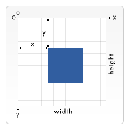

如上图所示，`canvas`元素默认被网格所覆盖。网格中的一个单元相当于`canvas`
元素中的一像素。栅格的起点为左上角（坐标为（0,0））。蓝色方形左上角距离左边（X轴）x像素，距离上边（Y轴）y像素（坐标为（x,y））。

#### 3.3.2.2 绘制矩形

`<canvas>`元素只支持两种形式的图形绘制：矩形和路径（由一系列点连成的线段）。所有其他类型的图形都是通过一条或者多条路径组合而成的。

`canvas`提供了三种方法绘制矩形：

```javascript
fillRect(x, y, width, height)
// 绘制一个填充的矩形
strokeRect(x, y, width, height)
// 绘制一个矩形的边框
clearRect(x, y, width, height)
// 清除指定矩形区域，让清除部分完全透明。
// 上述方法的参数相同。x与y指定了在canvas画布上所绘制的矩形的左上角（相对于原点）的坐标。width和 height设置矩形的尺寸。
```

**示例**

```javascript
function draw() {
  const canvas = document.getElementById("canvas");
  if (canvas.getContext) {
    const ctx = canvas.getContext("2d");
    ctx.fillRect(25, 25, 100, 100);
    // fillRect()函数绘制了一个边长为 100 的黑色正方形
    ctx.clearRect(45, 45, 60, 60);
    // clearRect()函数从正方形的中心开始擦除了一个 60*60 的正方形，
    ctx.strokeRect(50, 50, 50, 50);
    // strokeRect()在清除区域内生成一个 50*50 的正方形边框。
  }
}
```


#### 3.3.2.3 绘制路径

图形的基本元素是路径。路径是通过不同颜色和宽度的线段或曲线相连形成的不同形状的点的集合。一个路径，甚至一个子路径，都是闭合的。使用路径绘制图形需要一些额外的步骤。

```text
1、首先，你需要创建路径起始点。
2、然后你使用画图命令去画出路径。
3、之后你把路径封闭。
4、一旦路径生成，你就能通过描边或填充路径区域来渲染图形。
```

以下是所要用到的函数：

```javascript
beginPath()
// 新建一条路径，生成之后，图形绘制命令被指向到路径上生成路径。
closePath()
// 闭合路径之后图形绘制命令又重新指向到上下文中。
stroke()
// 通过线条来绘制图形轮廓。
fill()
// 通过填充路径的内容区域生成实心的图形。
```

第一步，调用`beginPath()`
。本质上，路径是由很多子路径构成，这些子路径都是在一个列表中，所有的子路径（线、弧形等）构成图形。调用`beginPath()`
后会清空重置列表，然后我们就可以重新绘制新的图形。

**备注：当前路径为空，即调用`beginPath()`之后，或者`canvas`刚建的时候，第一条路径构造命令通常被视为是`moveTo()`
，无论实际上是什么。出于这个原因，你几乎总是要在设置路径之后专门指定你的起始位置。**

第二步，调用函数指定绘制路径。

第三步，闭合路径`closePath()`（非必需）。这个方法会通过绘制一条从当前点到开始点的直线来闭合图形。如果图形是已经闭合了的，即当前点为开始点，该函数什么也不做。

**备注：当你调用`fill()`函数时，所有没有闭合的形状都会自动闭合，所以你不需要调用`closePath()`函数。但是调用`stroke()`
时不会自动闭合。**

##### 3.3.2.3.1 绘制一个三角形

```javascript
function draw() {
  const canvas = document.getElementById("canvas");
  if (canvas.getContext) {
    const ctx = canvas.getContext("2d");
    ctx.beginPath();
    ctx.moveTo(75, 50);
    // 移动到(75, 50)（三角形左顶点）
    ctx.lineTo(100, 75);
    // 移动并连接到(100, 75)（三角形下顶点）
    ctx.lineTo(100, 25);
    // 移动并连接到(100, 25)（三角形上顶点）
    ctx.fill();
    // 填充路径区域生成实心的三角形
  }
}
```


##### 3.3.2.3.2 移动笔触

```javascript
moveTo(x, y)
// 将笔触移动到指定的坐标(x, y)上。
```

当`canvas`初始化或`beginPath()`调用后，通常会使用`moveTo()`函数设置起点。我们也能够使用`moveTo()`
绘制一些不连续的路径。例如下面的笑脸示例。

**注意：`moveTo()`并不能画出任何东西**

```javascript
function draw() {
  const canvas = document.getElementById("canvas");
  if (canvas.getContext) {
    const ctx = canvas.getContext("2d");
    ctx.beginPath();
    ctx.arc(75, 75, 50, 0, Math.PI * 2, true);
    // 绘制脸的圆（逆时针）
    ctx.moveTo(110, 75);
    ctx.arc(75, 75, 35, 0, Math.PI, false);
    // 绘制口的半圆（顺时针）
    ctx.moveTo(65, 65);
    ctx.arc(60, 65, 5, 0, Math.PI * 2, true);
    // 绘制左眼
    ctx.moveTo(95, 65);
    ctx.arc(90, 65, 5, 0, Math.PI * 2, true);
    // 绘制右眼
    ctx.stroke();
    // 绘制路径（不调用的话，并不会真正的绘制图形）
  }
}
```


##### 3.3.2.3.3 线

绘制直线，需要用到的方法`lineTo()`。

```javascript
lineTo(x, y)
// 绘制一条从当前位置到指定(x, y)位置的直线。
```

该方法有两个参数：x和y，代表坐标系中直线结束的点。开始点和之前绘制的路径有关，之前的结束点作为接下来的开始点。开始点也可以通过`moveTo()`
函数改变。

```javascript
function draw() {
  const canvas = document.getElementById("canvas");
  if (canvas.getContext) {
    const ctx = canvas.getContext("2d");
    // 填充三角形
    ctx.beginPath();
    ctx.moveTo(25, 25);
    ctx.lineTo(105, 25);
    ctx.lineTo(25, 105);
    ctx.fill();
    // 描边三角形
    ctx.beginPath();
    ctx.moveTo(125, 125);
    ctx.lineTo(125, 45);
    ctx.lineTo(45, 125);
    ctx.closePath();
    ctx.stroke();
  }
}
```

**注意：因为路径使用填充`fill`时，路径自动闭合。而使用描边`stroke`不会闭合路径。如果不使用`closePath()`
闭合路径，则只绘制了两条线段，并不是一个完整的三角形。**


##### 3.3.2.3.4 圆弧

绘制圆弧或者圆，可以使用`arc()`方法。也可以使用`arcTo()`，不过这个的实现并不是那么的可靠，所以我们这里不作介绍。

```javascript
arc(x, y, radius, startAngle, endAngle, anticlockwise = false)
// 画一个以（x,y）为圆心的以 radius 为半径的圆弧（圆），角度从 startAngle 开始到 endAngle 结束，按照 anticlockwise 给定的方向（默认为顺时针）来生成。
// 该方法有六个参数：
// x,y为绘制圆弧所在圆上的圆心坐标。radius为半径。
// startAngle以及endAngle参数用弧度定义了开始以及结束的弧度。这些都是以 x 轴为基准。
// 参数anticlockwise为一个布尔值。为 true 时，是逆时针方向，否则顺时针方向。

arcTo(x1, y1, x2, y2, radius)
// 根据给定的控制点和半径画一段圆弧，再以直线连接两个控制点。
```

**备注：`arc()`函数中表示角的单位是弧度，不是角度。角度与弧度的`js`表达式：弧度=(`Math.PI/180`) X 角度。**

```javascript
function draw() {
  const canvas = document.getElementById("canvas");
  if (canvas.getContext) {
    const ctx = canvas.getContext("2d");
    for (let i = 0; i < 4; i++) {
      for (let j = 0; j < 3; j++) {
        ctx.beginPath();
        const x = 25 + j * 50; // x 坐标值
        const y = 25 + i * 50; // y 坐标值
        const radius = 20; // 圆弧半径
        const startAngle = 0; // 开始点
        const endAngle = Math.PI + (Math.PI * j) / 2; // 结束点
        const anticlockwise = i % 2 == 0 ? false : true; // 顺时针或逆时针
        ctx.arc(x, y, radius, startAngle, endAngle, anticlockwise);
        if (i > 1) {
          ctx.fill();
        } else {
          ctx.stroke();
        }
      }
    }
  }
}
```


##### 3.3.2.3.5 二次贝塞尔曲线及三次贝塞尔曲线

二次及三次贝塞尔曲线都十分有用，一般用来绘制复杂有规律的图形。

```javascript
quadraticCurveTo(cp1x, cp1y, x, y)
// 绘制二次贝塞尔曲线，cp1x,cp1y 为一个控制点，x,y 为结束点。
bezierCurveTo(cp1x, cp1y, cp2x, cp2y, x, y)
// 绘制三次贝塞尔曲线，cp1x,cp1y为控制点一，cp2x,cp2y为控制点二，x,y为结束点。
```

下图能够很好地描述两者的关系，二次贝塞尔曲线有一个开始点（蓝色）、一个结束点（蓝色）以及一个控制点（红色），而三次贝塞尔曲线有两个控制点。


参数x、y在这两个方法中都是结束点坐标。cp1x,cp1y为坐标中的第一个控制点，cp2x,cp2y为坐标中的第二个控制点。

使用二次以及三次贝塞尔曲线是有一定的难度的，因为不同于像`Adobe Illustrators`
这样的矢量软件，我们所绘制的曲线没有给我们提供直接的视觉反馈。这让绘制复杂的图形变得十分困难。

```javascript
// 使用二次贝塞尔曲线来渲染对话气泡。
function draw() {
  const canvas = document.getElementById("canvas");
  if (canvas.getContext) {
    const ctx = canvas.getContext("2d");
    // 二次贝塞尔曲线
    ctx.beginPath();
    ctx.moveTo(75, 25); // 上中点
    ctx.quadraticCurveTo(25, 25, 25, 62.5); // 左中点
    ctx.quadraticCurveTo(25, 100, 50, 100); // 话柄左上顶点
    ctx.quadraticCurveTo(50, 120, 30, 125); // 话柄左下顶点
    ctx.quadraticCurveTo(60, 120, 65, 100); // 话柄右上顶点
    ctx.quadraticCurveTo(125, 100, 125, 62.5); // 右中点
    ctx.quadraticCurveTo(125, 25, 75, 25); // 上中点
    ctx.stroke();
  }
}
```


```javascript
// 使用三次贝塞尔曲线绘制心形。
function draw() {
  const canvas = document.getElementById("canvas");
  if (canvas.getContext) {
    const ctx = canvas.getContext("2d");
    //三次贝塞尔曲线
    ctx.beginPath();
    ctx.moveTo(75, 40); // 心上中点
    ctx.bezierCurveTo(75, 37, 70, 25, 50, 25); // 左半心上中点
    ctx.bezierCurveTo(20, 25, 20, 62.5, 20, 62.5); // 左半心左中点
    ctx.bezierCurveTo(20, 80, 40, 102, 75, 120); // 心下中点
    ctx.bezierCurveTo(110, 102, 130, 80, 130, 62.5); // 右半心右中点
    ctx.bezierCurveTo(130, 62.5, 130, 25, 100, 25); // 右半心上中点
    ctx.bezierCurveTo(85, 25, 75, 37, 75, 40); // 心上中点
    ctx.fill();
  }
}
```


##### 3.3.2.3.6 矩形

除了直接在画布上绘制矩形的三个方法，还有`rect()`方法，将一个矩形路径增加到当前路径上。

```javascript
rect(x, y, width, height)
// 绘制一个左上角坐标为（x,y），宽高为 width 以及 height 的矩形。
```

当该方法执行的时候，`moveTo()`方法自动设置坐标参数`(0,0)`。也就是说，当前笔触自动重置回默认坐标。

##### 3.3.2.3.7 组合使用

```html
<!-- 因为宽高只有150px所以看不到最外两层矩形的下，右边框 -->
<canvas id="canvas" width="150" height="150"></canvas>
```

```javascript
// 封装的一个用于绘制圆角矩形的函数。
function roundedRect(ctx, x, y, width, height, radius) {
  ctx.beginPath();
  ctx.moveTo(x, y + radius); // 矩形左上直线开始点
  ctx.lineTo(x, y + height - radius);  // 矩形左下直线结束点
  ctx.quadraticCurveTo(x, y + height, x + radius, y + height); // 矩形左下圆弧（到下左直线开始点）
  ctx.lineTo(x + width - radius, y + height); // 矩形下右直线结束点
  ctx.quadraticCurveTo(x + width, y + height, x + width, y + height - radius); // 矩形右下圆弧（到右下直线开始点）
  ctx.lineTo(x + width, y + radius); // 矩形右上直线结束点
  ctx.quadraticCurveTo(x + width, y, x + width - radius, y); // 矩形右上圆弧（到上右直线开始点）
  ctx.lineTo(x + radius, y);  // 矩形上左直线结束点
  ctx.quadraticCurveTo(x, y, x, y + radius); // 矩形左上圆弧（到左上直线开始点）
  ctx.stroke();
}

function draw() {
  const canvas = document.getElementById("canvas");
  if (canvas.getContext) {
    const ctx = canvas.getContext("2d");
    roundedRect(ctx, 12, 12, 150, 150, 15);
    roundedRect(ctx, 19, 19, 150, 150, 9);
    roundedRect(ctx, 53, 53, 49, 33, 10);
    roundedRect(ctx, 53, 119, 49, 16, 6);
    roundedRect(ctx, 135, 53, 49, 33, 10);
    roundedRect(ctx, 135, 119, 25, 49, 10);

    ctx.beginPath();
    ctx.arc(37, 37, 13, Math.PI / 7, -Math.PI / 7, false);
    ctx.lineTo(31, 37);
    ctx.fill(); // 左上小人

    for (let i = 0; i < 8; i++) {
      ctx.fillRect(51 + i * 16, 35, 4, 4); // 第一行小点
    }

    for (i = 0; i < 6; i++) {
      ctx.fillRect(115, 51 + i * 16, 4, 4);  // 第一列小点
    }

    for (i = 0; i < 8; i++) {
      ctx.fillRect(51 + i * 16, 99, 4, 4); // 第二行小点
    }

    ctx.beginPath();
    ctx.moveTo(83, 116);
    ctx.lineTo(83, 102);
    ctx.bezierCurveTo(83, 94, 89, 88, 97, 88);
    ctx.bezierCurveTo(105, 88, 111, 94, 111, 102);
    ctx.lineTo(111, 116);
    ctx.lineTo(106.333, 111.333);
    ctx.lineTo(101.666, 116);
    ctx.lineTo(97, 111.333);
    ctx.lineTo(92.333, 116);
    ctx.lineTo(87.666, 111.333);
    ctx.lineTo(83, 116);
    ctx.fill(); // 第二行小人整体

    ctx.fillStyle = "white";
    ctx.beginPath();
    ctx.moveTo(91, 96);
    ctx.bezierCurveTo(88, 96, 87, 99, 87, 101);
    ctx.bezierCurveTo(87, 103, 88, 106, 91, 106);
    ctx.bezierCurveTo(94, 106, 95, 103, 95, 101);
    ctx.bezierCurveTo(95, 99, 94, 96, 91, 96);
    ctx.moveTo(103, 96);
    ctx.bezierCurveTo(100, 96, 99, 99, 99, 101);
    ctx.bezierCurveTo(99, 103, 100, 106, 103, 106);
    ctx.bezierCurveTo(106, 106, 107, 103, 107, 101);
    ctx.bezierCurveTo(107, 99, 106, 96, 103, 96);
    ctx.fill(); // 第二行小人眼球

    ctx.fillStyle = "black";
    ctx.beginPath();
    ctx.arc(101, 102, 2, 0, Math.PI * 2, true);
    ctx.fill(); // 第二行小人黑眼仁

    ctx.beginPath();
    ctx.arc(89, 102, 2, 0, Math.PI * 2, true);
    ctx.fill(); // 第二行小人黑眼仁
  }
}
```

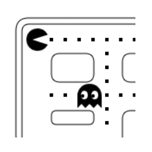

#### 3.3.2.4 Path2D对象

根据之前例子，你可以用一系列的路径和绘画命令将对象画在画布上。为了简化代码和提高性能，`Path2D`
对象已可以在较新版本的浏览器中使用，用来缓存或记录绘画命令，这样你将能快速地回顾路径。

`Path2D()`会返回一个新初始化的`Path2D`对象（可能将某一个路径作为变量——创建一个它的副本，或将一个包含`SVG path`
数据的字符串作为变量）。

```javascript
new Path2D(); // 空的 Path 对象
new Path2D(path); // 克隆 Path 对象
new Path2D(d); // 从 SVG 建立 Path 对象
```

所有的路径方法比如`moveTo`,`rect`,`arc`或`quadraticCurveTo`等，如我们前面见过的，都可以在`Path2D`中使用。

`Path2D API`添加了`addPath`作为将`path`结合起来的方法。当你想要从几个元素中来创建对象时，可以使用如下代码：

```javascript
Path2D.addPath(path, transform)
// 添加了一条路径到当前路径（可能添加了一个变换矩阵）。
```

**示例**

随着`Path2D API`的产生，可以使用带路径参数（使用`Path2D`对象而不是当前路径）的`stroke`和`fill`方法将对象画在画布上。

```javascript
function draw() {
  const canvas = document.getElementById("canvas");
  if (canvas.getContext) {
    const ctx = canvas.getContext("2d");
    const rectangle = new Path2D();
    rectangle.rect(10, 10, 50, 50);
    const circle = new Path2D();
    circle.moveTo(125, 35);
    circle.arc(100, 35, 25, 0, 2 * Math.PI);
    ctx.stroke(rectangle);
    ctx.fill(circle);
  }
}
```


使用`SVG paths`

新的`Path2D API`可以使用`SVG path data`来初始化`canvas`上的路径。这意味着你在获取路径时可以用`SVG`或`canvas`的方式来重用它们。

这条路径将先移动到`(10,10)`位置`(M10 10)`然后再水平移动`80`个单位`(h 80)`，然后下移`80`个单位`(v 80)`，接着左移`80`
个单位`(h -80)`，再回到起点处`(Z)`。你可以在Path2D constructor 查看这个例子。

```javascript
const canvas = document.getElementById("canvas");
const ctx = canvas.getContext("2d");
const p = new Path2D("M10 10 h 80 v 80 h -80 Z");
ctx.fill(p);
```

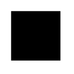

### 3.3.3 应用样式和色彩

#### 3.3.3.1 色彩

```javascript
fillStyle = color
// 设置图形的填充颜色。
strokeStyle = color
// 设置图形轮廓的颜色。
// color可以是表示CSS颜色值的字符串，渐变对象或者图案对象。默认情况下，线条和填充颜色都是黑色（即#000000）。
```

**备注：一旦你设置了`strokeStyle`或者`fillStyle`的值，那么这个新值就会成为新绘制的图形的默认值。如果你要给每个图形上不同的颜色，你需要重新设置
`fillStyle`或`strokeStyle`的值。**

```javascript
// 这些 fillStyle 的值均为橙色
ctx.fillStyle = "orange";
ctx.fillStyle = "#FFA500";
ctx.fillStyle = "rgb(255,165,0)";
ctx.fillStyle = "rgba(255,165,0,1)";
```

**`fillStyle`示例**

```javascript
function draw() {
  // 绘制方格颜色阵列
  const ctx = document.getElementById("canvas").getContext("2d");
  for (let i = 0; i < 6; i++) {
    for (let j = 0; j < 6; j++) {
      ctx.fillStyle = `rgb(${Math.floor(255 - 42.5 * i)},
        ${Math.floor(255 - 42.5 * j)}, 0)`;
      ctx.fillRect(j * 25, i * 25, 25, 25);
    }
  }
}
```

**`strokeStyle`示例**

```javascript
function draw() {
  // 绘制方格颜色阵列
  const ctx = document.getElementById("canvas").getContext("2d");
  for (let i = 0; i < 6; i++) {
    for (let j = 0; j < 6; j++) {
      ctx.fillStyle = `rgb(${Math.floor(255 - 42.5 * i)},
        ${Math.floor(255 - 42.5 * j)}, 0)`;
      ctx.arc(12.5 + j * 25, 12.5 + i * 25, 10, 0, Math.PI * 2, true);
      ctx.stroke();
    }
  }
}
```

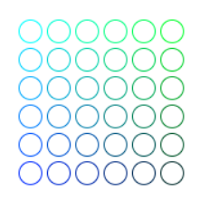

#### 3.3.3.2 透明度

除了可以绘制实色图形，我们还可以用`canvas`来绘制半透明的图形。通过设置`globalAlpha`属性或者使用一个半透明颜色作为轮廓或填充的样式。

```javascript
globalAlpha = transparencyValue
// 这个属性影响到 canvas 里所有图形的透明度，有效的值范围是 0.0（完全透明）到 1.0（完全不透明），默认是 1.0。
```

`globalAlpha`属性在需要绘制大量拥有相同透明度的图形时候相当高效。不过，我认为下面的方法可操作性更强一点。

因为`strokeStyle`和`fillStyle`属性接受符合`CSS3`规范的颜色值，那我们可以用下面的写法来设置具有透明度的颜色。

```javascript
// 指定透明颜色，用于描边和填充样式
ctx.strokeStyle = "rgba(255,0,0,0.5)";
ctx.fillStyle = "rgba(255,0,0,0.5)";
```

**`globalAlpha`示例**

```javascript
function draw() {
  const ctx = document.getElementById("canvas").getContext("2d");
  // 画背景
  ctx.fillStyle = "#FD0";
  ctx.fillRect(0, 0, 75, 75);
  ctx.fillStyle = "#6C0";
  ctx.fillRect(75, 0, 75, 75);
  ctx.fillStyle = "#09F";
  ctx.fillRect(0, 75, 75, 75);
  ctx.fillStyle = "#F30";
  ctx.fillRect(75, 75, 75, 75);
  ctx.fillStyle = "#FFF";
  // 设置透明度值
  ctx.globalAlpha = 0.2;
  // 画半透明圆
  for (let i = 0; i < 7; i++) {
    ctx.beginPath();
    ctx.arc(75, 75, 10 + 10 * i, 0, Math.PI * 2, true);
    ctx.fill();
  }
}
```


**`rgba`示例**

```javascript
function draw() {
  const ctx = document.getElementById("canvas").getContext("2d");
  // 画背景
  ctx.fillStyle = "rgb(255,221,0)";
  ctx.fillRect(0, 0, 150, 37.5);
  ctx.fillStyle = "rgb(102,204,0)";
  ctx.fillRect(0, 37.5, 150, 37.5);
  ctx.fillStyle = "rgb(0,153,255)";
  ctx.fillRect(0, 75, 150, 37.5);
  ctx.fillStyle = "rgb(255,51,0)";
  ctx.fillRect(0, 112.5, 150, 37.5);
  // 画半透明矩形
  for (let i = 0; i < 10; i++) {
    ctx.fillStyle = "rgba(255,255,255," + (i + 1) / 10 + ")";
    for (let j = 0; j < 4; j++) {
      ctx.fillRect(5 + i * 14, 5 + j * 37.5, 14, 27.5);
    }
  }
}
```


#### 3.3.3.3 线型

可以通过一系列属性来设置线的样式。

```javascript
lineWidth = value
// 设置线条宽度。
lineCap = type
// 设置线条末端样式。
lineJoin = type
// 设定线条与线条间接合处的样式。
miterLimit = value
// 限制当两条线相交时交接处最大长度；所谓交接处长度（斜接长度）是指线条交接处内角顶点到外角顶点的长度。
getLineDash()
// 返回一个包含当前虚线样式，长度为非负偶数的数组。
setLineDash(segments)
// 设置当前虚线样式。例如：[10, 20]
lineDashOffset = value
// 设置虚线样式的起始偏移量。
```

**`lineWidth`示例**

设置当前绘线的粗细。属性值必须为正数。默认值是`1.0`。

线宽是指给定路径的中心到两边的粗细。**换句话说就是在路径的两边各绘制线宽的一半。**
因为画布的坐标并不和像素直接对应，当需要获得精确的水平或垂直线的时候要特别注意。

下例中，用递增的宽度绘制了`10`条直线。最左边的线宽`1.0`单位。**所有宽度为奇数的线并不能精确呈现，这就是因为路径的定位问题。**

```javascript
function draw() {
  const ctx = document.getElementById("canvas").getContext("2d");
  for (let i = 0; i < 10; i++) {
    ctx.lineWidth = 1 + i;
    ctx.beginPath();
    ctx.moveTo(5 + i * 14, 5);
    ctx.lineTo(5 + i * 14, 140);
    ctx.stroke();
  }
}
```

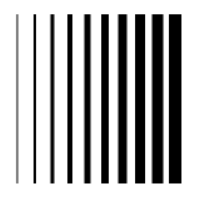

**想要获得精确的线条，必须对线条是如何描绘出来的有所理解。**

如下图，用网格代表`canvas`的坐标格，每一格对应屏幕上一个像素点。如图一所示，填充了`(2,1)`至`(5,5)`
的矩形，整个区域的边界刚好落在像素边缘上，这样就可以得到有着清晰边缘的矩形。

如果你想绘制一条从`(3,1)`到`(3,5)`，宽为`1.0`的线条，其效果如图二所示。
实际填充区域（深蓝色部分）会在路径两边各延伸半像素。而这半个像素又是以近似的方式进行渲染，这意味着那些像素只是部分着色，结果就是以实际笔触颜色一半色调的颜色来填充整个区域（浅蓝和深蓝的部分）。这就是上例中为何宽度为`1.0`
的线并不准确的原因。

要解决这个问题，必须对路径施加更精确地控制。已知宽为`1.0`的线条会在路径两边各延伸半像素，按图三的方式绘制从`(3.5,1)`
到`(3.5,5)`，宽为`1.0`的线条，其边缘正好落在像素边界，填充出来就是准确的宽为`1.0`的线条。


**备注： 图三中，其`Y`坐标刚好落在网格线上。若非如此则会出现渲染半个像素的情况（注意：这种现象受到当前`lineCap`（默认为`butt`
）的影响；将`lineCap`设置为`square`，可以得到宽为奇数宽度一半像素的笔画；因此，端点的外轮廓会自动延伸并完全覆盖整个像素格）。**

**注意，只有起点和终点受此影响：若路径使用`closePath()`封闭，它是没有起点和终点的；
其他情况下，路径上的所有端点都与上一个点相连，下一段路径使用当前的`lineJoin`设置（默认为`miter`
），若连接处是水平/垂直及相交的情况，会导致连接处的外轮廓根据相交点自动延伸，因此渲染出的路径轮廓会覆盖整个像素格。**

对于宽为偶数的线条，路径两边的像素数都是整数，那么你想要其路径是落在像素点之间（比如从`(3,1)`到`(3,5)`
）而不是在像素点的中间。同样，注意图三的垂直线条，其`Y`坐标刚好落在网格线上。若非如此，端点同样会出现渲染半个像素的情况。

**尽早地注意到像素网格与路径位置之间的关系，可以尽可能保证图形在经过缩放或者其他变形后都能保持较好的视觉效果：宽为`1.0`
的垂线在放大`2`倍后，会变成清晰的宽为`2.0`并且坐标刚好落在网格线上，不会出现渲染半个像素的情况。**

**`lineCap`示例**

`lineCap`决定了线段端点显示的样子。属性值如下：

* `butt`（默认值）：线条末端呈正方形。
* `round`：线条末端呈圆形的。
* `square`：线条末端呈方形，通过添加一个宽与线宽相同且高为线宽一半的盒子实现。

```javascript
function draw() {
  const ctx = document.getElementById("canvas").getContext("2d");
  const lineCap = ["butt", "round", "square"];
  // 创建路径
  ctx.strokeStyle = "#09f";
  ctx.beginPath();
  ctx.moveTo(10, 10);
  ctx.lineTo(140, 10);
  ctx.moveTo(10, 140);
  ctx.lineTo(140, 140);
  ctx.stroke();
  // 画线条
  ctx.strokeStyle = "black";
  for (let i = 0; i < lineCap.length; i++) {
    ctx.lineWidth = 15;
    ctx.lineCap = lineCap[i];
    ctx.beginPath();
    ctx.moveTo(25 + i * 50, 10);
    ctx.lineTo(25 + i * 50, 140);
    ctx.stroke();
  }
}
```

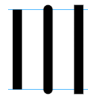

**`lineJoin`示例**

`lineJoin`决定了两线段连接处所显示的样子。属性值如下：

* `round`：通过填充一个额外的，圆心在相连部分末端的扇形，绘制拐角的形状。圆角的半径是线段的宽度。
* `bevel`：在相连部分的末端填充一个额外的以三角形为底的区域，每个部分都有各自独立的矩形拐角。
* `miter`（默认值）：通过延伸相连部分的外边缘，使其相交于一点，形成一个额外的菱形区域。这个设置受到`miterLimit`属性的影响。

```javascript
function draw() {
  const ctx = document.getElementById("canvas").getContext("2d");
  const lineJoin = ["round", "bevel", "miter"];
  ctx.lineWidth = 10;
  for (let i = 0; i < lineJoin.length; i++) {
    ctx.lineJoin = lineJoin[i];
    ctx.beginPath();
    ctx.moveTo(-5, 5 + i * 40);
    ctx.lineTo(35, 45 + i * 40);
    ctx.lineTo(75, 5 + i * 40);
    ctx.lineTo(115, 45 + i * 40);
    ctx.lineTo(155, 5 + i * 40);
    ctx.stroke();
  }
}
```

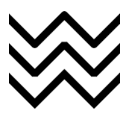

**`miterLimit`示例**

如上例所示，使用`miter`效果，线段的外侧边缘会被延伸交汇于一点上。线段之间夹角比较大时，交点不会太远，但随着夹角变小，交点距离会呈指数级增大。

`miterLimit`属性就是用来设定外延交点与连接点的最大距离，如果交点距离大于此值，连接效果会变成了`bevel`
。**注意，最大斜接长度（即交点距离）是当前坐标系测量线宽与此`miterLimit`属性值（`canvas`默认为`10.0`）的乘积，所以`miterLimit`
可以单独设置，不受显示比例改变或任何仿射变换的影响：它只影响线条边缘的有效绘制形状。**

更准确的说，斜接限定值`miterLimit`是延伸长度与线宽一半的最大允许比值。它也可以被等效定义为线条内外连接点距离`miterLength`
与线宽`lineWidth`的最大允许比值（因为路径点是内外连接点的中点）。这等同于相交线段最小内夹角`θ`
的一半的余割值，小于此角度的斜接将不会被渲染，而仅渲染斜边连接：

* `miterLimit = max miterLength / lineWidth = 1 / sin ( min θ / 2 )`
* 斜接限定值默认为`10.0`，这将会去除所有小于大约`11`度的斜接（`sin(5.75°) ≈ 0.100188`）。
* 斜接限定值为`√2 ≈ 1.4142136`（四舍五入）时，将去除所有锐角的斜接，仅保留钝角或直角。
* `1.0` 是合法的斜接限定值，但这会去除所有斜接。
* 小于`1.0`的值不是合法的斜接限定值。


```javascript
// 仅包含javascript代码，详见line.html文件
function draw() {
  const ctx = document.getElementById("canvas").getContext("2d");
  // 清空画布
  ctx.clearRect(0, 0, 150, 150);
  // 绘制参考线
  ctx.strokeStyle = "#09f";
  ctx.lineWidth = 2;
  ctx.strokeRect(-5, 50, 160, 50);
  // 设置线条样式
  ctx.strokeStyle = "#000";
  ctx.lineWidth = 10;
  // 检查输入
  if (document.getElementById("miterLimit").value.match(/\d+(\.\d+)?/)) {
    ctx.miterLimit = parseFloat(document.getElementById("miterLimit").value);
  } else {
    alert("Value must be a positive number");
  }
  // 绘制线条
  ctx.beginPath();
  ctx.moveTo(0, 100);
  for (let i = 0; i < 24; i++) {
    const dy = i % 2 === 0 ? 25 : -25;
    ctx.lineTo(Math.pow(i, 1.5) * 2, 75 + dy);
  }
  ctx.stroke();
  return false;
}
```

在此示例中，当你设定`miterLimit`的值小于`4.2`
时，图形可见部分的边角不会延伸相交，而是在蓝色线条边呈现斜边连接效果；当`miterLimit`的值大于
`10.0` 时，此例中大部分的边角都会在远离蓝线的位置相交，且从左至右，距离随着夹角的增大而减小；而介于上述值之间的值所呈现的效果，也介于两者之间。


**虚线示例**

使用`setLineDash`方法和`lineDashOffset`属性来制定虚线样式。`setLineDash`
方法接受一个数组，来指定线段与间隙的交替；`lineDashOffset`属性设置起始偏移量。

在这个例子中，我们创建了一个蚂蚁线的效果。它往往应用在计算机图形程序选区工具动效中。它可以帮助用户通过动画的边界来区分图像背景选区边框。

```javascript
const ctx = document.getElementById("canvas").getContext("2d");
const offset = 0;

function draw() {
  ctx.clearRect(0, 0, canvas.width, canvas.height);
  ctx.setLineDash([4, 2]);
  ctx.lineDashOffset = -offset;
  ctx.strokeRect(10, 10, 100, 100);
}

function march() {
  offset++;
  if (offset > 16) {
    offset = 0;
  }
  draw();
  setTimeout(march, 20);
}

march();
```


#### 3.3.3.4 渐变

可以用线性或径向渐变来填充或描边。新建一个`canvasGradient`对象，并且赋给图形的`fillStyle`或`strokeStyle`属性。

```javascript
createLinearGradient(x1, y1, x2, y2)
// 接受 4 个参数，表示渐变的起点 (x1,y1) 与终点 (x2,y2)。
createRadialGradient(x1, y1, r1, x2, y2, r2)
// 接受 6 个参数，前三个定义一个以 (x1,y1) 为原点，半径为 r1 的圆，后三个参数则定义另一个以 (x2,y2) 为原点，半径为 r2 的圆。
```

创建出`canvasGradient`对象后，我们就可以用`addColorStop`方法给它上色了。

```javascript
gradient.addColorStop(position, color)
// 接受 2 个参数，position 参数必须是一个 0.0 与 1.0 之间的数值，表示渐变中颜色所在的相对位置。color 参数必须是一个有效的 CSS 颜色值（如 #FFF，rgba(0,0,0,1)等）。
```

你可以根据需要添加任意多个色标（`color stops`）。

```javascript
// 线性黑白渐变
const lineargradient = ctx.createLinearGradient(0, 0, 150, 150);
lineargradient.addColorStop(0, "white");
lineargradient.addColorStop(1, "black");
```

**`createLinearGradient`示例**

本例涉及了两种渐变。第一种是背景色渐变，不难发现，给同一位置色标设置两种颜色可以实现突变的效果，就像本例中从白色到绿色的突变。一般情况下，色标的定义顺序是无所谓的，但是色标位置重复时，顺序就变得非常重要了。所以，保持色标定义顺序和它理想的顺序一致，结果应该没什么大问题。第二种渐变，并不是从`0.0`
位置开始定义色标，因为那并不是那么严格的。在`0.5`
处设置黑色色标，渐变会默认认为从起点到色标之间都是黑色。可以发现，`strokeStyle`和`fillStyle`属性都可以接受`canvasGradient`
对象。

```javascript
function draw() {
  const ctx = document.getElementById("canvas").getContext("2d");
  // 创建渐变对象
  const lingrad = ctx.createLinearGradient(0, 0, 0, 150);
  lingrad.addColorStop(0, "#00ABEB");
  lingrad.addColorStop(0.5, "#fff");
  lingrad.addColorStop(0.5, "#26C000");
  lingrad.addColorStop(1, "#fff");
  const lingrad2 = ctx.createLinearGradient(0, 50, 0, 95);
  lingrad2.addColorStop(0.5, "#000");
  lingrad2.addColorStop(1, "rgba(0,0,0,0)");
  // 指定填充和笔划渐变样式
  ctx.fillStyle = lingrad;
  ctx.strokeStyle = lingrad2;
  // 绘制图形
  ctx.fillRect(10, 10, 130, 130);
  ctx.strokeRect(50, 50, 50, 50);
}
```


**`createRadialGradient`示例**

本例定义了`4`个不同的径向渐变。由于可以控制渐变的起始与结束点，所以我们可以实现一些比经典的径向渐变更为复杂的效果（经典的径向渐变是只有一个中心点，简单地由中心点向外围的圆形扩张）。

```javascript
function draw() {
  const ctx = document.getElementById("canvas").getContext("2d");
  // 创建渐变
  const radgrad = ctx.createRadialGradient(45, 45, 10, 52, 50, 30);
  radgrad.addColorStop(0, "#A7D30C");
  radgrad.addColorStop(0.9, "#019F62");
  radgrad.addColorStop(1, "rgba(1,159,98,0)");
  const radgrad2 = ctx.createRadialGradient(105, 105, 20, 112, 120, 50);
  radgrad2.addColorStop(0, "#FF5F98");
  radgrad2.addColorStop(0.75, "#FF0188");
  radgrad2.addColorStop(1, "rgba(255,1,136,0)");
  const radgrad3 = ctx.createRadialGradient(95, 15, 15, 102, 20, 40);
  radgrad3.addColorStop(0, "#00C9FF");
  radgrad3.addColorStop(0.8, "#00B5E2");
  radgrad3.addColorStop(1, "rgba(0,201,255,0)");
  const radgrad4 = ctx.createRadialGradient(0, 150, 50, 0, 140, 90);
  radgrad4.addColorStop(0, "#F4F201");
  radgrad4.addColorStop(0.8, "#E4C700");
  radgrad4.addColorStop(1, "rgba(228,199,0,0)");
  // 绘制图形
  ctx.fillStyle = radgrad4;
  ctx.fillRect(0, 0, 150, 150);
  ctx.fillStyle = radgrad3;
  ctx.fillRect(0, 0, 150, 150);
  ctx.fillStyle = radgrad2;
  ctx.fillRect(0, 0, 150, 150);
  ctx.fillStyle = radgrad;
  ctx.fillRect(0, 0, 150, 150);
}
```


#### 3.3.3.5 图案样式（Patterns）

在`3.3.2.3.7 组合使用`中，使用循环来实现图案的效果。`createPattern`也可以实现这种效果。

```javascript
createPattern(image, type)
// 接受两个参数。Image 可以是一个 Image 或 canvas 对象。Type 为以下枚举值：repeat，repeat-x，repeat-y 和 no-repeat。
```

**备注：用`canvas`对象作为`Image`参数在`Firefox 1.5 (Gecko 1.8)`中是无效的。**

图案的应用跟渐变很类似的，创建出一个`pattern`之后，赋给`fillStyle`或`strokeStyle`属性即可。

```javascript
const img = new Image();
img.src = "someimage.png";
const ptrn = ctx.createPattern(img, "repeat");
```

**备注：与`drawImage`不同，你需要确认`image`对象已经装载完毕，否则图案可能效果不对的。**

**`createPattern`示例**

```javascript
// 详见patterns.html文件
const ctx = document.getElementById("canvas").getContext("2d");
// 创建一个 image 对象
const img = new Image();
img.src = "./1.png";
img.onload = function () {
  // 确保设置图案样式之前图像已经装载完毕
  ctx.fillStyle = ctx.createPattern(img, "repeat");
  ctx.fillRect(0, 0, 150, 150);
};
```

#### 3.3.3.6 阴影

```javascript
shadowOffsetX = float
// shadowOffsetX 和 shadowOffsetY 用来设定阴影在 X 和 Y 轴的延伸距离，它们是不受变换矩阵所影响的。负值表示阴影会往上或左延伸，正值则表示会往下或右延伸，它们默认都为 0。
shadowOffsetY = float
// shadowOffsetX 和 shadowOffsetY 用来设定阴影在 X 和 Y 轴的延伸距离，它们是不受变换矩阵所影响的。负值表示阴影会往上或左延伸，正值则表示会往下或右延伸，它们默认都为 0。
shadowBlur = float
// shadowBlur 用于设定阴影的模糊程度，其数值并不跟像素数量挂钩，也不受变换矩阵的影响，默认为 0。
shadowColor = color
// shadowColor 是标准的 CSS 颜色值，用于设定阴影颜色效果，默认是全透明的黑色。
```

**文字阴影示例**

```javascript
```


**``示例**

```javascript
function draw() {
  const ctx = document.getElementById("canvas").getContext("2d");
  ctx.shadowOffsetX = 2;
  ctx.shadowOffsetY = 2;
  ctx.shadowBlur = 2;
  ctx.shadowColor = "rgba(0, 0, 0, 0.5)";
  ctx.font = "20px Times New Roman";
  ctx.fillStyle = "Black";
  ctx.fillText("Sample String", 5, 30);
}
```


#### 3.3.3.7 Canvas填充规则

参考：https://www.zhangxinxu.com/wordpress/2018/10/nonzero-evenodd-fill-mode-rule/

当使用`fill`，`clip`或`isPointinPath`时，可以指定填充规则。填充规则根据某处在路径内/外侧情况来决定该处是否需要填充，对于路径与自己相交或路径嵌套的场景是非常实用的。

* `nonzero`（默认值）：非零规则`non-zero winding rule`。起始值为`0`，射线会和路径相交，形成一个转向的箭头。若为顺时针方向则`+1`
  ，若为逆时针方向则`-1`。若总计数值非`0`，则认为是路径内部（填充）；若总计数值为`0`，则认为是路径外部（不填充）。
* `evenodd`：奇偶规则`even-odd winding rule`。起始值为`0`，射线会和路径相交，每交叉一条路径，计数就`+1`
  。若总计数值为奇数，则认为是路径内部（填充）；若为偶数，则认为是路径外部（不填充）。

**注意：`nonzero`规则和`evenodd`规则统计的东西不一样，`nonzero`是计算顺时针逆时针数量，`evenodd`是交叉路径数量。**

**`evenodd`示例**

```javascript
function draw() {
  const ctx = document.getElementById("canvas").getContext("2d");
  ctx.beginPath();
  ctx.arc(50, 50, 30, 0, Math.PI * 2, true);
  ctx.arc(50, 50, 15, 0, Math.PI * 2, true);
  ctx.fill("evenodd");
}
```


### 3.3.4 绘制文本

#### 3.3.4.1 绘制文本

canvas 提供了两种方法来渲染文本：

```javascript
fillText(text, x, y, maxWidth)
// 在指定的 (x,y) 位置填充指定的文本，绘制的最大宽度是可选的。
strokeText(text, x, y, maxWidth)
// 在指定的 (x,y) 位置绘制文本边框，绘制的最大宽度是可选的。
```

**填充文本示例**

```javascript
function draw() {
  const ctx = document.getElementById("canvas").getContext("2d");
  ctx.font = "48px serif";
  ctx.fillText("Hello world", 10, 50);
}
```


**文本边框示例**

```javascript
function draw() {
  const ctx = document.getElementById("canvas").getContext("2d");
  ctx.font = "48px serif";
  ctx.strokeText("Hello world", 10, 50);
}
```


#### 3.3.4.2 有样式的文本

```javascript
font = value
// 当前我们用来绘制文本的样式。这个字符串使用和 CSS font 属性相同的语法。默认的字体是 10px sans-serif。
textAlign = value
// 文本对齐选项。可选的值包括：start, end, left, right or center. 默认值是 start。
textBaseline = value
// 基线对齐选项。可选的值包括：top, hanging, middle, alphabetic, ideographic, bottom。默认值是 alphabetic。
direction = value
// 文本方向。可能的值包括：ltr, rtl, inherit。默认值是 inherit。
```

下图展示了`textBaseline`属性支持的不同基线的情况：


**`textBaseline`示例**

```javascript
// 仅包含javascript代码，详见text.html文件
ctx.font = "48px serif";
ctx.textBaseline = "hanging";
ctx.strokeText("Hello world", 0, 100);
```


#### 3.3.4.3 预测量文本宽度

```javascript
measureText()
// 将返回一个 TextMetrics 对象的宽度、所在像素，这些体现文本特性的属性。
```

**`measureText`示例**

```javascript
function draw() {
  const ctx = document.getElementById("canvas").getContext("2d");
  const text = ctx.measureText("foo");
  // 测量 foo 的文本宽度
  text.width;
  // 15.259994506835938
}
```

#### 3.3.4.4 Geoko 特性说明

在`Geoko`（`Firefox`，`Firefox OS`及基于`Mozilla`的应用的渲染引擎）中，曾有一些版本较早的`API`实现了在`canvas`
上对文本作画的功能，但它们现在已不再使用。

### 3.3.5 使用图像

`canvas`更有意思的一项特性就是图像操作能力。可以用于动态的图像合成、图形的背景以及游戏界面（`Sprites`
）等。浏览器支持的任意格式的外部图片都可以使用（`PNG`、`GIF`或`JPEG`）。甚至可以将同一个页面中其他`canvas`生成的图片作为图片源。

引入图像到`canvas`里需要以下两个基本操作：

1、获取一个`HTMLImageElement`对象或一个`canvas`对象作为图片源，也可以通过提供一个`URL`的方式来使用图片。
2、使用`drawImage()`函数将图片绘制到画布上

#### 3.3.5.1 获得需要绘制的图片

`canvas`的`API`可以使用以下类型中的一种作为图片源：

```javascript
HTMLImageElement
// 这些图片是由 Image() 函数构造出来的，或是  元素
HTMLVideoElement
// 用一个 HTML 的 <video> 元素作为你的图片源，可以从视频中抓取当前帧作为一个图像
HTMLCanvasElement
// 可以使用另一个 <canvas> 元素作为你的图片源。
ImageBitmap
// 这是一个高性能的位图，可以低延迟地绘制，它可以从上述的所有源以及其他几种源中生成。
```

**这些源统一由`CanvasImageSource`类型来引用。**

**使用相同页面内的图片**

* `document.images`集合
* `document.getElementsByTagName()`方法
* 如果你知道使用的图片`ID`，你可以用`document.getElementById()`获得这个图片

**使用其他域名下的图片**

在`HTMLImageElement`上使用`crossOrigin`属性，你可以请求加载其他域名上的图片。如果图片的服务器允许跨域访问这个图片，那么你可以使用这个图片而不污染
`canvas`，否则，使用这个图片将会污染`canvas`。

**使用其他`canvas`元素**

和使用相同页面内的图片类似，用`document.getElementsByTagName`或`document.getElementById`方法来获取其他`canvas`
元素。但你引入的应该是已经准备好的`canvas`。

一个常见的应用就是将第二个`canvas`作为另一个大的`canvas`的缩略图。

**由零开始创建图像**

使用脚本创建一个新的`HTMLImageElement`对象。可以使用`Image()`构造函数来实现。

```javascript
const img = new Image();
// 创建一个 img 元素
img.src = "myImage.png";
// 设置图片源地址
```

当脚本执行后，图片开始装载。

若调用`drawImage`时，图片还没加载完，那么就不会有效果（一些旧的浏览器中可能会抛出异常）。因此需要用`load`事件确保使用的图片加载完成：

```javascript
const img = new Image();
// 创建一个 img 元素
img.onload = function () {
  // 执行 drawImage 语句
};
img.src = "myImage.png";
// 设置图片源地址
```

**通过`data:url`方式嵌入图像**

我们还可以通过`data:url`方式来引用图像。`Data urls`允许用一串`Base64`编码的字符串的方式来定义一个图片。

```javascript
img.src = "data:image/gif;base64,R0lGODlhCwALAIAAAAAA3pn/ZiH5BAEAAAEALAAAAAALAAsAAAIUhA+hkcuO4lmNVindo7qyrIXiGBYAOw==";
```

优点：

* 图片即时可用，不需要请求服务器。
* 可以将`CSS`，`JavaScript`，`HTML`和图片全部封装在一起，迁移起来十分方便

缺点：

* 图像没法缓存，图片大的话内嵌的`url`数据会非常长：

**使用视频帧**

你还可以使用`<video>`中的视频帧（即便视频是不可见的）。例如，如果你有一个`ID`为`myvideo`的`<video>`元素，你可以这样做：

```javascript
function getMyVideo() {
  const canvas = document.getElementById("canvas");
  if (canvas.getContext) {
    const ctx = canvas.getContext("2d");
    return document.getElementById("myvideo");
  }
}
```

#### 3.3.5.2 绘制图片

一旦获得了图片源对象，我们就可以使用`drawImage`方法将它渲染到`canvas`里。`drawImage`方法有三种形态，下面是最基础的一种。

```javascript
drawImage(image, x, y)
// 其中 image 是 image 或者 canvas 对象，x 和 y 是其在目标 canvas 里的起始坐标。
// 备注：SVG 图像必须在 <svg> 根指定元素的宽度和高度。
```

**`drawImage`线图示例**

```javascript
// 仅包含javascript代码，详见drawImage.html文件
function draw() {
  const ctx = document.getElementById("canvas").getContext("2d");
  const img = new Image();
  img.onload = function () {
    ctx.drawImage(img, 0, 0);
    ctx.beginPath();
    ctx.moveTo(30, 96);
    ctx.lineTo(70, 66);
    ctx.lineTo(103, 76);
    ctx.lineTo(170, 15);
    ctx.stroke();
  };
  img.src = "./1.png";
}
```

#### 3.3.5.3 缩放

`drawImage`方法的一种重载用法，增加了两个用于控制图像在`canvas`中缩放的参数。

```javascript
drawImage(image, x, y, width, height)
// 这个用法多了 2 个参数：width 和 height，这两个参数用来控制 当向 canvas 画入时应该缩放的大小
```

**`drawImage`平铺图像示例**

此例中，将一张图片作为背景在`canvas`中重复平铺。通过循环铺开经过缩放的图片。图像大小被缩放至原来的六分之一`50x38px`。

**备注： 图像可能会因为大幅度的缩放而变得模糊。如果图像里面有文字，最好还是不要进行缩放，因为文字缩放后很可能就无法辨认了。**

```javascript
function draw() {
  const ctx = document.getElementById("canvas").getContext("2d");
  const img = new Image();
  img.onload = () => {
    for (let i = 0; i < 4; i++) {
      for (let j = 0; j < 3; j++) {
        ctx.drawImage(img, j * 50, i * 38, 50, 38);
      }
    }
  };
  img.src = "https://mdn.github.io/shared-assets/images/examples/rhino.jpg";
}

draw();
```


#### 3.3.5.4 切片

`drawImage`方法的另外一种重载用法，有`8`个用于控制做切片显示的新参数。

```javascript
drawImage(image, sx, sy, sWidth, sHeight, dx, dy, dWidth, dHeight)
// 第一个参数，image 是 image 或者 canvas 对象。
// 新的 8 个参数参考下图图解，前 4 个是定义图片源的切片位置和大小，后 4 个则是定义切片的目标显示位置和大小。
```


切片是个做图像合成的强大工具。假设有一张包含了所有元素的图像，那么你可以用这个方法来合成一个完整图像。例如，你想画一张图表，而手上有一个包含所有必需的文字的
`PNG`文件，那么你可以根据实际数据的需要来改变最终显示的图表。**这方法的另一个好处就是你不需要单独装载每一个图像。**

**`drawImage`相框示例**

```javascript
// 仅包含javascript代码，详见drawImage-album.html文件
async function draw() {
  // 等待所有图片的加载。
  await Promise.all(Array.from(document.images).map((image) => new Promise((resolve) => image.addEventListener("load", resolve))));
  const canvas = document.getElementById("canvas");
  const ctx = canvas.getContext("2d");
  // 绘制切片
  ctx.drawImage(document.getElementById("source"), 33, 71, 104, 124, 21, 20, 87, 104,);
  // 绘制相框
  ctx.drawImage(document.getElementById("frame"), 0, 0);
}

draw();
```


#### 3.3.5.5 画廊示例

当页面及图片加载好后，为每张**画**创建`canvas`对象，加上相框，然后绘制到画廊中去。

此例中，所有**画**和相框都是固定宽高的。

使用`insertBefore`方法，将新节点（`canvas`元素）插入到指定节点之前。

**`drawImage`画廊示例**

```javascript
// 仅包含javascript代码，详见drawImage-gallery.html文件
const imgSrc = [
  "https://8deb4ee3957797b28d0e0ed0c7f2c8425fd9e13f.mdnplay.dev/en-US/docs/Web/API/Canvas_API/Tutorial/Using_images/gallery_1.jpg",
  "https://8deb4ee3957797b28d0e0ed0c7f2c8425fd9e13f.mdnplay.dev/en-US/docs/Web/API/Canvas_API/Tutorial/Using_images/gallery_2.jpg",
  "https://8deb4ee3957797b28d0e0ed0c7f2c8425fd9e13f.mdnplay.dev/en-US/docs/Web/API/Canvas_API/Tutorial/Using_images/gallery_3.jpg",
  "https://8deb4ee3957797b28d0e0ed0c7f2c8425fd9e13f.mdnplay.dev/en-US/docs/Web/API/Canvas_API/Tutorial/Using_images/gallery_4.jpg",
  "https://8deb4ee3957797b28d0e0ed0c7f2c8425fd9e13f.mdnplay.dev/en-US/docs/Web/API/Canvas_API/Tutorial/Using_images/gallery_5.jpg",
  "https://8deb4ee3957797b28d0e0ed0c7f2c8425fd9e13f.mdnplay.dev/en-US/docs/Web/API/Canvas_API/Tutorial/Using_images/gallery_6.jpg",
  "https://8deb4ee3957797b28d0e0ed0c7f2c8425fd9e13f.mdnplay.dev/en-US/docs/Web/API/Canvas_API/Tutorial/Using_images/gallery_7.jpg",
  "https://8deb4ee3957797b28d0e0ed0c7f2c8425fd9e13f.mdnplay.dev/en-US/docs/Web/API/Canvas_API/Tutorial/Using_images/gallery_8.jpg",
]

async function draw() {
  const imgList = document.querySelectorAll(".img")
  for (let i = 0; i < imgList.length; i++) {
    imgList[i].src = imgSrc[i];
  }
  // 等待所有图片的加载。
  await Promise.all(Array.from(document.images).map((image) => new Promise((resolve) => image.addEventListener("load", resolve))));
  // 循环所有的图片对象
  for (let i = 0; i < imgList.length; i++) {
    // 创建 canvas 元素
    const canvas = document.createElement("canvas");
    canvas.setAttribute("width", "132");
    canvas.setAttribute("height", "150");
    // 在图像前插入
    imgList[i].parentNode.insertBefore(canvas, imgList[i]);
    const ctx = canvas.getContext("2d");
    // 将图像绘制到画布
    ctx.drawImage(imgList[i], 15, 20);
    // 添加相框
    ctx.drawImage(document.getElementById("frame"), 0, 0);
  }
}

draw();
```


#### 3.3.5.6 控制图像的缩放行为

如同前文所述，过度缩放图像可能会导致图像模糊或像素化。可以通过使用绘图环境的`imageSmoothingEnabled`
属性来控制是否在缩放图像时使用平滑算法。默认为`true`，即启用平滑缩放。你也可以禁用此功能：

```javascript
ctx.mozImageSmoothingEnabled = false;
ctx.webkitImageSmoothingEnabled = false;
ctx.msImageSmoothingEnabled = false;
ctx.imageSmoothingEnabled = false;
```

### 3.3.6 变形（Transformations）

#### 3.3.6.1 状态的保存和恢复

在了解变形之前，先介绍两个在你开始绘制复杂图形时必不可少的方法。

```javascript
save()
// 保存画布 Canvas 的所有状态
restore()
// save 和 restore 方法是用来保存和恢复 Canvas 状态的，都没有参数。Canvas 的状态就是当前画面应用的所有样式和变形的一个快照。
```

`Canvas`状态存储在栈中，每当`save()`方法被调用后，当前的状态就被推送到栈中保存。一个绘画状态包括：

* 当前应用的变形（即移动，旋转和缩放）
* `Canvas`属性：`strokeStyle`，`fillStyle`，`globalAlpha`，`lineWidth`，`lineCap`，`lineJoin`，`miterLimit`，`lineDashOffset`,
  `shadowOffsetX`，`shadowOffsetY`，`shadowBlur`，`shadowColor`，`globalCompositeOperation`，`font`，`textAlign`，`textBaseline`,`direction`，`imageSmoothingEnabled`
* 当前的裁切路径（`clipping path`）

`save`方法可以调用任意次数。每一次调用`restore`方法，上一个保存的状态就从栈中弹出，所有设定都恢复。

**`save`和`restore`示例**

调用`restore`方法，状态栈中的最后状态会弹出并恢复所有设置。如果没有用`save`保存状态，那就需要手动改变设置来回到前一个状态。

**注意：调用`restore`方法，并且状态栈中没有保存的状态，再次绘制图像则会使用最后一次弹出的状态（没有手动改变设置的情况下）。**

```javascript
function draw() {
  const ctx = document.getElementById("canvas").getContext("2d");
  ctx.fillRect(0, 0, 150, 150); // 使用默认设置绘制一个矩形
  ctx.save(); // 保存默认状态
  ctx.fillStyle = "#09F"; // 在原有配置基础上对颜色做改变
  ctx.fillRect(15, 15, 120, 120); // 使用新的设置绘制一个矩形
  ctx.save(); // 保存当前状态
  ctx.fillStyle = "#FFF"; // 再次改变颜色配置
  ctx.globalAlpha = 0.5;
  ctx.fillRect(30, 30, 90, 90); // 使用新的配置绘制一个矩形
  ctx.restore(); // 重新加载之前的颜色状态
  ctx.fillRect(45, 45, 60, 60); // 使用上一次的配置绘制一个矩形
  ctx.restore(); // 加载默认颜色配置
  ctx.fillRect(60, 60, 30, 30); // 使用加载的配置绘制一个矩形
}
```


#### 3.3.6.2 移动

`translate`方法，它用于以原点为基准将`canvas`移动到一个新位置。

```javascript
translate(x, y)
// translate 方法接受两个参数。 x 是左右偏移量，y 是上下偏移量，如下图所示。
```

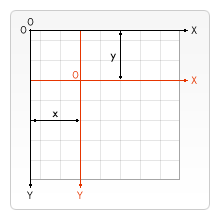

大多数情况下，调用`restore`方法比手动恢复原先的状态要简单得多。如果在循环中做位移但没有保存和恢复`canvas`
的状态，很可能会出现某些`canvas`元素没有渲染的情况，因为它很可能已经超出`canvas`范围以外了。

**`translate`示例**

```javascript
function draw() {
  const ctx = document.getElementById("canvas").getContext("2d");
  for (const i = 0; i < 3; i++) {
    for (const j = 0; j < 3; j++) {
      ctx.save();
      ctx.fillStyle = "rgb(" + 51 * i + ", " + (255 - 51 * i) + ", 255)";
      ctx.translate(10 + j * 50, 10 + i * 50);
      ctx.fillRect(0, 0, 25, 25);
      ctx.restore();
    }
  }
}
```

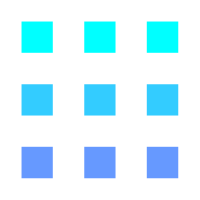

#### 3.3.6.3 旋转

`rotate`方法，它用于以原点为中心旋转`canvas`。

```javascript
rotate(angle)
// rotate 方法接受一个参数：旋转的角度 angle，它是顺时针方向的，以弧度为单位的值。
```


**注意：旋转的中心点始终是`canvas`的原点。如果要改变它，我们需要用到`translate`方法。**

**`rotate`示例**

```javascript
function draw() {
  const ctx = document.getElementById("canvas").getContext("2d");
  ctx.save();
  // 左矩形，从画布原点旋转
  // 绘制蓝色矩形
  ctx.fillStyle = "#0095DD";
  ctx.fillRect(30, 30, 100, 100);
  ctx.rotate((Math.PI / 180) * 25); // 旋转
  // 绘制灰色矩形
  ctx.fillStyle = "#4D4E53";
  ctx.fillRect(30, 30, 100, 100);
  ctx.restore();
  // 右矩形，从矩形中心旋转
  // 绘制蓝色矩形
  ctx.fillStyle = "#0095DD";
  ctx.fillRect(150, 30, 100, 100);
  ctx.translate(200, 80); // 移动到矩形中心
  // translateX = x + 0.5 * width
  // translateY = y + 0.5 * height
  ctx.rotate((Math.PI / 180) * 25); // 旋转
  ctx.translate(-200, -80); // 重置移动操作
  // 绘制灰色矩形
  ctx.fillStyle = "#4D4E53";
  ctx.fillRect(150, 30, 100, 100);
}
```


#### 3.3.6.4 缩放

`scale`方法，它用于增减图形在`canvas`中的像素数目，对形状，位图进行缩小或者放大。

```javascript
scale(x, y)
// scale 方法可以缩放画布的水平和垂直的单位。两个参数都是实数，可为负数，x 为水平缩放因子，y 为垂直缩放因子。
// 如果比 1 小，会缩小图形，如果比 1 大会放大图形。默认值为 1，为实际大小。
```

画布初始情况下，是以左上角坐标为原点的第一象限。如果参数为负实数，相当于以`x`或`y`
轴作为对称轴镜像反转（例如，使用`translate(0,canvas.height)`;`scale(1,-1)`; 以`y`轴作为对称轴镜像反转，就可得到著名的笛卡尔坐标系，左下角为原点）。

默认情况下，`canvas`的`1`个单位为`1`个像素。举例说，如果我们设置缩放因子是`0.5`，`1`个单位就变成对应`0.5`
个像素，这样绘制出来的形状就会是原先的一半。同理，设置为`2.0`时，`1`个单位就对应变成了`2`像素，绘制的结果就是图形放大了`2`倍。

**`scale`示例**

```javascript
function draw() {
  const ctx = document.getElementById("canvas").getContext("2d");
  // draw a simple rectangle, but scale it.
  ctx.save();
  ctx.scale(10, 3);
  ctx.fillRect(1, 10, 10, 10);
  ctx.restore();
  // mirror horizontally
  ctx.scale(-1, 1);
  ctx.font = "48px serif";
  ctx.fillText("MDN", -135, 120);
}
```

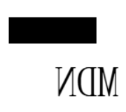

#### 3.3.6.5 变形

`transform`方法，它可以直接对`canvas`变形矩阵进行修改。

```javascript
transform(a, b, c, d, e, f)
// 这个方法是将当前的变形矩阵乘上一个基于自身参数的矩阵，矩阵形式：[[a, c, e], [b, d, f], [0, 0, 1]]
```

如果任意一个参数是`Infinity`（全局属性，表示一个无穷大的数值），变形矩阵也必须被标记为无限大，否则会抛出异常。

矩阵中，各个参数含义：

* `a`（`m11`）：水平方向的缩放
* `b`（`m12`）：竖直方向的倾斜偏移
* `c`（`m21`）：水平方向的倾斜偏移
* `d`（`m22`）：竖直方向的缩放
* `e`（`dx`）：水平方向的移动
* `f`（`dy`）：竖直方向的移动

```javascript
setTransform(a, b, c, d, e, f)
// 这个方法会将当前的变形矩阵重置为单位矩阵，然后用相同的参数调用 transform 方法。
// 如果任意一个参数是无限大，那么变形矩阵也必须被标记为无限大，否则会抛出异常。
// 从本质上来说，该方法是取消了当前变形，然后设置为指定的变形，一步完成。
resetTransform()
// 重置当前变形为单位矩阵，它和调用以下语句是一样的：ctx.setTransform(1, 0, 0, 1, 0, 0);
```

**`transform`和`setTransform`示例**

```javascript
function draw() {
  const ctx = document.getElementById("canvas").getContext("2d");
  const sin = Math.sin(Math.PI / 6);
  const cos = Math.cos(Math.PI / 6);
  ctx.translate(100, 100);
  const c = 0;
  for (let i = 0; i <= 12; i++) {
    c = Math.floor((255 / 12) * i);
    ctx.fillStyle = "rgb(" + c + "," + c + "," + c + ")";
    ctx.fillRect(0, 0, 100, 10);
    ctx.transform(cos, sin, -sin, cos, 0, 0);
  }
  // 重置变形
  ctx.setTransform(-1, 0, 0, 1, 100, 100);
  ctx.fillStyle = "rgba(255, 128, 255, 0.5)";
  ctx.fillRect(0, 50, 100, 100);
}
```


### 3.3.7 合成（Compositing）

#### 3.3.7.1 全局合成操作

参考：https://developer.mozilla.org/zh-CN/docs/Web/API/CanvasRenderingContext2D/globalCompositeOperation

`globalCompositeOperation`属性设置在绘制新形状时应用的合成操作策略。

```javascript
globalCompositeOperation = type
// 这个属性设置在绘制新形状时应用的合成操作策略，有很多种策略。
```

**合成操作策略**

* `source-over`（默认值）：在现有画布上绘制新图形。
* `source-in`：仅在新形状和目标画布重叠的地方绘制新形状。其他的都是透明的。
* `source-out`：在不与现有画布内容重叠的地方绘制新图形。
* `source-atop`：仅在与现有画布内容重叠的地方绘制新图形。
* `destination-over`：在现有画布内容的后面绘制新的图形。
* `destination-in`：仅保留现有画布内容和新形状重叠的部分。其他的都是透明的。
* `destination-out`：仅保留现有画布内容和新形状不重叠的部分。
* `destination-atop`：仅保留现有画布内容和新形状重叠的部分。新形状是在现有画布内容的后面绘制的。
* `lighter`：两个重叠图形的颜色是通过颜色值相加来确定的。
* `copy`：仅显示新图形。
* `xor`：形状在重叠处变为透明，并在其他地方正常绘制。
* `multiply`：将顶层像素与底层相应像素相乘，结果是一幅更黑暗的图片。
* `screen`：像素被倒转、相乘、再倒转，结果是一幅更明亮的图片（与`multiply`相反）。
* `overlay`：`multiply`和`screen`的结合。原本暗的地方更暗，原本亮的地方更亮。
* `darken`：保留两个图层中最暗的像素。
* `lighten`：保留两个图层中最亮的像素。
* `color-dodge`：将底层除以顶层的反置。
* `color-burn`：将反置的底层除以顶层，然后将结果反过来。
* `hard-light`：类似于`overlay`，`multiply`和`screen`的结合，但上下图层互换了。
* `soft-light`：柔和版本的`hard-light`。纯黑或纯白不会导致纯黑或纯白。
* `difference`：从顶层减去底层（或反之亦然），始终得到正值。
* `exclusion`：与`difference`类似，但对比度较低。
* `hue`：保留底层的亮度（`luma`）和色度（`chroma`），同时采用顶层的色调（`hue`）。
* `saturation`：保留底层的亮度和色调，同时采用顶层的色度。
* `color`：保留了底层的亮度，同时采用了顶层的色调和色度。
* `luminosity`：保持底层的色调和色度，同时采用顶层的亮度。

**`globalCompositeOperation`示例**

```javascript
const canvas = document.getElementById("canvas");
const ctx = canvas.getContext("2d");
ctx.globalCompositeOperation = "xor";
ctx.fillStyle = "blue";
ctx.fillRect(10, 10, 100, 100);
ctx.fillStyle = "red";
ctx.fillRect(50, 50, 100, 100);
```

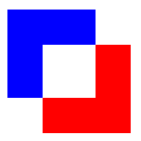

#### 3.3.7.2 裁切路径

裁切路径和普通的`canvas`图形差不多，不同的是它的作用是遮罩，用来隐藏不需要的部分。如下图所示，红边五角星就是裁切路径，所有路径外的部分都不会绘制出来。

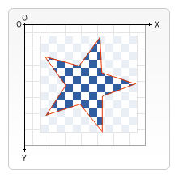

裁切路径可以实现与`globalCompositeOperation`属性`source-in`和`source-atop`类似的效果。
**最重要的区别是裁切路径不会在`canvas`上绘制东西，而且它永远不受新图形的影响。**

**`clip`示例**

```javascript
// 用一个圆形的裁切路径来限制随机星星的绘制区域。
function draw() {
  const ctx = document.getElementById("canvas").getContext("2d");
  ctx.fillRect(0, 0, 150, 150);
  ctx.translate(75, 75);
  // 创建一个圆形的裁切路径
  ctx.beginPath();
  ctx.arc(0, 0, 60, 0, Math.PI * 2, true);
  ctx.clip();
  // 绘制线性渐变的星空背景
  const lingrad = ctx.createLinearGradient(0, -75, 0, 75);
  lingrad.addColorStop(0, "#232256");
  lingrad.addColorStop(1, "#143778");
  ctx.fillStyle = lingrad;
  ctx.fillRect(-75, -75, 150, 150);
  // 绘制星星
  for (let j = 1; j < 50; j++) {
    ctx.save();
    ctx.fillStyle = "#fff";
    ctx.translate(
            75 - Math.floor(Math.random() * 150),
            75 - Math.floor(Math.random() * 150),
    );
    drawStar(ctx, Math.floor(Math.random() * 4) + 2);
    ctx.restore();
  }
}

// 绘制星星
function drawStar(ctx, r) {
  ctx.save();
  ctx.beginPath();
  ctx.moveTo(r, 0);
  for (let i = 0; i < 9; i++) {
    ctx.rotate(Math.PI / 5);
    if (i % 2 == 0) {
      ctx.lineTo((r / 0.525731) * 0.200811, 0);
    } else {
      ctx.lineTo(r, 0);
    }
  }
  ctx.closePath();
  ctx.fill();
  ctx.restore();
}
```

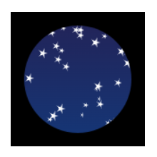

### 3.3.8 基本动画

`canvas`动画的最大限制就是图像一旦绘制出来，它就是一直保持那样了。如果需要移动它，需要对所有东西（包括之前的）进行重绘。重绘是相当费时的，而且性能很依赖于电脑的速度。

#### 3.3.8.1 动画的基本步骤

1、清空`canvas`。如果要绘制的内容不会完全充满`canvas`（例如背景图），那么需要清空画布。最简单的做法就是用`clearRect`方法。
2、保存`canvas`状态。如果会改变一些`canvas`状态的设置（样式，变形等），又需要在每画一帧之时都是原始状态的话，那么需要先保存一下状态。
3、绘制动画图形（`animated shapes`）。这一步才是重绘动画帧。
4、恢复`canvas`状态。如果已经保存了`canvas`的状态，可以先恢复它，然后重绘下一帧。

**清空`canvas`的必要性：**

* 避免重叠：每次更新动画时，如果不清空画布，新的图形会覆盖在旧的图形上，造成画面混乱。
* 流畅的动画效果：清空画布并重新绘制所有内容，确保动画平滑，避免视觉上的残影。

**不清空`canvas`的情况：**

* 如果动画不需要刷新背景或背景已经固定，并且只想在画布上绘制特定的元素（例如，静态背景+移动对象）。可以选择不清空画布，只清除或更新需要更新的区域。但是，这种做法较为复杂，需要精确控制绘制和清除的区域。

#### 3.3.8.2 操控动画

在`canvas`上绘制内容使用`canvas`提供/自定义的方法。通常，我们只有在脚本执行结束后才能看见结果，比如，在`for`循环里面做完成动画是不太可能的。

因此，为了实现动画，需要支持定时重绘的方法。`setInterval`、`setTimeout`和`requestAnimationFrame()`可以设置时间进行定时重绘。

```javascript
setInterval()
// 当设定好间隔时间后，function 会定期执行。
setTimeout()
// 在设定好的时间之后执行函数
requestAnimationFrame()
// 告诉浏览器你希望执行一个动画，并在重绘之前，请求浏览器执行一个特定的函数来更新动画。
```

如果不需要与用户互动，可以使用`setInterval()`方法，它可以定期执行指定代码。

如果需要与用户互动（例如：游戏等），可以使用键盘/鼠标事件搭配`setTimeout()`方法实现。通过设置事件监听，捕捉用户的交互并执行相应的动作。

**备注：`window.requestAnimationFrame()`可以更平缓地执行动画，当具备重绘条件时，才会绘制动画帧。一般每秒回调函数执行`60`
次，也有可能会被降低。**

#### 3.3.8.3 动画示例

* 太阳系动画，详见`animation-solar-system.html`
* 时钟动画，详见`animation-clock.html`
* 循环全景照片动画，详见`animation-photo.html`
* 鼠标追踪动画，详见`animation-track.html`

### 3.3.9 高级动画

#### 3.3.9.1 绘制小球

为了画出小球，我们需要创建一个包含相关属性及`draw()`方法的`ball`对象完成绘制。

```javascript
// 完整代码详见animation-ball.html
const canvas = document.getElementById("canvas");
const ctx = canvas.getContext("2d");
const ball = {
  x: 100,
  y: 100,
  vx: 5,
  vy: 3,
  radius: 25,
  color: "blue",
  draw: function () {
    ctx.beginPath();
    ctx.arc(this.x, this.y, this.radius, 0, Math.PI * 2, true);
    ctx.closePath();
    ctx.fillStyle = this.color;
    ctx.fill();
  }
}
ball.draw();
```

#### 3.3.9.2 添加速率

使用`window.requestAnimationFrame()`控制动画。给小球添加速率矢量进行移动。每次重新绘制需要使用`clearRect`清理掉之前帧里的圆形。

```javascript
function draw() {
  ctx.clearRect(0, 0, canvas.width, canvas.height);
  ball.draw();
  ball.x += ball.vx;
  ball.y += ball.vy;
  raf = window.requestAnimationFrame(draw);
}

canvas.addEventListener("mouseover", function (e) {
  raf = window.requestAnimationFrame(draw);
});

canvas.addEventListener("mouseout", function (e) {
  window.cancelAnimationFrame(raf);
});
```

#### 3.3.9.3 边界

若不检测碰撞，小球很快就会超出画布。检查小球`x`和`y`是否超出画布的尺寸及是否需要将速度矢量反转。`draw`函数添加如下代码：

```javascript
if (ball.y + ball.vy > canvas.height || ball.y + ball.vy < 0) {
  ball.vy = -ball.vy;
}
if (ball.x + ball.vx > canvas.width || ball.x + ball.vx < 0) {
  ball.vx = -ball.vx;
}
```

#### 3.3.9.4 加速度

为了让小球运动更真实，可以对速度矢量进行如下处理。`draw`函数添加如下代码：

```javascript
// 小球会逐帧减少垂直方向的速度，所以小球最终将只会在地板上弹跳。
ball.vy *= 0.99;
ball.vy += 0.25;
```

#### 3.3.9.5 长尾效果

清除前一帧动画使用的是`clearRect`函数。为了实现长尾效果，可以改用一个半透明的`fillRect`函数。`draw`函数添加如下代码：

```javascript
ctx.fillStyle = "rgba(255,255,255,0.3)";
ctx.fillRect(0, 0, canvas.width, canvas.height);
```

#### 3.3.9.6 添加鼠标控制

为了更好地控制小球，可以用`mousemove`事件让小球跟随鼠标移动。`click`事件会释放小球，让小球重新跳起。

```javascript
canvas.addEventListener("mousemove", function (e) {
  if (!running) {
    ctx.fillStyle = "rgba(255, 255, 255, 0.3)";
    ctx.fillRect(0, 0, canvas.width, canvas.height);
    ball.x = e.offsetX;
    ball.y = e.offsetY;
    ball.draw();
  }
})
canvas.addEventListener("click", function (e) {
  if (!running) {
    raf = window.requestAnimationFrame(draw);
    running = true;
  }
})
```

### 3.3.10 像素操作

#### 3.3.10.1 ImageData对象

`ImageData`对象中存储着`canvas`对象真实像素数据，它包含以下几个只读属性：

* `width`：图片宽度，单位是像素。
* `height`：图片高度，单位是像素。
* `data`：`Uint8ClampedArray`类型的一维数组，包含着`RGBA`格式的整型数据，范围在`0`至`255`之间（包括`255`）。
* `Uint8ClampedArray`：包含`height`×`width`×`4`字节数据，索引值从`0`到(`height`×`width`×`4`)-`1`

`data`属性返回一个`Uint8ClampedArray`，它可以被使用作为查看初始像素数据。每个像素用`4`个`1bytes`
值（按照红，绿，蓝和透明值的顺序，即`RGBA`格式）来代表。每个颜色值区用`0`至`255`
来代表。颜色值区会分配到在数组内连续的索引，像素左上角的红色值区在数组的索引`0`位置。像素处理从左至右，从上到下，遍历整个数组。

根据行、列读取某像素点的`R/G/B/A`值的公式：

````javascript
imageData.data[行 * (imageData.width * 4) + 列 * 4 + 0 / 1 / 2 / 3];
````

读取像素数组的大小（以字节为单位）：

```javascript
const numBytes = imageData.data.length;
```

#### 3.3.10.2 创建ImageData对象

创建一个新的，空白的`ImageData`对象，需要使用`createImageData()`方法。有`2`种重载用法。

```javascript
const myImageData = ctx.createImageData(width, height);
// 创建一个 height × width 尺寸的新 ImageData 对象。所有像素被预设为透明黑。
const myImageData = ctx.createImageData(anotherImageData);
// 创建一个与 anotherImageData 对象相同像素的 ImageData 对象。这个新对象的所有像素被预设为透明黑。并非复制 anotherImageData 图片数据。
```

#### 3.3.10.3 获取场景像素数据

获取包含画布场景像素数据的`ImageData`对象，可以用`getImageData()`方法：

```javascript
const myImageData = ctx.getImageData(left, top, width, height);
// 这个方法会返回一个 ImageData 对象，它代表了画布区域的对象数据。此画布的区域为 (left, top) 到 (left + width, top + height) 的矩形。
```

**颜色选择器示例**

```javascript
// 详见imageData-getImageData.html文件
const img = new Image();
// 设置图片跨域资源共享
img.crossOrigin = "anonymous";
img.src = "https://mdn.github.io/shared-assets/images/examples/rhino.jpg";
const canvas = document.getElementById("canvas");
const ctx = canvas.getContext("2d");
const hoveredColor = document.getElementById("hoveredColor");
const selectedColor = document.getElementById("selectedColor");
img.onload = function () {
  ctx.drawImage(img, 0, 0);
  img.style.display = "none";
};

function pick(event, destination) {
  const x = event.layerX;
  const y = event.layerY;
  const pixel = ctx.getImageData(x, y, 1, 1);
  const data = pixel.data;
  const rgba = `rgba(${data[0]}, ${data[1]}, ${data[2]}, ${data[3] / 255})`;
  destination.style.background = rgba;
  destination.textContent = rgba;
  return rgba;
}

canvas.addEventListener("mousemove", function (event) {
  pick(event, hoveredColor);
});
canvas.addEventListener("click", function (event) {
  pick(event, selectedColor);
});
```

#### 3.3.10.4 在场景中写入像素数据

使用`putImageData()`方法对场景进行像素数据的写入操作。

```javascript
ctx.putImageData(myImageData, dx, dy);
// dx 和 dy 表示像素数据在画布中绘制的起始水平，垂直坐标
```

**颜色选择器示例**

```javascript
// 详见imageData-putImageData.html文件
const img = new Image();
// 设置图片跨域资源共享
img.crossOrigin = "anonymous";
img.src = "https://mdn.github.io/shared-assets/images/examples/rhino.jpg";
const canvas = document.getElementById("canvas");
const ctx = canvas.getContext("2d");
img.onload = function () {
  ctx.drawImage(img, 0, 0);
};

const original = function () {
  ctx.drawImage(img, 0, 0);
};

const grayscale = function () {
  ctx.drawImage(img, 0, 0);
  const imageData = ctx.getImageData(0, 0, canvas.width, canvas.height);
  const data = imageData.data;
  for (let i = 0; i < data.length; i += 4) {
    const avg = (data[i] + data[i + 1] + data[i + 2]) / 3;
    data[i] = avg;
    data[i + 1] = avg;
    data[i + 2] = avg;
  }
  ctx.putImageData(imageData, 0, 0);
};

const invert = function () {
  ctx.drawImage(img, 0, 0);
  const imageData = ctx.getImageData(0, 0, canvas.width, canvas.height);
  const data = imageData.data;
  for (let i = 0; i < data.length; i += 4) {
    data[i] = 255 - data[i];
    data[i + 1] = 255 - data[i + 1];
    data[i + 2] = 255 - data[i + 2];
  }
  ctx.putImageData(imageData, 0, 0);
}

const sepia = function () {
  ctx.drawImage(img, 0, 0);
  const imageData = ctx.getImageData(0, 0, canvas.width, canvas.height);
  const data = imageData.data;
  for (let i = 0; i < data.length; i += 4) {
    const r = data[i];
    const g = data[i + 1];
    const b = data[i + 2];
    data[i] = r * 0.393 + g * 0.769 + b * 0.189;
    data[i + 1] = r * 0.349 + g * 0.686 + b * 0.168;
    data[i + 2] = r * 0.272 + g * 0.534 + b * 0.131;
  }
  ctx.putImageData(imageData, 0, 0);
};

const inputs = document.querySelectorAll("[name=filter]");
for (const input of inputs) {
  input.addEventListener("change", function (e) {
    switch (e.target.value) {
      case "original":
        return original();
      case "grayscale":
        return grayscale();
      case "inverted":
        return invert();
      case "sepia":
        return sepia();
      default:
        return original();
    }
  });
}
```

#### 3.3.10.5 缩放和抗锯齿

通过设置`imageSmoothingEnabled`属性可以实现抗锯齿的效果（默认开启抗锯齿）。

**图片放大镜示例**

根据鼠标位置裁切指定大小的图片，将其复制到另一个画布并调整到期望的大小。本例为将`10×10`像素裁切为`200×200`像素。

```javascript
// 详见imageData-anti-aliasing.html文件
const img = new Image();
img.src = "https://mdn.github.io/shared-assets/images/examples/rhino.jpg";
const canvas = document.getElementById("canvas");
const ctx = canvas.getContext("2d");
img.onload = function () {
  img.style.display = "none";
  draw(this);
};

function draw(img) {
  ctx.drawImage(img, 0, 0);
  const zoomCtx = document.getElementById("zoom").getContext("2d");
  const smoothBtn = document.getElementById("smoothButton");
  const toggleSmoothing = function (event) {
    zoomCtx.imageSmoothingEnabled = this.checked;
    zoomCtx.mozImageSmoothingEnabled = this.checked;
    zoomCtx.webkitImageSmoothingEnabled = this.checked;
    zoomCtx.msImageSmoothingEnabled = this.checked;
  };
  smoothBtn.addEventListener("change", toggleSmoothing);
  const zoom = function (event) {
    const x = event.layerX;
    const y = event.layerY;
    zoomCtx.drawImage(canvas, Math.abs(x - 5), Math.abs(y - 5), 10, 10, 0, 0, 200, 200);
  };
  canvas.addEventListener("mousemove", zoom);
}
```

#### 3.3.10.6 保存图片

`toDataURL()`返回一个包含图片展示的数据链接`data URI`。可以使用`type`指定其类型，默认为`PNG`格式。图片的分辨率为`96dpi`。

```javascript
toDataURL(type, encoderOptions)
// type：图片格式，默认为 image/png
// encoderOptions：在指定图片格式为 image/jpeg 或 image/webp 的情况下，可以从 0 到 1 的区间内选择图片的质量。
// 1 表示最好品质，0 基本不被辨析但有比较小的文件大小。如果超出取值范围，将会使用默认值 0.92。其他参数会被忽略。
```

* 如果画布的高度或宽度是`0`，那么会返回字符串`data:,`。
* 如果传入的类型非`image/png`，但是返回的值以`data:image/png`开头，那么该传入的类型是不支持的。
* `Chrome`支持`image/webp`类型。

**当在画布中生成了一个`data URI`，它可以用于任何`<image>`元素，或放在一个有`download`
属性的超链接里用于保存到本地。也可以用画布创建一个`Blob`对象。**

`toBlob()`创造`Blob`对象，用以展示`canvas`上的图片。这个图片文件可以被缓存或保存到本地（由用户代理自行决定）。

可以在调用时指定所需的文件格式和图像质量，若未指定文件格式（或不支持指定的文件格式），则默认导出`image/png`
类型。浏览器需要支持`image/png`，大多数浏览器还支持额外的图片格式，包括`image/jpeg`和`image/webp`。

对于支持以指定分辨率编码的图片格式，如不特别指明，图片的默认分辨率为`96dpi`。

```javascript
canvas.toBlob(callback, type, quality)
// callback：回调函数，可获得一个单独的 Blob 对象参数。如果图像未被成功创建，可能会获得 null 值。
// type：指定图片格式，默认格式（未指定或不支持）为 image/png。
// quality：值在 0 与 1 之间，当请求图片格式为 image/jpeg 或者 image/webp 时用来指定图片展示质量。
// 如果这个参数的值不在指定类型与范围之内，则使用默认值，其余参数将被忽略。
```

### 3.3.11 canvas 的优化

参考：https://www.cnblogs.com/fangsmile/p/14721283.html

#### 3.3.11.1 在离屏Canvas上预渲染相似的图形或重复的对象

如果发现自己在每个动画帧上存在一些重复绘制操作，请考虑将其分流到屏幕外的画布上。然后，你可以根据需要将屏幕外的图像渲染到主画布上，而不必重复生成该图像的步骤。

```javascript
myEntity.offscreenCanvas = document.createElement("canvas");
myEntity.offscreenCanvas.width = myEntity.width;
myEntity.offscreenCanvas.height = myEntity.height;
myEntity.offscreenContext = myEntity.offscreenCanvas.getContext("2d");

myEntity.render(myEntity.offscreenContext);
```

#### 3.3.11.2 避免浮点数的坐标点，用整数取而代之

**当绘制存在浮点数坐标点的对象时会发生子像素渲染。**

浏览器为了达到抗锯齿的效果会做额外的运算。为了避免这种情况，请保证在调用`drawImage()`函数时，用`Math.floor()`函数对所有的坐标点取整。

#### 3.3.11.3 使用drawImage时不要缩放图像

在离屏`canvas`中缓存图片的不同尺寸，而不要用`drawImage()`去缩放它们。

#### 3.3.11.4 将复杂的场景分解为多层画布

项目可能会出现某些对象需要经常移动或更改，而其他对象则保持相对静态。在这种情况下，可以使用多个`<canvas>`元素对项目进行分层进行优化。

例如，假设你有一个游戏，其 UI 位于顶部，中间是游戏性动作，底部是静态背景。

```html
<!-- 在这种情况下，可以将游戏分成三个 canvas 层。UI 将仅在用户输入时发生变化，游戏层随每个新框架发生变化，背景层通常保持不变。 -->
<div id="stage">
  <canvas id="ui-layer" width="480" height="320"></canvas>
  <canvas id="game-layer" width="480" height="320"></canvas>
  <canvas id="background-layer" width="480" height="320"></canvas>
</div>
<style>
  #stage {
    width: 480px;
    height: 320px;
    position: relative;
    border: 2px solid black;
  }

  canvas {
    position: absolute;
  }

  #ui-layer {
    z-index: 3;
  }

  #game-layer {
    z-index: 2;
  }

  #background-layer {
    z-index: 1;
  }
</style>
```

#### 3.3.11.5 用CSS设置大的背景图

如大多数游戏那样，你有一张静态的背景图，用一个静态的`<div>`元素，结合`background`特性，以及将它置于画布元素之后。这么做可以避免在每一帧在画布上绘制背景图。

#### 3.3.11.6 用CSS变换特性缩放画布

`CSS`变换使用`GPU`，因此速度更快。最好的情况是不直接缩放画布，或具有较小的画布并按比例放大，而不是较大的画布并按比例缩小。

```javascript
const scaleX = window.innerWidth / canvas.width;
const scaleY = window.innerHeight / canvas.height;
const scaleToFit = Math.min(scaleX, scaleY);
const scaleToCover = Math.max(scaleX, scaleY);
// 从左上角开始缩放。等同于 transform-origin: left top;
stage.style.transformOrigin = "0 0";
stage.style.transform = "scale(" + scaleToFit + ")";
```

#### 3.3.11.7 关闭透明度

如果项目使用的画布且不需要透明。在`getContext()`创建一个绘图上下文时把`alpha`选项设置为`false`。这个选项可以帮助浏览器进行内部优化。

```javascript
const ctx = canvas.getContext("2d", {alpha: false});
```

#### 3.3.11.8 更多建议

* 合并绘制操作：将画布的函数调用集合到一起（例如，绘制一条折线，而不是分成多条直线进行绘制）。
* 减少状态变化：避免不必要的画布状态改变。
* 局部重绘：渲染画布中的差异点，而非重绘整个画布。
* 尽可能避免`shadowBlur`特性。
* 尽可能避免`text rendering`。
* 尝试不同的方法来清除画布（`clearRect()`，`fillRect()`，调整`canvas`大小）。
* 绘制动画使用`Window.requestAnimationFrame()`，而非`setInterval()`。
* 谨慎使用大型物理库

## 3.4 SVG学习

参考：https://developer.mozilla.org/zh-CN/docs/Web/SVG/Tutorial

### 3.4.1 SVG基础

`SVG`是一种`XML`语言，类似`XHTML`，可以用来绘制如下图所示的矢量图形。`SVG`
可以定义线和形状来创建图形，也可以修改已有的位图，或结合两种方式来创建图形。可以对图形和其组成部分进行变形、合成、滤镜方式来改变外观。


`SVG`诞生于`1999`年，之前有几个相互竞争的格式规范提交到了`W3C`，但都没有获得批准。主流浏览器均支持`SVG`。加载慢是`SVG`
的一个缺点。但`SVG`也有自身的优点，比如它实现了`DOM`接口（比`Canvas`方便），不需要安装第三方扩展。

#### 3.4.1.1 基本要素

`HTML`提供了定义标题、段落、表格等内容的元素。同样的，`SVG`也提供了用于定义圆形、矩形、简单或复杂的曲线的元素。一个简单的`SVG`
文档由`<svg>`根元素和基本的形状元素构成。此外，`SVG`可以使用`g`元素将若干个基本形状编成一个组。

`SVG`可以实现复杂的场景。`SVG`支持渐变、旋转、动画、滤镜效果、与`JavaScript`交互等功能，但是这些额外的语言特性，都需要在一个定义好的图形区域内实现。

* `SVG`的元素和属性必须按标准格式书写，因为`XML`是区分大小写的（这一点和`HTML`不同）
* `SVG`里的属性值必须用引号引起来，就算是数值也必须这样做。

#### 3.4.1.2 SVG兼容性

兼容性列表：https://caniuse.com/svg

各种浏览器对`SVG`标准的支持程度不同。因此制作好的图形在某种浏览器调试正常后，但在另一种浏览器中无法正常显示。这是因为`SVG`
在各种浏览器中存在差异。另外，如果你将其他技术和`SVG`一起使用（比如`JavaScript`和`CSS`），也会出现类似的情况。

#### 3.4.1.3 SVG的种类

从`2003`年成为`W3C`推荐标准，最接近完整版的`SVG`版本是`1.1`版，它基于`1.0`版，并增加了很多便于实现的模块化内容，`SVG1.1`
的第二个版本在`2011`年成为推荐标准，完整版的`SVG1.2`原本是下一个标准版本，但它被`SVG2.0`取代。`SVG2.0`
正在制定当中，它采用了类似`CSS3`的制定方法，通过若干松散耦合的组件形成一套标准。

除了完整版的`SVG`推荐标准，`W3C`工作组还在`2003`年推出了`SVG Tiny`和`SVG Basic`。这两个配置文件主要瞄准移动设备。`SVG Tiny`
主要是为性能低的小设备生成图元，而`SVG Basic`实现了完整版`SVG`里的很多功能，只舍弃了难以实现的大型渲染（比如动画）。`2008`
年，`SVG Tiny1.2`成为`W3C`推荐标准。

另外还有一些关于`SVG`打印规格的项目，增加对多页面和颜色管理的支持，但是这项工作已经终止。

#### 3.4.1.4 SVG基础示例

**绘制流程（详见`demo.svg`文件）：**

1、从`<svg>`根元素开始：

* 舍弃来自`(X)HTML`的`doctype`声明，因为基于`DTD`的`SVG`验证导致的问题比它能解决的问题更多。
* `SVG 2.0`之前`version`属性和`baseProfile`属性用来供其他类型的验证识别`SVG`的版本。`SVG 2.0`已弃用`version`
  和`baseProfile`这两个属性。
* 作为`XML`的一种，`SVG`必须正确地绑定命名空间（在`xmlns`属性中绑定）。

2、绘制一个完全覆盖图像区域的矩形`<rect>`，把背景颜色设为红色。
3、一个半径`80px`的绿色圆圈`<circle>`绘制在红色矩形的正中央（向右偏移`150px`，向下偏移`100px`）。
4、绘制文字`SVG`。文字被填充为白色，通过设置居中的锚点把文字定位到期望的位置：在这种情况下，中心点应该对应于绿色圆圈的中点。可以精细调整字体大小和垂直位置，确保最后的样式是美观的。

#### 3.4.1.5 SVG基础属性

`SVG`元素的渲染顺序：全局有效的规则是后覆盖前，越后面的元素越可见。

`Web`上的`SVG`文件可以直接在浏览器上展示，或通过以下几种方法嵌入到`HTML`文件中：

* 如果`HTML`是`XHTML`并且声明类型为`application/xhtml+xml`，可以直接把`SVG`嵌入到`XML`源码中。
* `SVG`可以直接被嵌入到`HTML`中。
* 可以使用`img`元素。
* 可以使用`object`元素引用`SVG`文件。
* 可以使用`iframe`元素引用`SVG`文件。
* 可以使用`JavaScript`动态创建并注入到`HTML DOM`中。

```html
<!-- 使用 object 元素引用 SVG 文件 -->
<object data="assets/3/3.4/demo.svg" type="image/svg+xml"></object>
<!-- 使用 iframe 元素引用 SVG 文件 -->
<iframe src="assets/3/3.4/demo.svg"></iframe>
```

#### 3.4.1.6 SVG文件类型

`SVG`文件有两种形式。

* 普通`SVG`文件是包含`SVG`标记的简单文本文件。推荐使用`.svg`（全部小写）作为此类文件的扩展名。
* 由于在某些应用（比如地图应用等）中使用`SVG`时，文件可能会很大，`SVG`标准允许使用`gzip`压缩的`SVG`文件。推荐使用`.svgz`
  （全部小写）作为此类文件的扩展名。不幸的是，如果服务器是微软的`IIS`服务器，使`gzip`压缩的`SVG`文件在所有的使用`SVG`
  的用户代理上可靠地运行是相当困难的，而且`Firefox`不能在本地机器上加载`gzip`压缩的`SVG`
  文件。除非知道处理发布内容的`Web`服务器才可以正确的处理`gzip`，否则要避免使用`gzip`压缩的`SVG`。

#### 3.4.1.7 Web服务器使用SVG文件

将`SVG`文件上传到`Web`服务器。对于普通`SVG`文件，服务器应该会发送如下`HTTP`响应标头：

```http request
Content-Type: image/svg+xml
Vary: Accept-Encoding
```

对于`gzip`压缩的`SVG`文件，服务器应该会发送如下`HTTP`响应标头：

```http request
Content-Type: image/svg+xml
Content-Encoding: gzip
Vary: Accept-Encoding
```

利用网络监控面板来检查服务器是否给`SVG`文件发送正确的`HTTP`响应标头：

* 提交一个`SVG`文件的`URL`
* 查看`HTTP`响应标头。如果发现服务器没有发送上述响应标头，那么你应该联系网站托管服务商。

如果不能说服他们为`SVG`修正服务器配置，我们还有一些可以自行解决的办法。请阅读服务器配置页面的帮助文档。

帮助文档：https://www.w3.org/services/svg-server/

服务器配置错误是`SVG`加载失败的常见原因，所以一定要确保服务器配置正确。如果不能把服务器配置成给`SVG`
文件发送上述响应标头，`Firefox`很有可能把该文件的标记显示成文本或乱码，甚至会要求查看者选择打开文件的应用程序。

### 3.4.2 使用SVG来绘制图形

#### 3.4.2.1 网格坐标定位

`SVG`使用的坐标系统/网格系统和`Canvas`用的差不多（所有计算机绘图都差不多）。坐标系统以页面的左上角为`(0,0)`
坐标点，坐标以像素为单位，`x`轴正方向是向右，`y`轴正方向是向下。如下图所示，蓝色方形左上角坐标为`(x,y)`。


**矩形示例**

```html
<!-- 定义一个矩形，即从左上角开始，向右延展 100px，向下延展 100px，形成一个 100*100 大的矩形。 -->
<rect x="0" y="0" width="100" height="100"/>
```

在`SVG`文档中的`1`个像素对应输出设备（比如显示屏）上的`1`个像素。但是这种情况是可以改变的。如同`CSS`
可以定义字体的绝对大小和相对大小，`SVG`也可以定义绝对大小（比如使用`pt`或`cm`标识维度）同时`SVG`
也能使用相对大小，只需给出数字，不标明单位，输出时就会采用用户的单位。

**在没有进一步规范说明的情况下，`1`个用户单位等同于`1`个屏幕单位。**

要明确改变这种设定，`SVG`里有多种方法。

```html
<!-- 定义了一个 100*100px 的 SVG 画布，这里 1 用户单位等同于 1 屏幕单位。 -->
<svg width="100" height="100"></svg>
<!--
    定义的画布尺寸是 200*200px。但是 viewBox 属性定义了画布上可以显示的区域：从 (0,0) 点开始，100*100px 的区域。
    这个 100*100px 的区域，会放到 200*200px 的画布上显示。于是就形成了放大两倍的效果。
-->
<svg width="200" height="200" viewBox="0 0 100 100"></svg>
```

用户单位和屏幕单位的映射关系被称为**用户坐标系统**。除缩放外，坐标系统还可以旋转、倾斜、翻转。默认的用户坐标系统`1`
用户像素等于设备上的`1`像素（但设备可能会自己定义`1`像素到底是多大）。在定义了具体尺寸单位的`SVG`中，比如单位是`cm`或`in`
，最终图形会以实际大小的`1:1`比例呈现。

例如：假设在用户的设备环境里，`1px `等于`0.2822222`毫米（即分辨率是`90dpi`），那么所有的`SVG`内容都会按照这种比例处理：`1cm`
等于`35.43307px`（即`35.43307`用户单位）.

#### 3.4.2.2 绘制矩形

```xml
<!-- rect 元素会在屏幕上绘制一个矩形。可以通过设置 6 个基本属性来控制它在屏幕上的位置和形状。 -->
<rect x="60" y="10" rx="10" ry="10" width="30" height="30"/>
```

**参数**

* `x`：矩形左上角的`x`位置，默认值为`0`。
* `y`：矩形左上角的`y`位置，默认值为`0`。
* `width`：矩形的宽度。
* `height`：矩形的高度。
* `rx`：圆角的`x`方位的半径，默认值为`0`。
* `ry`：圆角的`y`方位的半径，默认值为`0`。

#### 3.4.2.3 绘制圆形

```xml
<!-- circle 元素会在屏幕上绘制一个圆形。可以通过设置 3 个基本属性来设置圆形。 -->
<circle cx="25" cy="75" r="20"/>
```

**参数**

* `r`：圆的半径。
* `cx`：圆心的`x`位置，默认值为`0`。
* `cy`：圆心的`y`位置，默认值为`0`。

#### 3.4.2.4 绘制椭圆

```xml
<!-- ellipse 是 circle 元素更通用的形式，你可以分别缩放圆的 x 半径和 y 半径（通常数学家称之为长轴半径和短轴半径）。 -->
<ellipse cx="75" cy="75" rx="20" ry="5"/>
```

**参数**

* `rx`：椭圆的`x`半径。当`rx`省略时，会和`ry`保持一致。若都省略则不绘制图形。
* `ry`：椭圆的`y`半径。当`ry`省略时，会和`rx`保持一致。若都省略则不绘制图形。
* `cx`：椭圆中心的`x`位置，默认值为`0`。
* `cy`：椭圆中心的`y`位置，默认值为`0`。

#### 3.4.2.5 绘制线条

```xml
<!-- line 元素会在屏幕上绘制直线。它取两个点的位置作为属性，指定这条线的起点和终点位置。 -->
<line x1="10" x2="50" y1="110" y2="150" stroke="black" stroke-width="5"/>
```

**参数**

* `x1`：起点的`x`位置，默认值为`0`。
* `y1`：起点的`y`位置，默认值为`0`。
* `x2`：终点的`x`位置，默认值为`0`。
* `y2`：终点的`y`位置，默认值为`0`。

#### 3.4.2.6 绘制折线

```xml
<!-- polyline 是一组连接在一起的直线。因为它可以有很多的点，折线的所有点位置都放在一个 points 属性中。 -->
<svg>
  <polyline points="60, 110 65, 120 70, 115 75, 130 80, 125 85, 140 90, 135 95, 150 100, 145"/>
</svg>
```

**参数**

* `points`：点集数列。每个数字用空白、逗号、终止命令符或换行符分隔开。每个点必须包含`2`个数字，一个是`x`坐标，一个是`y`
  坐标。所以点列表`(0,0)`,`(1,1)`和`(2,2)`可以写成这样：`0 0, 1 1, 2 2`。

#### 3.4.2.7 绘制多边形

```xml
<!-- 
    polygon 和折线很像，它们都是由连接一组点集的直线构成。不同的是，polygon 的路径在最后一个点处自动回到第一个点。
    需要注意的是，矩形也是一种多边形，如果需要更多灵活性的话，你也可以用多边形创建一个矩形。
-->
<polygon points="50, 160 55, 180 70, 180 60, 190 65, 205 50, 195 35, 205 40, 190 30, 180 45, 180"/>
```

**参数**

* `points`：点集数列。每个数字用空白、逗号、终止命令符或换行符分隔开。每个点必须包含`2`个数字，一个是`x`坐标，一个是`y`
  坐标。所以点列表`(0,0)`,`(1,1)`和`(2,2)`可以写成这样：`0 0, 1 1, 2 2`。路径绘制完后闭合图形，直线将从`(2,2)`连接到`(0,0)`。

#### 3.4.2.8 绘制路径

```xml
<!-- 
   path 可能是 SVG 中最常见的形状。你可以用 path 元素绘制矩形（直角矩形或者圆角矩形）、圆形、椭圆、折线形、多边形，以及一些其他的形状。
   例如贝塞尔曲线、2 次曲线等曲线。因为 path 很强大也很复杂，所以会在后续章进行详细介绍。这里只介绍一个定义路径形状的属性。
-->
<path d="M20,230 Q40,205 50,230 T90,230" fill="none" stroke="blue" stroke-width="5"/>
```

**参数**

* `d`：一个点集数列及如何绘制路径的信息，即“命令+参数”的序列。

### 3.4.3 路径

`path`元素是`SVG`基本形状中最强大的一个。你可以用它创建线条，曲线，弧形等。

`path`只需要设定很少的点，就可以创建平滑流畅的线条（比如曲线）。虽然`polyline`
元素也能实现类似的效果，但需要设置大量的点（点越密集，越接近连续，看起来越平滑流畅），并且这种做法不支持放大（放大后，点的离散程度会变得更明显）。所以在绘制
`SVG`时，对路径的良好理解很重要。虽然不建议使用`XML`编辑器创建复杂的路径，但了解其工作方式有助于识别和修复`SVG`中的显示问题。

`path`元素的形状是通过属性`d`定义的，属性`d`的值是一个“命令+参数”的序列。

每种命令都用一个关键字母来表示。比如，字母`M`表示的是`Move to`命令，当解析器读到这个命令时，它就知道你是打算移动到某个点。跟在命令字母后面的数字，就是期望移动到的
`x`和`y`轴坐标。比如移动到`(10,10)`这个点的命令，应该写成`M 10 10`。这一段命令结束后，解析器就会去读下一段命令。

每种命令都有两种表示方式，一种是用大写字母，表示采用绝对定位。一种是用小写字母，表示采用相对定位（即以上一个点为基准/原点进行移动）。

因为属性`d`采用的是用户坐标系统，所以不需标明单位。

#### 3.4.3.1 直线命令

`path`元素有`5`种绘制直线的命令。直线命令就是在两个点之间绘制直线。

##### 3.4.3.1.1 `Move to`命令

`Move to`命令，`M`命令需要两个参数，分别是期望移动到的点的`x`轴和`y`轴的坐标。因为`M`命令仅是移动画笔，所以使用`M`
命令，只会移动画笔，并不会在两点之间画线。因此，`M`命令经常出现在路径的开始处，用来指明从何处开始绘制。

```text
M x y
大写字母，表示采用绝对定位
m dx dy
小写字母，表示采用相对定位（即以上一个点为基准/原点进行移动）
```

##### 3.4.3.1.2 `Line to`命令

能够真正绘制出线的命令有三个，最常用的是`Line to`命令，`L`命令需要两个参数，分别是期望移动的点的`x`轴和`y`轴坐标，`L`
命令将会在当前位置和新位置（`L`之前画笔所在的点）之间画一条线段。

```text
L x y
大写字母，表示采用绝对定位
l dx dy
小写字母，表示采用相对定位（即以上一个点为基准/原点进行移动）
```

##### 3.4.3.1.3 `Horizontal lineto`命令

`H`命令绘制水平线。只需要一个参数，标明在`x`轴期望移动到的位置，因为它只在坐标轴的水平方向上移动。

```text
H x
大写字母，表示采用绝对定位
h dx
小写字母，表示采用相对定位（即以上一个点为基准/原点进行移动）
```

##### 3.4.3.1.4 `Vertical lineto`命令

`V`命令绘制垂直线。只需要一个参数，标明在`y`轴期望移动到的位置，因为它只在坐标轴的水平方向上移动。

```text
V y
大写字母，表示采用绝对定位
v dy
小写字母，表示采用相对定位（即以上一个点为基准/原点进行移动）
```

##### 3.4.3.1.5 `Closepath`命令

`Z`命令会从当前点绘制一条到路径起点的直线，虽然并不总是需要闭合路径，但它经常被放到路径的最后。`Z`命令不区分大小写。

```text
Z
z
大小写效果一样
```

##### 3.4.3.1.6 矩形示例

```xml
<!-- 以下两个矩形是一致的 -->
<svg>
  <path d="M 10 10 H 90 V 90 H 10 Z" fill="transparent" stroke="black"/>
  <!-- 画笔移动到 (10,10) 点，由此开始，向右移动到 90 像素构成一条水平线，然后向下移动到 90 像素，然后向左移动到 10 像素，然后再回到起点。 -->
  <path d="M 10 10 h 80 v 80 h -80 Z" fill="transparent" stroke="black"/>
  <!-- 画笔移动到 (10,10) 点，由此开始，向右移动 80 像素构成一条水平线，然后向下移动 80 像素，然后向左移动 80 像素，然后再回到起点。 -->
</svg>
```

`polygon`和`polyline`可以绘制相同的图形。那么使用`path`命令的意义在何处？

如果只是画直线，`polygon`和`polyline`元素可能会更好用。但`path`命令可以实现更多效果。`path`是众多开发者在`SVG`
绘制中经常使用的。理论上，它们不存在性能上的优劣。但是通过脚本生成的`path`可能有所不同，因为`polygon`和`polyline`
只需要指明点，而`path`在这方面的语法会更复杂一些。

#### 3.4.3.2 曲线命令

`path`元素有`3`种绘制平滑曲线的命令。其中两种用于绘制贝塞尔曲线，另外一种用于绘制弧形/圆的一部分。贝塞尔曲线的类型有很多，但是在
`path`元素种，只存在两种贝塞尔曲线：三次贝塞尔曲线`C`和二次贝塞尔曲线`Q`。

##### 3.4.3.2.1 `Cubic Bezier Curve`命令

使用`C`命令创建的三次贝塞尔曲线，需要配置两控制点及终点三组坐标参数。前两组坐标是控制点，`(x1,y1)`是起点的控制点，`(x2,y2)`
是终点的控制点，最后一组坐标`(x,y)`是曲线的终点。控制点是描述曲线的起始点及各点的斜率，是从起点斜率到终点斜率的渐变过程。

```text
C x1 y1, x2 y2, x y
大写字母，表示采用绝对定位
c dx1 dy1, dx2 dy2, dx dy
小写字母，表示采用相对定位（即以上一个点为基准/原点进行移动）
```

```svg
<!--
    从左往右看，控制点在水平方向上逐渐分开。从上往下看，控制点和曲线坐标之间离得越来越远。
    曲线沿着起点到第一控制点的方向伸出，逐渐弯曲，然后沿着第二控制点到终点的方向结束。
-->
<svg version="1.1" baseProfile="full" width="190" height="160" xmlns="http://www.w3.org/2000/svg">
  <rect width="190" height="160" fill="white"/>
  <path d="M 10 10 C 20 20, 40 20, 50 10" stroke="black" fill="transparent"/>
  <path d="M 70 10 C 70 20, 110 20, 110 10" stroke="black" fill="transparent"/>
  <path d="M 130 10 C 120 20, 180 20, 170 10" stroke="black" fill="transparent"/>
  <path d="M 10 60 C 20 80, 40 80, 50 60" stroke="black" fill="transparent"/>
  <path d="M 70 60 C 70 80, 110 80, 110 60" stroke="black" fill="transparent"/>
  <path d="M 130 60 C 120 80, 180 80, 170 60" stroke="black" fill="transparent"/>
  <path d="M 10 110 C 20 140, 40 140, 50 110" stroke="black" fill="transparent"/>
  <path d="M 70 110 C 70 140, 110 140, 110 110" stroke="black" fill="transparent"/>
  <path d="M 130 110 C 120 140, 180 140, 170 110" stroke="black" fill="transparent"/>
</svg>
```


使用`S`命令创建的三次贝塞尔曲线，它的第一控制点默认为第二控制点的轴对称点（保持斜率不变）。

```text
S x2 y2, x y
大写字母，表示采用绝对定位
s dx2 dy2, dx dy
小写字母，表示采用相对定位（即以上一个点为基准/原点进行移动）
```

如果`S`命令跟在`C`或`S`命令后面，则会将前命令第二控制点的中心对称点作为它的第一控制点。如果`S`命令单独使用，前面没有`C`
或`S`命令，那当前点将作为第一个控制点。

```svg
<!-- 图中左侧红色标记的点对应的控制点即为蓝色标记点 -->
<svg version="1.1" baseProfile="full" width="190" height="160" xmlns="http://www.w3.org/2000/svg">
  <rect width="100%" height="100%" fill="white"/>
  <path d="M 10 80 C 40 10, 65 10, 95 80 S 150 150, 180 80" fill="transparent" stroke="black"/>
</svg>
```


##### 3.4.3.2.2 二次贝塞尔曲线命令

使用`Q`命令创建的二次贝塞尔曲线，需要配置控制点及终点两组坐标参数。`(x1,y1)`是控制点，`(x,y)`
是曲线的终点。控制点是描述曲线的起始点及各点的斜率，是从起点斜率到终点斜率的渐变过程。

```text
Q x1 y1, x y
大写字母，表示采用绝对定位
q dx1 dy1, dx dy
小写字母，表示采用相对定位（即以上一个点为基准/原点进行移动）
```

```svg

<svg version="1.1" baseProfile="full" width="190" height="160" xmlns="http://www.w3.org/2000/svg">
  <rect width="100%" height="100%" fill="white"/>
  <path d="M 10 80 Q 95 10 180 80" stroke="black" fill="transparent"/>
</svg>
```

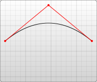

如果`T`命令跟在`Q`或`T`命令后面，则会将前命令控制点的中心对称点被作为它的控制点。如果`T`命令单独使用，前面没有`Q`或`T`
命令，那么控制点就会被认为和终点是同一个点，所以画出来的将是一条直线。

```text
Q x1 y1, x y
大写字母，表示采用绝对定位
q dx1 dy1, dx dy
小写字母，表示采用相对定位（即以上一个点为基准/原点进行移动）
```

```svg
<!-- 图中左侧红色标记的点对应的控制点即为蓝色标记点。 -->
<svg version="1.1" baseProfile="full" width="190" height="160" xmlns="http://www.w3.org/2000/svg">
  <rect width="100%" height="100%" fill="white"/>
  <path d="M 10 80 Q 52.5 10, 95 80 T 180 80" stroke="black" fill="transparent"/>
</svg>
```

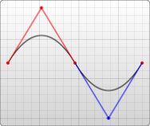

##### 3.4.3.2.3 弧形命令

`A`命令绘制弧形。需要`7`个参数。

* `rx`：弧形对应椭圆`x`轴半径。
* `ry`：弧形对应椭圆`y`轴半径。
* `x-axis-rotation`：椭圆横轴相对于`x`轴的旋转角度。
* `large-arc-flag`：在前三个参数确定的情况下，满足当前点到弧形终点`(x,y)`位置条件的弧形会有`4`条。`large-arc-flag`
  决定弧线是否大于`180°`，取值为`0`表示绘制小角度弧形，取值为`1`表示绘制大角度弧形。
* `sweep-flag`：在前四个参数确定的情况下，满足当前点到弧形终点`(x,y)`位置条件的弧形会有`2`条。`sweep-flag`
  表示弧线的方向，取值为`0`表示绘制逆时针方向的弧形，取值为`1`表示绘制顺时针方向的弧形。
* `x`：弧形终点的`x`坐标。
* `y`：弧形终点的`y`坐标。

```text
A rx ry x-axis-rotation large-arc-flag sweep-flag x y
大写字母，表示采用绝对定位
a rx ry x-axis-rotation large-arc-flag sweep-flag dx dy
小写字母，表示采用相对定位（即以上一个点为基准/原点进行移动）
```

**`x-axis-rotation`示例**

```svg
<!--
    图中的两个椭圆弧(x 半径 30, y 半径 50)被对角线切开。第一个椭圆弧的 x-axis-rotation 是 0，所以弧形所在的椭圆是正置的（没有倾斜）。
    第二个椭圆弧的 x-axis-rotation 是 -45，所以这是一个旋转了 -45° 的椭圆，并以短轴为分割线，形成了两个对称的弧形。
-->
<svg version="1.1" baseProfile="full" width="320" height="320" xmlns="http://www.w3.org/2000/svg">
  <rect width="100%" height="100%" fill="white"/>
  <path d="M 10 315
           L 110 215
           A 30 50 0 0 1 162.55 162.45
           L 172.55 152.45
           A 30 50 -45 0 1 215.1 109.9
           L 315 10" stroke="black" fill="green" stroke-width="2" fill-opacity="0.5"/>
</svg>
```

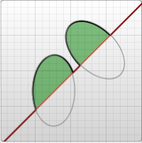

```svg
<!-- 上图没有旋转的椭圆，因为两点连线（即对角线）穿过了椭圆的中心，所以只有 2 种弧形可以选择。如下图所示为一般情况，会有两个椭圆，4 种弧。 -->
<svg version="1.1" baseProfile="full" width="320" height="320" xmlns="http://www.w3.org/2000/svg">
  <rect width="100%" height="100%" fill="white"/>
  <path d="M 10 315
           L 110 215
           A 36 60 0 0 1 150.71 170.29
           L 172.55 152.45
           A 30 50 -45 0 1 215.1 109.9
           L 315 10" stroke="black" fill="green" stroke-width="2" fill-opacity="0.5"/>
  <circle cx="150.71" cy="170.29" r="2" fill="red"/>
  <circle cx="110" cy="215" r="2" fill="red"/>
  <ellipse cx="144.931" cy="229.512" rx="36" ry="60" fill="transparent" stroke="blue"/>
  <ellipse cx="115.779" cy="155.778" rx="36" ry="60" fill="transparent" stroke="blue"/>
</svg>
```


**`large-arc-flag`和`sweep-flag`示例**

```svg
<!--
    x-axis-rotation 示例的 4 种不同路径将由 large-arc-flag（角度大小）和 sweep-flag（弧线方向）这两个参数决定。
    large-arc-flag 决定弧线是大于还是小于 180 度，0 表示小角度弧，1 表示大角度弧。
    sweep-flag 表示弧线的方向，0 表示从起点到终点沿逆时针画弧，1 表示从起点到终点沿顺时针画弧。
-->
<svg version="1.1" baseProfile="full" width="350" height="350" xmlns="http://www.w3.org/2000/svg">
  <rect width="100%" height="100%" fill="white"/>
  <path d="M 80 80
           A 45 45, 0, 0, 0, 125 125
           L 125 80 Z" fill="green"/>
  <path d="M 230 80
           A 45 45, 0, 1, 0, 275 125
           L 275 80 Z" fill="red"/>
  <path d="M 80 230
           A 45 45, 0, 0, 1, 125 275
           L 125 230 Z" fill="purple"/>
  <path d="M 230 230
           A 45 45, 0, 1, 1, 275 275
           L 275 230 Z" fill="blue"/>
</svg>
```

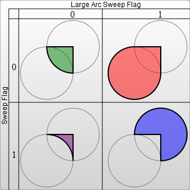

### 3.4.4 填充和描边

可以使用几种方法来着色（包括指定对象的属性）使用内联`CSS`样式、内嵌`CSS`样式，或者使用外部`CSS`样式文件。大多数的`Web`网站的
`SVG`使用的是内联样式`CSS`，对于这些方法都有优缺点。

#### 3.4.4.1 填充

填充可以通过在元素上设置`fill`和`stroke`属性实现。`fill`设置对象内部的颜色，`stroke`设置对象的线条的颜色。可以使用`CSS`
颜色命名方案定义颜色，比如颜色名（`red`）、`rgb`值、十六进制值、`rgba`值等。

```svg
<!-- 绘制了一个背景为紫色，边框为蓝色的 100*100px 的矩形 -->
<svg version="1.1" baseProfile="full" width="120" height="120" xmlns="http://www.w3.org/2000/svg">
  <rect width="100%" height="100%" fill="white"/>
  <rect x="10" y="10" width="100" height="100" stroke="blue" fill="purple" fill-opacity="0.5" stroke-opacity="0.8"/>
</svg>
```

定义填充色和边框色的不透明度，属性`fill-opacity`控制填充色的不透明度，属性`stroke-opacity`控制描边的不透明度。

**备注：`FireFox 3+`支持`rgba`
值，并提供相同的效果，但为了在其他浏览器中保持兼容，最好和填充/描边的不透明度分开使用。如果同时指定了`rgba`
值和填充/描边不透明度，它们将都被调用。**

#### 3.4.4.2 描边

可以通过一系列属性来控制绘制描边的样式。

```text
stroke-width = value
// 设置描边宽度。
stroke-linecap = type
// 设置描边末端样式。
stroke-linejoin = type
// 设定描边与描边间接合处的样式。
stroke-miterlimit = value
// 限制当两条描边相交时交接处最大长度；所谓交接处长度（斜接长度）是指线条交接处内角顶点到外角顶点的长度。
stroke-dasharray = value
// 设置当前虚线样式。例如：stroke-dasharray="5,10,5"
stroke-dashoffset = value
// 设置虚线样式的起始偏移量。
fill-rule = type
// 定义了用来确定一个多边形内部区域的算法。
```

**`stroke-linecap`示例**

`stroke-linecap`决定了线段端点显示的样子。属性值如下：

* `butt`（默认值）：线条末端呈正方形。
* `round`：线条末端呈圆形，圆形的半径也是由`stroke-width`控制的。
* `square`：线条末端呈方形，通过添加一个宽与`stroke-width`相同且高为`stroke-width`一半的盒子实现。

```svg
<!-- stroke-linecap 的三种形式 -->
<svg version="1.1" baseProfile="full" width="160" height="120" xmlns="http://www.w3.org/2000/svg">
  <rect width="100%" height="100%" fill="white"/>
  <line x1="40" x2="120" y1="20" y2="20" stroke="black" stroke-width="20" stroke-linecap="butt"/>
  <line x1="40" x2="120" y1="60" y2="60" stroke="black" stroke-width="20" stroke-linecap="square"/>
  <line x1="40" x2="120" y1="100" y2="100" stroke="black" stroke-width="20" stroke-linecap="round"/>
</svg>
```


**`stroke-linejoin`示例**

`stroke-linejoin`决定了两线段连接处所显示的样子。属性值如下：

* `miter`（默认值）：用尖角连接路径段。通过在路径段的切线处延伸笔触的外边缘直到它们相交，来形成拐角。受到`stroke-miterlimit`
  属性的影响。如果超出了`stroke-miterlimit`，则会呈现`bevel`的效果。
* `round`：使用圆角连接路径片段。圆角的半径是`stroke-width`。
* `bevel`：在相连部分的末端填充一个额外的以三角形为底的区域，每个部分都有各自独立的矩形拐角。

```svg
<!-- stroke-linejoin 的三种形式 -->
<svg version="1.1" baseProfile="full" width="160" height="280" xmlns="http://www.w3.org/2000/svg">
  <rect width="100%" height="100%" fill="white"/>
  <polyline points="40 60 80 20 120 60" stroke="black" stroke-width="20"
            stroke-linecap="butt" fill="none" stroke-linejoin="miter"/>

  <polyline points="40 140 80 100 120 140" stroke="black" stroke-width="20"
            stroke-linecap="round" fill="none" stroke-linejoin="round"/>

  <polyline points="40 220 80 180 120 220" stroke="black" stroke-width="20"
            stroke-linecap="square" fill="none" stroke-linejoin="bevel"/>
</svg>
```


**`stroke-miterlimit`注意事项**

如果两条线交汇在一起形成一个尖角，且属性`stroke-linejoin`指定为`miter`，斜接有可能远远超过出路径轮廓的`stroke-width`
。属性`stroke-miterlimit`给斜接长度与`stroke-width`的比率加了一个极限。当到达极限时，交汇处由斜接变成倒角。

`stroke-miterlimit`是斜接长度（斜接的外尖角和内夹角之间的距离）与`stroke-width`的比率。`stroke-miterlimit`
与两条线之间的角度`θ`有如下关系：

* `stroke-miterlimit = miterLength / stroke-width = 1 / sin ( θ / 2 )`
* 斜接默认值为`4.0`，`θ`小于`29`度的斜接会转换成倒角（`sin(14.5°) ≈ 0.250380`）。
* 斜接限定值为`√2 ≈ 1.4142136`（四舍五入）时，将去除所有锐角的斜接，仅保留钝角或直角的斜接。
* `1.0` 是合法的斜接限定值，但这会去除所有斜接。
* 小于`1.0`的值不是合法的斜接限定值。

**虚线示例**

`stroke-dasharray`属性的参数，是一组用逗号分割的数字序列。`stroke-dashoffset`属性设置起始偏移量。

**注意，与`path`不同的是，这里的数字必须用逗号分割（空格会被忽略）。**

每一组数字，第一个用来表示填色区域的长度，第二个用来表示非填色区域的长度。在下例中，红色路径会先做`5`
像素单位的填色，紧接着是`5`个空白单位，然后又是`5`个单位的填色。如果你想要更复杂的虚线模式，你可以定义更多的数字。黑色路径指定了
`3`个数字，这种情况下，数字会循环两次，形成一个偶数的虚线模式。所以该路径依次渲染`5`个填色单位，`10`个空白单位，`5`
个填色单位。然后从头进行一次循环， **但这次依次渲染`5`个空白单位，`10`个填色单位，`5`个空白单位** 。通过两次循环得到偶数模式，并重复这个偶数模式。

```svg

<svg version="1.1" baseProfile="full" width="200" height="150" xmlns="http://www.w3.org/2000/svg">
  <rect width="100%" height="100%" fill="white"/>
  <path d="M 10 75 Q 50 10 100 75 T 190 75" stroke="black"
        stroke-linecap="round" stroke-dasharray="5,10,5" fill="none"/>
  <path d="M 10 75 L 190 75" stroke="red"
        stroke-linecap="round" stroke-width="1" stroke-dasharray="5,5" fill="none"/>
</svg>
```


**`fill-rule`示例**

参考：https://developer.mozilla.org/zh-CN/docs/Web/SVG/Attribute/fill-rule

`fill-rule`是表现属性，它定义了用来确定一个多边形内部区域的算法。

`fill-rule`可以被应用于任何元素，但只会在`<path>`，`<polygon>`，`<polyline>`，`<text>`，`<textPath>`，`<tref>`，`<tspan>`中有效。

* `nonzero`（默认值）：非零规则`non-zero winding rule`。起始值为`0`，射线会和路径相交，形成一个转向的箭头。若为顺时针方向则`+1`
  ，若为逆时针方向则`-1`。若总计数值非`0`，则认为是路径内部（填充）；若总计数值为`0`，则认为是路径外部（不填充）。
* `evenodd`：奇偶规则`even-odd winding rule`。起始值为`0`，射线会和路径相交，每交叉一条路径，计数就`+1`
  。若总计数值为奇数，则认为是路径内部（填充）；若为偶数，则认为是路径外部（不填充）。

**注意：`nonzero`规则和`evenodd`规则统计的东西不一样，`nonzero`是计算顺时针逆时针数量，`evenodd`是交叉路径数量。**

**`nonzero`示例**

```svg

<svg version="1.1" baseProfile="full" width="320" height="120" viewBox="-10 -10 320 120"
     xmlns="http://www.w3.org/2000/svg">
  <rect width="100%" height="100%" fill="white"/>
  <!-- nonzero 填充规则被用于路径段会相交的形状上的效果 -->
  <polygon
          fill-rule="nonzero"
          stroke="red"
          points="50,0 21,90 98,35 2,35 79,90"/>
  <!--
  nonzero 填充规则被用于一个形状在另一形状内部的效果
  这两个正方形的路径段方向相同（都是顺时针）
  -->
  <path
          fill-rule="nonzero"
          stroke="red"
          d="M110,0  h90 v90 h-90 z
    M130,20 h50 v50 h-50 z"/>
  <!--
  这个例子与第二个例子几乎相同，唯一的区别是：两个形状的路径段方向相反
  外面的正方形是顺时针，里面的正方形则是逆时针
  -->
  <path
          fill-rule="nonzero"
          stroke="red"
          d="M210,0  h90 v90 h-90 z
    M230,20 v50 h50 v-50 z"/>
</svg>
```


**`evenodd`示例**

```svg

<svg version="1.1" baseProfile="full" width="320" height="120" viewBox="-10 -10 320 120"
     xmlns="http://www.w3.org/2000/svg">
  <rect width="100%" height="100%" fill="white"/>
  <!-- evenodd 填充规则被用于路径段会相交的形状上的效果 -->
  <polygon
          fill-rule="evenodd"
          stroke="red"
          points="50,0 21,90 98,35 2,35 79,90"/>
  <!--
  evenodd 填充规则被用于一个形状在另一形状内部的效果
  这两个正方形的路径段方向相同（都是顺时针）
  -->
  <path
          fill-rule="evenodd"
          stroke="red"
          d="M110,0  h90 v90 h-90 z
    M130,20 h50 v50 h-50 z"/>
  <!--
  这个例子与第二个例子几乎相同，唯一的区别是：两个形状的路径段方向相反
  外面的正方形是顺时针，里面的正方形则是逆时针
  -->
  <path
          fill-rule="evenodd"
          stroke="red"
          d="M210,0  h90 v90 h-90 z
    M230,20 v50 h50 v-50 z"/>
</svg>
```

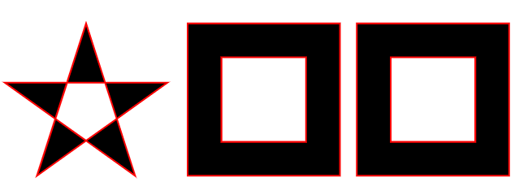

#### 3.4.4.3 使用CSS设置样式

可以通过`CSS`来设置填充和描边。语法和`HTML`里使用`CSS`一样，只需要把`background-color`、`border`改成`fill`和`stroke`
。注意，不是所有的属性都能用`CSS`来设置。上色和填充的部分一般是可以用`CSS`来设置的，比如`fill`，`stroke`，`stroke-dasharray`
等，但是不包括渐变和图案等功能。另外，`width`、`height`，以及路径的命令等，都不能用`CSS`设置。

```svg

<svg version="1.1" baseProfile="full" width="200" height="200" xmlns="http://www.w3.org/2000/svg">
  <!--
    <defs> 表示定义，这里面可以定义一些不会在 SVG 图形中出现、但是可以被其他元素使用的元素。
    可以使用hover这样的伪类来创建翻转之类的效果
    一些可以在 HTML 里使用的 CSS，在 svg 里可能无法正常工作，比如before和after伪类。
  -->
  <defs>
    <style>
      <![CDATA[
        #MyRect {
          stroke: black;
          fill: red;
        }
        #MyRect:hover {
          stroke: black;
          fill: blue;
        }
      ]]>
    </style>
  </defs>
  <rect width="100%" height="100%" fill="white"/>
  <rect x="10" y="10" width="180" height="180" id="MyRect"/>
  <!-- CSS 可以利用 style 属性插入到元素的行间 -->
  <rect x="10" y="10" width="180" height="180" style="stroke: black; fill: green;"/>
</svg>
```


### 3.4.5 渐变

#### 3.4.5.1 线性渐变

线性渐变沿着直线改变颜色。线性渐变需要在`SVG`文件的`defs`元素内部，创建一个`<linearGradient>`元素。

线性渐变内部有几个`stop`结点，这些结点通过指定位置的`offset`（偏移）和`stop-color`
（颜色中值）来说明在渐变的特定位置上应该是什么颜色；可以直接指定这两个属性值，也可以通过`CSS`
来指定他们的值，该例子中混合使用了这两种方法。你可以根据需求按照自己的喜好插入很多中间颜色，但是偏移量应该始终从`0%`
开始（或`0`，百分号可省略），到`100%`（或`1`）结束。如果`stop`设置的位置有重合，将使用`XML`
树中较晚设置的值。类似于填充和描边，通过指定属性`stop-opacity`来设置某个位置的半透明度。

详见`linearGradient.svg`文件。

#### 3.4.5.2 径向渐变

径向渐变与线性渐变相似，只是它是从一个点开始发散绘制渐变。径向渐变需要在`SVG`文件的`defs`中创建一个`<radialGradient>`元素。

详见`radialGradient.svg`文件。

`spreadMethod`属性定义了当渐变到达边缘时的行为，但此时该对象尚未被填充颜色。

* `pad`（默认值）：衬垫效果。当渐变到达终点时，最终的偏移颜色被用于填充对象剩下的空间。
* `reflect`：反射效果。会让渐变一直持续下去，效果是与渐变本身是相反的，以`100%`偏移位置的颜色开始，渐变到`0%`
  位置的颜色，然后再渐变`100%`位置的颜色。
* `repeat`：重复效果。会让渐变一直持续下去，效果是与渐变本身是相同的，它会跳回到最初的颜色然后继续渐变。

线性和径向渐变都有`gradientUnits`（渐变单元）属性，它定义了用来描述渐变的大小和方向的单元系统。

* `objectBoundingBox`（默认值）：表示使用渐变元素的矩形百分比指定位置大小。设置`0`到`1`的坐标值，渐变单元就会自动缩放到渐变元素对应大小。
* `userSpaceOnUse`：表示几何属性的所有坐标都是应用时定义的用户坐标系。

详见`radialGradient-spreadMethod.svg`文件。

### 3.4.6 图案

#### 3.4.6.1 图案

图案`patterns`是`SVG`中用到的最让人混淆的填充类型之一。`<pattern>`需要定义在`SVG`文件的`<defs>`内。在`patterns`
元素可以包含任何之前包含的其他基本形状，并且每个形状都可以使用之前学习过（包括渐变和半透明）的任何样式。

详见`pattern.svg`文件。

`patterns`元素上定义了`width`和`height`属性，用于描述图案容器的标准宽高（绘制一份图案）。可以使用`x`和`y`属性添加初始偏移。

`patterns`的`patternsUnits`（图案单元）属性，它定义了用来描述图案容器（绘制一份图案）的大小和方向的单元系统。

* `objectBoundingBox`（默认值）：表示使用图案元素的矩形百分比指定位置大小。设置`0`到`1`的坐标值，图案单元就会自动缩放到图案元素对应大小。
* `userSpaceOnUse`：表示几何属性的所有坐标都是应用时定义的用户坐标系。

`patterns`的`patternsContentUnits`（图案内容单元）属性，用于描述`patterns`元素基于基本图形使用的单元系统。

* `objectBoundingBox`：表示使用图案元素的矩形百分比指定位置大小。设置`0`到`1`的坐标值，图案内容单元就会自动缩放到图案元素对应大小。
* `userSpaceOnUse`（默认值）：表示几何属性的所有坐标都是应用时定义的用户坐标系。

**需要指定`patternsContentUnits`和`patternsUnits`中的一个，否则`patterns`中绘制的图形和`patterns`元素使用的坐标系不同。**

如果图案改变了大小，`patterns`会自适应其大小，但是图案里的图形不会自适应。

* `patternContentUnits`设置为`objectBoundingBox`时，`pattern`会自动缩放以保证`pattern`内部的图形数目和重复不变。
* `patternUnits`设置为`userSpaceOnUse`时，`pattern`本身会保持不变，只是重复更多次去填充。

`objectBoundingBox`如果在`Gecko`绘制半径设小于`0.075`圆，绘制可能会出现问题。应尽量避免在`objectBoundingBox`单元绘制图形。

详见`pattern-compare.svg`文件。

#### 3.4.6.2 嵌入光栅图像

`SVG`的`<image>`元素允许在一个`SVG`对象内部添加光栅图像（`<image>`元素至少需要支持`PNG`、`JPG`和`SVG`格式文件）。

嵌入的图像变成一个普通的`SVG`元素。可以在其内容上用剪切、遮罩、滤镜、旋转以及其他`SVG`工具。

```svg

<svg version="1.1" baseProfile="full" width="200" height="200" xmlns="http://www.w3.org/2000/svg">
  <image x="90" y="-65" width="128" height="146" transform="rotate(45)"
         xlink:href="https://developer.mozilla.org/zh-CN/docs/Web/SVG/Element/image/mdn_logo_only_color.png"/>
</svg>
```

**注意事项：**

* 如果没有设置`x`或`y`属性，会自动设置为`0`。
* 如果没有设置`width`或`height`属性，会自动设置为`0`。
* 如果`width`或`height`等于`0`，则不会绘制这个图像。

#### 3.4.6.3 嵌入XML

参考：https://www.cnblogs.com/fangsmile/p/11649683.html
https://developer.mozilla.org/zh-CN/docs/Web/MathML/Authoring

`SVG`是一个`XML`应用，所以可以在`SVG`文档的任何位置嵌入任意`XML`。通常不会定义其他`SVG`对此`SVG`的影响。`foreignObject`
元素可以在其内部使用具有其它`XML`命名空间的`XML`元素。即借助`foreignObject`标签，可以直接在`SVG`内部嵌入`XHTML`元素。`HTML`
布局比`SVG text`元素更适合长文本。另一个常用的案例是用`MathML`写方程式。`foreignObject`是一个`SVG`
元素，所以可以使用任何`SVG`的方法对其内容进行操作。

**备注：`foreignObject`元素的内容是能被浏览器加工的。一个独立的`SVG`浏览器不太可能呈现`HTML`或`MathML`。**

### 3.4.7 文本

`SVG`两种文本模式：一种是写在图像中的文本，另一种是`SVG`字体。

#### 3.4.7.1 text元素

`text`元素定义了一个由文字组成的图形。

**注意：`text`上可以使用渐变、图案、剪切路径、遮罩或滤镜。**

* `x`和`y`属性设置文本在视口中显示的位置。
* `text-anchor`属性用来描述该文本与所给点的对齐方式：`start`（开头对齐）、`middle`（中间对齐）、`end`（末尾对齐）或`inherit`（继承）。
* `fill`属性设置文本填充颜色。
* `stroke`属性设置文本描边颜色，可以使用渐变或图案。
* `font-family`：允许通过给定一个有先后顺序的，由字体名或字体族名组成的列表来为选定的元素设置字体。
* `font-style`：字体中选择`normal`（正常）、`italic`（斜体）或`oblique`（斜体，可加角度）的字体外观。
* `font-weight`：设置字体的粗细程度。一些字体只提供`normal`（正常）和`bold`（加粗）两种值。
* `font-variant`：用于设置文本的字体变体。主要用于控制小型大写字母（`small-caps`）的显示，即所有的小写字母都会被转换为大写字母，但是字体大小会比正常的大写字母小。
* `font-stretch`：字体中选择`normal`（正常）、`semi-condensed、condensed、extra-condensed、ultra-condensed`
  （紧凑）或`semi-expanded、expanded、extra-expanded、ultra-expanded`（扩展）的字体外观。
* `font-size`：设置字体大小。
* `font-size-adjust`：定义字体大小应取决于小写字母，而不是大写字母。在字体较小时，字体的可读性主要由小写字母的大小决定，通过此选项即可进行调整。
* `letter-spacing`：用于设置文本字符的间距表现。
* `word-spacing`：设置标签、单词之间的空格长度。
* `text-decoration`：设置文本上的装饰性线条的外观。比如下划线。

#### 3.4.7.2 tspan元素

`tspan`元素用来标记文本的子部分，它必须是一个`text`元素或别的`tspan`元素的子元素。一个典型的用法是把句子中的一个词变成粗体红色。

* `x`：为容器设置一个新绝对`x`坐标。它覆盖了默认的当前的文本位置。可以接收一个数列，将逐个应用到`tspan`元素内的每一个字符。
* `y`：为容器设置一个新绝对`y`坐标。它覆盖了默认的当前的文本位置。可以接收一个数列，将逐个应用到`tspan`元素内的每一个字符。
* `dx`：从当前位置，用一个水平偏移开始绘制文本。可以接收一个数列，将逐个应用到`tspan`元素内的每一个字符并累计偏移。
* `dy`：从当前位置，用一个垂直偏移开始绘制文本。可以接收一个数列，将逐个应用到`tspan`元素内的每一个字符并累计偏移。
* `rotate`：把所有的字符旋转一个角度。可以接收一个数列，则使每个字符旋转分别旋转到那个值，剩下的字符根据最后一个值旋转。
* `textLength`：这是一个很模糊的属性，给出字符串的计算长度。如果度量的文字和长度不满足`textLength`，则允许渲染引擎精细调整字型的位置。

#### 3.4.7.3 textPath元素

`textPath`元素将文本放置在其内部，并通过`xlink:href`属性值引用`<path>`元素，就可以让文字块呈现在`<path>`元素给定的路径上了。

详见`text.svg`文件。

#### 3.4.7.4 SVG字体

制定`SVG`时，并未在浏览器支持`Web`字体。访问字体文件让字体正确呈现是具有稳定性的。因此，通过字体描述技术实现`SVG`
文字。而不是为了和其他（`PostScript`，`OTF`）格式兼容，仅是为了将字形信息嵌入`SVG`进行呈现。

**备注：`SVG`字体当前只在`Safari`和`Android`浏览器中受支持。`Chrome 38`（`Opera 25`）移除了这个功能，`Firefox`
已经无限期推迟实施它以专注于实现`WOFF`。`Batik`和部分`Inkscape`支持`SVG` 字体嵌入。**

因为该功能已经移除，不做过多赘述。

### 3.4.8 基础变形

利用`<g>`元素，可以把属性赋给一整个元素集合。这是`<g>`元素唯一的用途。

#### 3.4.8.1 平移

`translate(x,y)`能把元素移动一段距离，甚至你可以根据相应的属性定位它。如果没有指定`y`，则默认值为`0`。

#### 3.4.8.2 旋转

`rotate(a)`能把元素旋转`a`度。

#### 3.4.8.3 斜切

参考：https://juejin.cn/post/7145014612713766948

`skewX(a)`，`skewY(b)`都可以将元素倾斜一定角度并按照斜切方向移动一定距离。不支持`skew(x,y)`。

#### 3.4.8.4 缩放

`scale(x,y)`可以改变元素的尺寸。`0.5`表示收缩到`50%`。如果`y`缺省，则默认赋值为`x`。

#### 3.4.8.5 矩阵操作

参考：https://www.cnblogs.com/bbcfive/p/11155824.html
https://www.cnblogs.com/fangsmile/p/9324194.html

上述所有变形可以使用一个`2x3`的变形矩阵替代实现。使用`matrix(a, b, c, d, e, f)`设置变形矩阵。它将上一个坐标系统的坐标映射到新的坐标系统：

x<sub>new</sub> = ax<sub>prev</sub> + cy<sub>prev</sub> + e

y<sub>new</sub> = bx<sub>prev</sub> + dy<sub>prev</sub> + f

详见`transform.svg`文件

#### 3.4.8.6 坐标系统上的变形

如果使用了变形，会在元素内部建立一个应用了这些变形的新坐标系统，你为该元素和它的子元素指定的单位可能不是`1:1`
像素映射。但是依然会根据这个变形进行平移、旋转、斜切、缩放操作。

```svg

<g transform="scale(2)">
  <rect width="50" height="50"/>
</g>
```

#### 3.4.8.7 SVG嵌套变形

`SVG`允许嵌入别的`<svg>`元素。可以利用内部`<svg>`元素的`viewBox`、`width`和`height`属性创建一个新的坐标系统。

```svg

<svg xmlns="http://www.w3.org/2000/svg" version="1.1">
  <svg width="100" height="100" viewBox="0 0 50 50">
    <rect width="50" height="50"/>
  </svg>
</svg>
```

### 3.4.9 裁切和遮罩

#### 3.4.9.1 裁切

`clip-path`用于移除在其他元素的部分内容。不支持任何半透明效果，只能显示或不显示。

**`clip-path`示例**

```svg
<!-- 经过裁切，得到一个四分之三圆 -->
<svg version="1.1" baseProfile="full" width="200" height="200" xmlns="http://www.w3.org/2000/svg">
  <defs>
    <!-- <clipPath> 裁切元素通常定义在 <defs> 中 -->
    <clipPath id="cut-off-bottom">
      <!-- 用于确定画布填充范围，它并不会被绘制 -->
      <rect x="0" y="0" width="200" height="150"/>
    </clipPath>
  </defs>
  <rect width="100%" height="100%" fill="white"/>
  <!-- clip-path 引用 <clipPath> 裁切元素 -->
  <circle cx="100" cy="100" r="100" fill="red" clip-path="url(#cut-off-bottom)"/>
</svg>
```

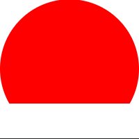

#### 3.4.9.2 遮罩

`mask`用于实现具有透明度和灰度值遮罩的渐变边缘。

**`mask`示例**

```svg
<!-- 遮罩可以实现元素淡出的效果 -->
<svg version="1.1" baseProfile="full" width="200" height="200" xmlns="http://www.w3.org/2000/svg">
  <defs>
    <linearGradient id="Gradient">
      <stop offset="0" stop-color="white" stop-opacity="0"/>
      <stop offset="1" stop-color="white" stop-opacity="1"/>
    </linearGradient>
    <mask id="Mask">
      <!-- 填充了一个透明到白色的渐变 -->
      <rect x="0" y="0" width="200" height="200" fill="url(#Gradient)"/>
    </mask>
  </defs>
  <rect x="0" y="0" width="200" height="200" fill="green"/>
  <!-- mask 引用 <mask> 遮罩元素。红色矩形继承遮罩的 alpha 值（透明度） -->
  <rect x="0" y="0" width="200" height="200" fill="red" mask="url(#Mask)"/>
</svg>
```


#### 3.4.9.3 透明度

可以用`opacity`为整个元素设置透明度。填充和描边分别有`fill-opacity`和`stroke-opacity`属性，用来控制填充和描边的不透明度。

**注意：描边在填充的图层上面。如果在一个元素上设置了描边透明度，同时设有填充，则描边的一半应用填充色，另一半将应用背景色。**

**`opacity`示例**

```svg
<!-- 红色的圆形在绿色的背景上，黄色描边设置为 50% 不透明度，达到双色描边的效果 -->
<svg version="1.1" baseProfile="full" width="200" height="200" xmlns="http://www.w3.org/2000/svg">
  <rect x="0" y="0" width="200" height="200" fill="green"/>
  <circle cx="100" cy="100" r="50" stroke="yellow" stroke-width="40" stroke-opacity="0.5" fill="red"/>
</svg>
```


### 3.4.10 滤镜效果

某些情况下，基本的`SVG`图形不能实现某种想要的效果。比如阴影效果不能通过渐变类元素实现。

滤镜就是`SVG`用于创建复杂效果的一种机制。滤镜使用`<filter>`元素在`<defs>`中定义。`<filter>`元素提供一系列图元（`primitives`
），以及在前一个基本变换操作上添加另一个操作。只需要为`SVG`元素设置`filter`属性即可应用所创建的滤镜效果。

**滤镜示例**

实现一个带光照效果的`SVG`的名牌。

1. 创建图形阴影：设置`<feGaussianBlur>`中的`in`属性为`SourceAlpha`（源图像的透明度`alpha`通道），设置模糊度为`4`并把`result`
   保存在了一个名为`blur`的缓冲区中。
2. 设置阴影偏移：设置`<feOffset>`中的`in`属性为`blur`，即上一步保存`result`的缓冲区。然后设置相对坐标，向右偏移`4`
   ，向下偏移`4`。最后把结果`result`保存到名为`offsetBlur`的缓冲区中。
3. 设置光照效果：设置`<feSpecularLighting>`中的`in`属性为`blur`，将会生成一个光照效果，并将结果`result`保存在`specOut`中。
4. 组合光照效果：设置`<feComposite>`中的`in`属性为`specOut`及`in2`属性为`SourceAlpha`，将`specOut`
   的效果遮盖掉，使得最后的结果不会大于`SourceAlpha`（源图像），组合结果`result`保存到`specOut`。
5. 组合光照效果：设置`<feComposite>`中的`in`属性为`SourceGraphic`及`in2`属性为`specOut`，使用`arithmetic`
   组合模式，在`SourceGraphic`上添加`specOut`的效果，组合结果`result`保存到`litPaint`。
6. 合并元素：使用`<feMerge>`元素合并了阴影效果`offsetBlur`和源图像的光照效果`litPaint`。

详见`filter.svg`文件

## 3.5 Blob及File学习

参考：https://juejin.cn/post/7424414729857400870

### 3.5.1 Blob对象

`Blob`对象表示一个不可变、原始数据的类文件对象。它的数据可以按文本或二进制的格式进行读取，也可以转换成`ReadableStream`
来用于数据操作。`Blob`提供了一种高效的方式来操作数据文件，而不需要将数据全部加载到内存中(比如流式读取、文件切片`slice()`
方法)，这在处理大型文件或二进制数据时非常有用。

`Blob`表示的不一定是`JavaScript`原生格式的数据。`File`接口基于`Blob`，继承了`Blob`的功能并将其扩展以支持用户系统上的文件。

#### 3.5.1.1 语法

要从其他非`Blob`对象和数据构造一个`Blob`，请使用`Blob()`构造函数。要创建一个`Blob`数据的子集`blob`，请使用`slice()`方法。

```javascript
new Blob(blobParts)
new Blob(blobParts, options)
// Blob() 构造函数返回一个新的 Blob 对象。blob 的内容由参数 blobParts 中给出的值串联而成。
```

* `blobParts`（可选）：一个可迭代对象，比如`Array`，包含`ArrayBuffer`、`TypedArray`、`DataView`、`Blob`
  、字符串或者任意这些元素的组合，这些元素将会被放入`Blob`中。字符串应该是格式良好的`Unicode`，而单独代理项（`lone surrogate`
  ）会使用和`String.prototype.toWellFormed()`相同的算法进行清理。
* `options`（可选）：一个可以指定以下任意属性的对象：
  * `type`（可选）：将会被存储到`Blob`中的数据的`MIME`类型。默认值是空字符（`""`）。
  * `endings`（可选、非标准）：如果数据是文本，那么如何解释其中的换行符（`\n`）。默认值`transparent`会将换行符复制到`Blob`
    中而不会改变它们。要将换行符转换为主机系统的本地约定，请指定值`native`。

#### 3.5.1.2 属性

```javascript
Blob.size
// 只读，Blob 对象中所包含数据的大小（字节）。
Blob.type
// 只读，一个字符串，表明该 Blob 对象所包含数据的 MIME 类型。如果类型未知，则该值为空字符串。
```

#### 3.5.1.3 实例方法

```javascript
Blob.arrayBuffer()
// 返回一个 promise，其会兑现一个包含 Blob 所有内容的二进制格式的 ArrayBuffer。适合处理二进制数据。
Blob.bytes()
// 返回一个 promise，其会兑现一个包含 Blob 内容的 Uint8Array。
Blob.slice(start, end)
// 返回一个新的 Blob 对象，其中包含调用它的 Blob 的指定字节范围内的数据。
Blob.stream()
// 返回一个能读取 Blob 内容的 ReadableStream。允许你以流的方式处理数据，适合处理大文件。
Blob.text()
// 返回一个 promise，其会兑现一个包含 Blob 所有内容的 UTF-8 格式的字符串。
```

#### 3.5.1.4 使用场景

**从Blob中提取数据**

```javascript
const reader = new FileReader();
reader.addEventListener("loadend", () => {
  // reader.result 包含被转化为类型化数组的 blob 中的内容
});
reader.readAsArrayBuffer(blob);
// 读取指定的 Blob 对象，并将文件内容读为 ArrayBuffer。
reader.readAsBinaryString(blob);
// 读取指定的 Blob 对象，并将文件内容读为二进制字符串。
reader.readAsDataURL(blob);
// 读取指定的 Blob 对象，并将文件内容读为 Data URL（Base64 编码的字符串）。
reader.readAsText(blob);
// 读取指定的 Blob 对象，并将文件内容读为文本字符串，默认使用 UTF-8 编码。

const text = new Response(blob).text();
// 将 Blob 中的内容读取为文本

const text = blob.text();
// 将 Blob 中的内容读取为文本
```

**生成文件下载**

```javascript
// 可以通过 Blob 创建文件并生成下载链接供用户下载文件
const blob = new Blob(["This is a test file."], {type: "text/plain"});
const url = URL.createObjectURL(blob); // 创建一个 Blob URL
const a = document.createElement("a");
a.href = url;
a.download = "test.txt";
a.click();
URL.revokeObjectURL(url); // 释放 URL 对象
```

**上传文件**

```javascript
// Blob 常用于上传文件到服务器，尤其是在使用 FormData API 时
const formData = new FormData();
// 做过上传文件功能的小伙伴，肯定都遇到过将 File 对象传入到 formData 中上传
// 其实 File 对象就是继承了 Blob 对象，只不过加上了一些文件信息。
formData.append("file", blob, "example.txt");

fetch("/upload", {
  method: "POST",
  body: formData,
}).then((response) => {
  console.log("File uploaded successfully");
});
```

**图像处理**

通过`FileReader`可以将`Blob`对象读取为不同的数据格式。详见`blob-demo.html`文件。

### 3.5.2 File对象

`File`提供有关文件的信息，允许`JavaScript`访问其内容。

`File`继承自`Blob`对象，包含文件的元数据（如文件名、文件大小、类型等）。可以在`Blob`可使用的上下文中使用。

`Blob`是纯粹的二进制数据，它可以存储任何类型的数据，但不具有文件的元数据（如文件名、最后修改时间等）。

`File`是`Blob`的子类，除了继承`Blob`的所有属性和方法之外，还包含文件的元数据。你可以将`File`
对象看作是带有文件信息的`Blob`。`Blob`更加通用，而`File`更专注于与文件系统的交互。

#### 3.5.2.1 语法

```javascript
new File(fileBits, fileName)
new File(fileBits, fileName, options)
// File() 构造函数创建新的 File 对象实例。
```

* `fileBits`：一个可迭代对象，例如一个具有`ArrayBuffer`、`TypedArray`、`DataView`、`Blob`、字符串或任何此类元素的组合的数组，将被放入
  `File`内。**注意：这里的字符串被编码为`UTF-8`，与通常的`JavaScript UTF-16`字符串不同。**
* `fileName`：表示文件名或文件路径的字符串。
* `options`（可选）：包含文件可选属性的选项对象。可用选项如下：
  * `type`（可选）：表示将放入文件的内容的`MIME`类型的字符串。默认值为`""`。
  * `endings`（可选）：如果数据是文本，那么如何解释其中的换行符（`\n`）。默认值`transparent`会将换行符复制到`Blob`
    中而不会改变它们。要将换行符转换为主机系统的本地约定，请指定值`native`。
  * `lastModified`（可选）：一个数字，表示`Unix`时间纪元与文件上次修改时间之间的毫秒数。默认值为调用`Date.now()`返回的值。

#### 3.5.2.2 属性

```javascript
// File 接口还继承了 Blob 接口的属性。
File.lastModified
// 只读，返回文件的最后修改时间，以 UNIX 纪元（1970 年 1 月 1 日午夜）以来的毫秒为单位。
File.lastModifiedDate
// 已弃用 只读 非标准，返回 File 对象引用的文件的最后修改时间的 Date。
File.name
// 只读，返回 File 对象引用的文件的名称。
File.webkitRelativePath
// 只读，返回 File 对象相对于 URL 的路径。
```

#### 3.5.2.3 实例方法

```javascript
// File 接口还继承了 Blob 接口的方法。
File.arrayBuffer()
// 返回一个 promise，其会兑现一个包含 File 所有内容的二进制格式的 ArrayBuffer。适合处理二进制数据。
File.bytes()
// 返回一个 promise，其会兑现一个包含 File 内容的 Uint8Array。
File.slice(start, end)
// 返回一个新的 File 对象，其中包含调用它的 File 的指定字节范围内的数据。
File.stream()
// 返回一个能读取 File 内容的 ReadableStream。允许你以流的方式处理数据，适合处理大文件。
File.text()
// 返回一个 promise，其会兑现一个包含 File 所有内容的 UTF-8 格式的字符串。
```

#### 3.5.2.4 获取方式

1. `File`对象通常从用户使用`<input>`元素选择文件返回的`FileList`对象中检索。
2. 拖放操作返回的`DataTransfer`对象中检索。
3. 使用`File`构造函数手动创建。

```javascript
<input type="file" id="fileInput"/>
// 获取用户上传的
document.getElementById("fileInput").addEventListener("change", (event) => {
  const file = event.target.files[0];
  console.log("文件名:", file.name, "文件类型:", file.type, "文件大小:", file.size);
});

// 手动创建 File
const file = new File(["Hello, world!"], "hello-world.txt", {
  type: "text/plain",
});
console.log(file);
```

#### 3.5.2.5 支持Blob和File对象的API

以下`API`都接受`Blob`对象和`File`对象：

1. `FileReader`
2. `URL.createObjectURL() `
3. `Window.createImageBitmap()`和`WorkerGlobalScope.createImageBitmap()`
4. `fetch()`方法的`body`选项
5. `XMLHttpRequest.send()`

### 3.5.3 FileReader对象

`FileReader`接口允许`Web`应用程序异步读取存储在用户计算机上的文件（或原始数据缓冲区）的内容，使用`File`或`Blob`
对象指定要读取的文件或数据。

文件对象可以从用户使用`<input type="file">元素选择文件而返回的`FileList`对象中获取，或者从拖放操作的`DataTransfer`对象中获取。

`FileReader`只能访问用户明确选择的文件内容（`input`或拖放）。它不能用于从用户的文件系统中按路径名读取文件。要按路径名读取客户端文件系统上的文件，请使用文件系统访问
`API`。要读取服务器端文件，请使用`fetch()`，如果跨源读取，则需要`CORS`权限。

#### 3.5.3.1 语法

```javascript
new FileReader()

// FileReader() 构造函数创建一个新的 FileReader 对象。

function printFile(file) {
  // 使用 FileReader() 构造函数创建 FileReader 对象，和该对象的后续使用。
  const reader = new FileReader();
  reader.onload = (evt) => {
    console.log(evt.target.result);
  };
  reader.readAsText(file);
}
```

#### 3.5.3.2 属性

```javascript
FileReader.error
// 只读，一个表示在读取文件时发生的错误的 DOMException。
FileReader.readyState
// 只读，表示FileReader状态的数字。取值如下：
// 常量名	值	描述
// EMPTY	0	还没有加载任何数据。
// LOADING	1	数据正在被加载。
// DONE	    2	已完成全部的读取请求。
FileReader.result
// 只读，文件的内容。该属性仅在读取操作完成后才有效，数据的格式取决于使用哪个方法来启动读取操作。
```

#### 3.5.3.3 实例方法

```javascript
FileReader.abort()
// 中止读取操作。在返回时，readyState 属性为 DONE。
FileReader.readAsArrayBuffer()
// 开始读取指定的 Blob 中的内容，一旦完成，result 属性中将包含一个表示文件数据的 ArrayBuffer 对象。
FileReader.readAsBinaryString()
// 已弃用。开始读取指定的 Blob 中的内容。一旦完成，result 属性中将包含一个表示文件中的原始二进制数据的字符串。
FileReader.readAsDataURL()
// 开始读取指定的 Blob 中的内容。一旦完成，result 属性中将包含一个表示文件数据的 data: URL（Base64 编码的字符串）。
FileReader.readAsText()
// 开始读取指定的 Blob 中的内容。一旦完成，result 属性中将包含一个表示所读取的文件内容的字符串。可以指定可选的编码名称。
```

#### 3.5.3.4 事件

使用`addEventListener()`方法或通过将事件侦听器分配给此接口的`oneventname`属性来侦听这些事件。一旦不再使用`FileReader`
，请使用`removeEventListener()`删除事件侦听器，以避免内存泄漏。

```javascript
abort
// 当读取被中止时触发，例如因为程序调用了 FileReader.abort() 方法。
error
// 当读取由于错误而失败时触发。
load
// 读取成功完成时触发。
loadend
// 读取完成时触发，无论成功与否（包括被中止）。
loadstart
// 读取开始时触发。
progress
// 读取数据时定期触发。
```

### 3.5.4 Base64编码

`Base64`是一种二进制到文本的编码规则，让二进制数据在解释成`64`进制的表现形式后能够用`ASCII`字符串的格式表示出来。`Base64`
出自一种特定的`MIME`内容传输编码。常用于需要通过文本数据传输二进制数据的场景，例如在`URL`、电子邮件以及`JSON`数据中嵌入图像或文件。

当单独使用术语`Base64`指代特定算法时，通常指的是`RFC 4648`第`4`节中概述的`Base64`版本。

#### 3.5.4.1 Base64编码原理

* 基本字符集：`Base64`使用`64`个可打印字符来表示二进制数据。这些字符包括：
  * 大写字母`A-Z`（`26`个字符）
  * 小写字母`a-z`（`26`个字符）
  * 数字`0-9`（`10`个字符）
  * 加号`+`和斜杠`/`（`2`个字符）
* 数据分组：`Base64`将输入的二进制数据分成`24`位（`3`字节）一组，然后将这`24`位分为`4`个`6`位的块。每个`6`
  位的块被转换为一个`Base64`字符。
* 填充字符：如果原始数据的字节数不是`3`的倍数，`Base64`编码会在末尾添加一个或两个等号`=`作为填充，以确保输出字符数是`4`的倍数。

**编码后大小增加：**

每个`Base64`位代表`6`位数据。输入字符串/二进制文件的三个`8`位字节（`3×8 = 24`位）可以用四个`6`位`Base64`位（`4×6 = 24`
位）表示。因此，字符串或文件的`Base64`版本通常比原来的内容多大约三分之一（受字符串的绝对长度、模`3`的余数、是否使用填充字符影响）。

#### 3.5.4.2 Base64编码转换

浏览器原生提供了两个`JavaScript`函数，用于解码和编码`Base64`字符串：

`Window.btoa()`（在`worker`中可用）：从二进制数据字符串创建一个`Base64`编码的`ASCII`字符串（`btoa`应看作“从二进制到`ASCII`）
`Window.atob()`（在`worker`中可用）：解码通过`Base64`编码的字符串数据（`atob`应看作“从`ASCII`到二进制）

注意：`Base64`是一种二进制编码，而不是文本编码，但是在`Web`平台支持二进制数据类型之前，`btoa`和`atob`
被添加到了其中。因此，这两个函数使用字符串来表示二进制数据，其中每个字符的码位表示每个字节的值。这导致了一个普遍的误解，即
`btoa`可以用来编码任意文本数据，例如创建文本或`HTML`文档的`Base64 data: URL`。

然而，字节到码位的对应关系只能可靠地适用于最高为`0x7f`的码位。此外，超过`0xff`的码位将导致`btoa`抛出错误，因为超过了`1`
字节的最大值。

**任意`Unicode`文本进行`Base64`编码解决方案**

由于`btoa`将其输入字符串的码位解释为字节值，因此如果字符的码位超过`0xff`，调用`btoa`将导致`Character Out Of Range`
异常。对于需要编码任意`Unicode`文本的用例，需要首先将字符串转换为其`UTF-8`的组成字节，然后再对这些字节进行编码。

最简单的解决方案是使用`TextEncoder`和`TextDecoder`在`UTF-8`和字符串的单字节表示之间进行转换：

```javascript
function base64ToBytes(base64) {
  const binString = atob(base64);
  return Uint8Array.from(binString, (m) => m.codePointAt(0));
}

function bytesToBase64(bytes) {
  const binString = Array.from(bytes, (byte) =>
          String.fromCodePoint(byte),
  ).join("");
  return btoa(binString);
}

// 用法
bytesToBase64(new TextEncoder().encode("a Ā 𐀀 文 🦄")); // "YSDEgCDwkICAIOaWhyDwn6aE"
new TextDecoder().decode(base64ToBytes("YSDEgCDwkICAIOaWhyDwn6aE")); // "a Ā 𐀀 文 🦄"
```

`bytesToBase64`和`base64ToBytes`函数可以直接用于在`Base64`字符串和`Uint8Array`之间进行转换。

为了获得更好的性能，可以通过`FileReader`和`fetch`进行基于`Base64`数据`URL`的异步转换：

```javascript
async function bytesToBase64DataUrl(bytes, type = "application/octet-stream") {
  return await new Promise((resolve, reject) => {
    const reader = Object.assign(new FileReader(), {
      onload: () => resolve(reader.result),
      onerror: () => reject(reader.error),
    });
    reader.readAsDataURL(new File([bytes], "", {type}));
  });
}

async function dataUrlToBytes(dataUrl) {
  const res = await fetch(dataUrl);
  return new Uint8Array(await res.arrayBuffer());
}

// 用法
await bytesToBase64DataUrl(new Uint8Array([0, 1, 2])); // "data:application/octet-stream;base64,AAEC"
await dataUrlToBytes("data:application/octet-stream;base64,AAEC"); // Uint8Array [0, 1, 2]
```

### 3.5.5 URL.createObjectURL()静态方法

`URL`接口的`createObjectURL()`静态方法创建一个用于表示参数中给出的对象的`URL`的字符串。`URL`代表指定的`MediaSource`
（基本被废弃）、`File`或`Blob`对象。允许开发者通过`URL`引用本地的文件或数据，而不需要将其上传到服务器。

`URL`的生命周期与其创建时所在窗口的`document`绑定在一起，浏览器会在卸载文档时自动释放对象`URL`
。但为了优化性能和内存使用，若在安全时间内可以明确卸载，就应该卸载，需要手动调用`revokeObjectURL()`。

**注意：此特性在`Service Worker`中不可用，因为它有可能导致内存泄漏。**

#### 3.5.4.1 语法

要从其他非`Blob`对象和数据构造一个`Blob`，请使用`Blob()`构造函数。要创建一个`Blob`数据的子集`blob`，请使用`slice()`方法。

```javascript
URL.createObjectURL(object)
// createObjectURL() 静态方法创建一个用于表示参数中给出的对象的 URL 的字符串。
```

* `object`：用于创建`URL`的`File`、`Blob`或`MediaSource`对象。

#### 3.5.4.2 内存管理

每次调用`createObjectURL()`时，都会创建一个新的对象`URL`，即使已经为同一个对象创建了一个`URL`
。当不再需要这些对象时，必须通过调用`URL.revokeObjectURL()`来释放它们。

浏览器会在卸载文档时自动释放对象`URL`；然而，为了优化性能和内存使用，如果在安全时间内可以明确卸载，就应该卸载。

使用对象`URL`进行媒体流处理：在较早版本的媒体源规范中，需要为`MediaStream`创建一个对象`URL`才能将流附加到`<video>`
元素。这已不再必要，浏览器正在逐步取消对此的支持。

#### 3.5.5.3 使用场景

* 预览文件：用户上传文件后，可以使用`createObjectURL()`生成一个`URL`来在浏览器中预览图像、视频或音频。
* 动态生成内容：在不需要持久化存储的情况下，使用`Blob`对象动态生成内容并通过`URL`引用。

```html
<!DOCTYPE html>
<html lang="en">
<head>
  <meta charset="UTF-8">
  <meta name="viewport" content="width=device-width, initial-scale=1.0">
  <title>Image Preview</title>
</head>
<body>
<h1>Upload and Preview Image</h1>
<input type="file" id="fileInput" accept="image/*">
<div id="preview" style="margin-top: 20px;">
  
</div>

<script>
  document.getElementById('fileInput').addEventListener('change', function (event) {
    const file = event.target.files[0];
    if (!file) {
      return;
    }
    // 生成一个 URL 用于引用文件
    const imageUrl = URL.createObjectURL(file);
    // 显示图像预览
    const img = document.getElementById('imagePreview');
    img.src = imageUrl;
    img.style.display = 'block';

    img.onload = function () {
      URL.revokeObjectURL(imageUrl);
    };
  });
</script>
</body>
</html>
```

## 3.6 WebSocket学习

参考：https://cloud.tencent.com/developer/article/1887095
https://www.cnblogs.com/mq0036/p/18643983
https://blog.csdn.net/guoqi_666/article/details/137260613

`WebSocket`对象提供了用于创建和管理`WebSocket`连接，以及可以通过该连接发送和接收数据的`API`。

`WebSocket`协议是一种基于`TCP`的协议，用于在客户端和服务器之间建立持久连接，并且可以在这个连接上实时地交换数据。`WebSocket`
协议有自己的握手协议，用于建立连接，也有自己的数据传输格式。

当客户端发送`WebSocket`请求时，服务器将发送一个协议响应以确认请求。在握手期间，客户端和服务器将协商使用的协议版本、支持的子协议、支持的扩展选项等。
握手完成后，连接将保持打开状态，客户端和服务器就可以在连接上实时地传递数据。

`WebSocket`协议使用的是双向数据传输，即客户端和服务器都可以在任意时间向对方发送数据，而不需要等待对方的请求。它支持二进制数据和文本数据，可以自由地在它们之间进行转换。

`WebSocket`协议是一种可靠的、高效的、双向的、持久的通信协议，它适用于需要实时通信的`Web`应用程序，如在线游戏、实时聊天等。

### 3.6.1 WebSocket的生命周期

`WebSocket`生命周期描述了`WebSocket`连接从创建到关闭的过程。一个`WebSocket`连接包含以下四个主要阶段：

* 连接建立阶段（`Connection Establishment`）：客户端和服务器之间的`WebSocket`连接被建立。客户端发送一个`WebSocket`
  握手请求，服务器响应一个握手响应，然后连接就被建立了。
* 连接开放阶段（`Connection Open`）：`WebSocket`连接已经建立并开放，客户端和服务器可以在连接上互相发送数据。
* 连接关闭阶段（`Connection Closing`）：`WebSocket`连接即将被关闭。它可以被客户端或服务器发起，通过发送一个关闭帧来关闭连接。
* 连接关闭完成阶段（`Connection Closed`）：`WebSocket`连接已经完全关闭。客户端和服务器之间的任何交互都将无效。

**注意：`WebSocket`连接在任何时候都可能关闭，例如网络故障、服务器崩溃等情况都可能导致连接关闭。因此，需要及时处理`WebSocket`
连接关闭的事件，以确保应用程序的可靠性和稳定性。**


### 3.6.2 数据帧格式

在`WebSocket`协议中，三个月还有是通过一系列数据帧来进行传输的。

为了避免由于网络中介（如拦截代理）或一些安全问题，客户端必须在它发送到服务器的所有帧中添加掩码。服务端收到没有添加掩码的数据帧以后，必须立即关闭连接。

统一格式详见`data-frame.text`文件


针对前面的格式概览图进行逐个字段解释：

* `FIN`：`1`个比特。
  * `1`：表示这是消息`message`的最后一个分片`fragment`。
  * `0`，表示不是消息`message`的最后一个分片`fragment`。
* `RSV1`,`RSV2`,`RSV3`：各占`1`个比特。一般情况下全为`0`。当客户端、服务端协商采用`WebSocket`扩展时，这三个标志位可以非`0`
  ，且值的含义由扩展进行定义。如果出现非零的值，且并没有采用`WebSocket`扩展，连接出错。
* `Opcode`：`4`个比特。操作代码，`Opcode`的值决定了应该如何解析后续的数据载荷（`data payload`
  ）。如果操作代码是不认识的，那么接收端应该断开连接。可选的操作代码如下：
  * `0x0`：表示一个延续帧。当`Opcode`为`0`时，表示本次数据传输采用了数据分片，当前收到的数据帧为其中一个数据分片。
  * `0x1`：表示这是一个文本帧（`frame`）。
  * `0x2`：表示这是一个二进制帧（`frame`）。
  * `0x3-7`：保留的操作代码，用于后续定义的非控制帧。
  * `0x8`：表示连接断开。
  * `0x9`：表示这是一个`ping`操作。
  * `0xA`：表示这是一个`pong`操作。
  * `0xB-F`：保留的操作代码，用于后续定义的控制帧。
* `Mask`: `1`个比特。表示是否要对数据载荷进行掩码操作。从客户端向服务端发送数据时，需要对数据进行掩码操作；从服务端向客户端发送数据时，不需要对数据进行掩码操作。
  如果服务端接收到的数据没有进行过掩码操作，服务端需要断开连接。若`Mask`为`1`，则会在`Masking-key`
  中会定义一个掩码键，并用掩码键对数据载荷进行反掩码。所有客户端发送到服务端的数据帧`Mask`都是`1`。
* `Payload length`：载荷数据的长度，单位是字节。为`7`位、`7+16`位或`1+64`位。如果`Payload length`
  占用了多个字节的话，`Payload length`的二进制表达采用网络序（`big endian`，重要的位在前）。
  * 假设数`Payload length = x`，则有：
  * `x`为`0~126`：数据的长度为`x`字节。
  * `x`为`126`：后续`2`个字节代表一个`16`位的无符号整数，该无符号整数的值作为载荷数据的长度。
  * `x`为`127`：后续`8`个字节代表一个`64`位的无符号整数（最高位为`0`），该无符号整数的值作为载荷数据的长度。
* `Masking-key`：`0`或`4`字节（`32`位）。所有从客户端传送到服务端的数据帧，数据载荷都进行了掩码操作，`Mask`为`1`，且携带了`4`
  字节的`Masking-key`。如果`Mask`为`0`，则没有`Masking-key`。 **备注：载荷数据的长度不包括`Masking-key`长度。**
* `Payload data`：载荷数据，`x+y`字节。
  * 载荷数据：包括了扩展数据、应用数据。其中，扩展数据`x`字节，应用数据`y`字节。
  * 扩展数据：如果没有协商使用扩展的话，扩展数据数据为`0`字节。所有的扩展都必须声明扩展数据的长度，或可以如何计算出扩展数据的长度。
    如何使用扩展必须在握手阶段就协商好。如果扩展数据存在，那么载荷数据长度必须将扩展数据的长度包含在内。
  * 应用数据：任意的应用数据，在扩展数据之后（如果存在扩展数据），占据了数据帧剩余的位置。载荷数据长度减去扩展数据长度，就得到应用数据的长度。

### 3.6.3 WebSocket的API

`WebSocket API`是用于在`Web`应用程序中创建和管理`WebSocket`连接的接口集合。`WebSocket API`由浏览器原生支持，可直接使用。

`WebSocket`内置了一些常量：

* `WebSocket.CONNECTING`:`0`
* `WebSocket.OPEN`:`1`
* `WebSocket.CLOSING`:`2`
* `WebSocket.CLOSED`:`3`

#### 3.6.3.1 语法

```javascript
WebSocket(url, protocols)
// 返回一个 WebSocket 对象。
```

* `url`：要连接的`URL`；这应该是`WebSocket`服务器将响应的`URL`。
* `protocols`（可选）：一个协议字符串或一个包含协议字符串的数组。字符串用于指定子协议，这样单个服务器可以实现多个`WebSocket`
  子协议（例如，期望一台服务器能够根据指定的协议（`protocol`）处理不同类型的交互）。如果不指定协议字符串，则假定为空字符串。

#### 3.6.3.2 属性

```javascript
WebSocket.binaryType
// 使用二进制的数据类型连接。
WebSocket.bufferedAmount
// 只读，未发送至服务器的字节数。
WebSocket.extensions
// 只读，服务器选择的扩展。
WebSocket.onclose
// 用于指定连接关闭后的回调函数。
WebSocket.onerror
// 用于指定连接失败后的回调函数。
WebSocket.onmessage
// 用于指定当从服务器接受到信息时的回调函数。
WebSocket.onopen
// 用于指定连接成功后的回调函数。
WebSocket.protocol
// 只读，服务器选择的下属协议。
WebSocket.readyState
// 只读，当前的链接状态。
WebSocket.url
// 只读，WebSocket 的绝对路径。
```

#### 3.6.3.3 实例方法

```javascript
WebSocket.close(code, reason)
// 关闭当前链接。
// code（可选）：一个数字状态码，它解释了连接关闭的原因。如果没有传这个参数，默认使用 1005。CloseEvent的允许的状态码见状态码列表 。
// reason（可选）：一个人类可读的字符串，它解释了连接关闭的原因。这个 UTF-8 编码的字符串不能超过 123 个字节。
WebSocket.send(data)
// 对要传输的数据进行排队。
// data：用于传输至服务器的数据。它必须是以下类型之一：
// USVString 文本字符串。字符串将以 UTF-8 格式添加到缓冲区，并且 bufferedAmount 将加上该字符串以 UTF-8 格式编码时的字节数的值。
// ArrayBuffer 你可以使用类型化数组对象发送底层二进制数据；其二进制数据内存将被缓存于缓冲区，bufferedAmount 将加上所需字节数的值。
// Blob 该类型将队列 Blob 中的原始数据以二进制中传输。 bufferedAmount 将加上原始数据的字节数的值。
// ArrayBufferView 你可以以二进制帧的形式发送任何 JavaScript 类数组对象 ；其二进制数据内容将被队列于缓冲区中。值 bufferedAmount 将加上必要字节数的值。
```

#### 3.6.3.4 事件

使用`addEventListener()`或将一个事件监听器赋值给本接口的`oneventname`属性，来监听下面的事件。

```javascript
close
// 当一个 WebSocket 连接被关闭时触发。 也可以通过 onclose 属性来设置。
error
// 当一个 WebSocket 连接因错误而关闭时触发，例如无法发送数据时。 也可以通过 onerror 属性来设置。
message
// 当通过 WebSocket 收到数据时触发。 也可以通过 onmessage 属性来设置。
open
// 当一个 WebSocket 连接成功时触发。 也可以通过 onopen 属性来设置。
```

#### 3.6.3.5 示例

```javascript
// 创建 WebSocket 连接
const socket = new WebSocket("ws://localhost:8080");

// 连接开发
socket.addEventListener("open", function (event) {
  socket.send("Hello Server!");
});

// 监听消息
socket.addEventListener("message", function (event) {
  console.log("Message from server ", event.data);
});
```

### 3.6.4 数据传递

当`WebSocket`客户端、服务端建立连接后，后续操作都是基于数据帧的传递。`WebSocket`根据`Opcode`来区分操作的类型。比如`0x8`
表示断开连接，`0x0-0x2`表示数据交互。

#### 3.6.4.1 数据分片

`WebSocket`的每条消息可能被切分成多个数据帧。当`WebSocket`的接收方收到一个数据帧时，会根据`FIN`的值来判断，是否已经收到消息的最后一个数据帧。

`FIN=1`表示当前数据帧为消息的最后一个数据帧，此时接收方已经收到完整的消息，可以对消息进行处理。`FIN=0`，则接收方还需要继续监听接收其余的数据帧。

此外，`Opcode`在数据交换的场景下，表示的是数据的类型。`0x01`表示文本，`0x02`表示二进制。而`0x00`
比较特殊，表示延续帧（`continuation frame`），顾名思义，就是完整消息对应的数据帧还没接收完。

#### 3.6.4.2 数据分片例子

**单个帧中发送消息示例：**

`FIN=1`, 表示是当前消息的最后一个数据帧。服务端收到当前数据帧后，可以处理消息。`Opcode=0x1`，表示客户端发送的是文本类型。
`Client: FIN=1, Opcode=0x1, msg="hello"`
`Server: (process complete message immediately) Hi.`

**跨三个帧发送消息示例：**

`FIN=0，Opcode=0x1`，表示发送的是文本类型，且消息还没发送完成，还有后续的数据帧。
`Client: FIN=0, Opcode=0x1, msg="and a"`
`Server: (listening, new message containing text started)`

`FIN=0，Opcode=0x0`，表示消息还没发送完成，还有后续的数据帧，当前的数据帧需要接在上一条数据帧之后。
`Client: FIN=0, Opcode=0x0, msg="happy new"`
`Server: (listening, payload concatenated to previous message)`

`FIN=1，Opcode=0x0`，表示消息已经发送完成，没有后续的数据帧，当前的数据帧需要接在上一条数据帧之后。服务端可以将关联的数据帧组装成完整的消息。
`Client: FIN=1, Opcode=0x0, msg="year!"`
`Server: (process complete message) Happy new year to you too!`

### 3.6.5 保持连接

`WebSocket`为了保持客户端、服务端的实时双向通信，需要确保客户端、服务端之间的`TCP`
通道保持连接。如果长时间没有数据往来，但仍然长时间保持连接，会浪费连接资源。

#### 3.6.5.1 实现方式

在经过握手之后的任意时刻里，无论客户端还是服务端都可以选择发送一个`ping`消息给另一方。当收到`ping`消息的时候，接受的一方必须尽快回复一个
`pong`消息。例如，可以使用这种方式来确保客户端还是连接状态。

一个`ping`或`pong`都只是一个常规的帧，只是这个帧是一个控制帧。`ping`消息的`Opcode`值为`0x9`，`pong`消息的`Opcode`值为
`0xA`。当你获取到一个`ping`消息的时候，回复一个跟`ping`消息有相同载荷数据的`pong`消息 (`ping`和`pong`
的最大载荷长度位是`125`)。有可能在没有发送`ping`消息的情况下接收到`pong`消息，忽略该消息即可。

#### 3.6.5.2 心跳

某些场景下，虽然客户端、服务端长时间没有数据往来，但仍需要保持连接。这种需求可以采用心跳来实现。

所谓**心跳**就是定时发送一个自定义的结构体（心跳包或心跳帧），让对方知道自己**在线**，以确保链接的有效性。

心跳包就是客户端定时发送简单的信息给服务器端告诉它**我还在**而已。

代码实现就是每隔一段（根据需求需求设置）发送一个固定信息给服务端，服务端收到后回复一个固定信息。如果服务端几分钟内没有收到客户端信息，则认为客户端断开。

### 3.6.6 WebSocket性能

#### 3.6.6.1 WebSocket的优势和劣势

**`WebSocket`优势**

* 实时性：`WebSocket`的持久化连接可以实现实时的数据传输，避免了`Web`应用程序需要不断地发送请求以获取最新数据的情况。
* 双向通信：`WebSocket`协议支持双向通信，这意味着服务器可以主动向客户端发送数据，而不需要客户端发送请求。
* 减少网络负载：由于`WebSocket`的持久化连接，它可以减少`HTTP`请求的数量，从而减少了网络负载。

**`WebSocket`劣势**

* 浏览器和服务器的支持度：`WebSocket`是一种相对新的技术，需要浏览器和服务器都支持。旧的浏览器和服务器可能不支持`WebSocket`。
* 额外的开销：`WebSocket`需要在服务器上维护长时间的连接，这需要额外的开销，包括内存和`CPU`。
* 安全问题：由于`WebSocket`允许服务器主动向客户端发送数据，可能会存在安全问题。服务器必须保证只向合法的客户端发送数据。

#### 3.6.6.2 WebSocket与传统HTTP请求/响应模型比较

* 双向通信性能更好：`WebSocket`协议使用单一的`TCP`连接，允许客户端和服务器在同一个连接上进行双向通信。这种实时的双向通信可以更快地传输数据，
  而不需要建立多个`HTTP`请求/响应连接。
* 更小的网络流量：`WebSocket`不需要在每个请求/响应交换中发送头部信息，因此保持`WebSocket`连接的网络流量比`HTTP`协议要少。
* 更低的延迟：`WebSocket`协议允许服务器主动向客户端推送消息，而不需要客户端先发送请求。这种实时通信可以减少响应延迟，并提高应用程序的性能。
* 更好的服务器资源管理：由于`WebSocket`连接可以保持活动状态，服务器可以更好地管理客户端连接，减少服务器开销和处理时间。

`WebSocket`协议的性能比传统的`HTTP`请求/响应模型更好，特别是在实时通信和低延迟方面。`WebSocket`
协议适用于需要实时通信和实时数据更新的应用程序，如在线聊天、多人游戏、实时监控等。

#### 3.6.6.3 WebSocket性能优化

* 减少消息大小：`WebSocket`传输的数据大小对性能有很大影响。尽量减少消息的大小，可以降低网络带宽和服务器负载。例如，可以使用二进制传输协议来代替文本传输，或使用压缩算法对消息进行压缩。
* 使用`CDN`加速：使用`CDN`（内容分发网络）可以将静态资源缓存到离用户更近的节点上，提高传输速度和性能。`CDN`
  可以缓存`Websocket`的初始握手请求，避免不必要的网络延迟。
* 使用负载均衡：`WebSocket`服务可以使用负载均衡来分配并平衡多个服务器的负载。负载均衡可以避免单个服务器被过载，并提高整个服务的可伸缩性。
* 优化服务端代码：`WebSocket`服务端代码的性能也是关键因素。使用高效的框架和算法，避免使用过多的内存和`CPU`
  资源，可以提高服务端的性能和响应速度。
* 避免网络阻塞：`WebSocket`的性能也会受到网络阻塞的影响。当有太多的连接同时请求数据时，服务器的性能会下降。
  使用合适的线程池和异步`IO`操作可以避免网络阻塞，提高`WebSocket`服务的并发性能。
