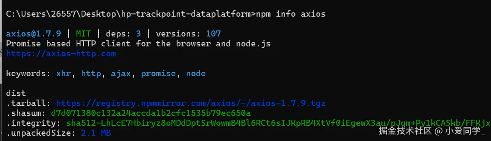
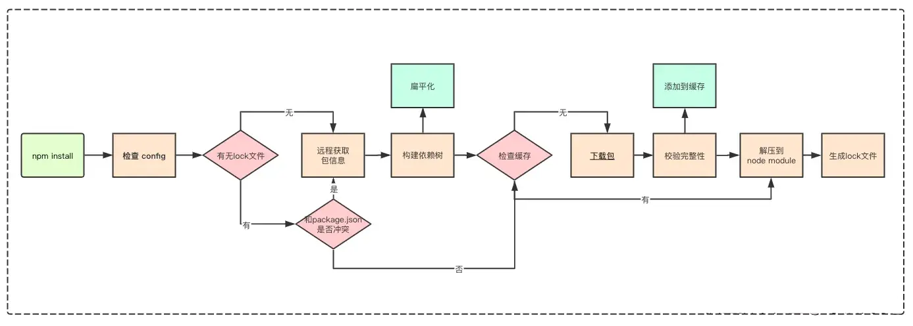

# 8、npm相关

## 8.1 npm/npm私服发包

参考：https://juejin.cn/post/7367554378732945444
https://segmentfault.com/a/1190000039766438
https://zhuanlan.zhihu.com/p/412183990

首先，我们需要先将发包代码实现完成并完成对`package.json`文件相关配置项的配置。

`package.json`文件是`Node.js`项目中的一个重要文件，它包含了项目的配置信息。以下是`package.json`文件中常见的字段及其含义：

*`name`：项目的名称。
*`version`：项目的版本号，遵循语义化版本规范。
*`description`：项目的描述信息。
*`main`：项目的入口文件，默认是`index.js`。
*`scripts`：定义了可以通过`npm`运行的脚本命令。
*`keywords`：关键字，用于在`npm`上搜索项目。
*`author`：项目的作者信息。
*`license`：项目的许可证信息。
*`dependencies`：项目运行时依赖的包及其版本范围。
*`devDependencies`：开发过程中需要的工具包及其版本范围。

### 8.1.1 npm发包

#### 8.1.1.1 注册npm账号

登录`npm`官网（[https://www.npmjs.com/]()），注册一个`npm`账号（然后注册完后，去你的邮箱根据提示进行操作，验证通过即可）

#### 8.1.1.2 在终端登录账号

在终端执行登录命令：`npm login`，输入npm官网的账号、密码

**注意：要设置`npm`源为`npm`官方源**

先查看当前`npm`源：

```shell
npm config get registry
```

设置淘宝镜像源：

```shell
npm config set registry https://registry.npm.taobao.org/
```

设置`npm`官方源：

```shell
npm config set registry https://registry.npmjs.org/
```

#### 8.1.1.3 发布

`npm`账号登录成功后，在终端里输入发布命令`npm publish`即可，此时`npm`账号绑定的邮箱会收到发包成功邮件，到此发包成功。

参考网址：https://segmentfault.com/a/1190000039766438

### 8.1.2 npm私服发包

#### 8.1.2.1 连接npm私服

设置`npm`源为`npm`私服地址。私服地址一般在`package.json`文件的`publishConfig`中的`registry`选项中，若没有请询问私服管理员

```shell
# 根据私服地址设置npm源
npm config set registry http://192.168.0.1:8888/repository/npm-hosted/
```

#### 8.1.2.2 在终端登录账号

在终端执行登录命令：`npm login`，输入你在`npm`私服的账号、密码

#### 8.1.2.3 发布

登录成功后，在终端里输入发布命令`npm publish`即可

**注意：发包到私服后，记得将`npm`源切换回官方/淘宝镜像**

## 8.2 npm常用命令

以下是常用的`npm`命令，按照功能分类整理：

### 8.2.1 初始化项目

```bash
# 初始化一个新的 npm 项目，生成 package.json 文件
npm init

# 快速初始化（使用默认值）
npm init -y
```

### 8.2.2 安装依赖

```bash
# 安装生产环境依赖
npm install <package-name>

# 安装开发环境依赖
npm install <package-name> --save-dev 或 npm i <package-name> -D

# 全局安装
npm install <package-name> -g 或 npm i <package-name> -g
```

### 8.2.3 卸载依赖

```bash
# 卸载生产环境依赖
npm uninstall <package-name>

# 卸载开发环境依赖
npm uninstall <package-name> --save-dev 或 npm un <package-name> -D

# 全局卸载
npm uninstall <package-name> -g
```

### 8.2.4 更新依赖

```bash
# 更新指定包到最新版本
npm update <package-name>

# 更新所有依赖到最新版本
npm update
```

### 8.2.5 运行脚本

```bash
# 运行 package.json 中定义的脚本
npm run <script-name>

# 简写形式（如果脚本名以 "start"、"test" 等命名）
npm start
npm test
```

### 8.2.6 查看信息

```bash
# 查看全局安装的包
npm list -g --depth=0

# 查看当前项目的依赖树
npm list

# 查看某个包的详细信息
npm info <package-name>
```

### 8.2.7 清理缓存

```bash
# 清理 npm 缓存
npm cache clean --force
```

### 8.2.8 登录与发布

```bash
# 登录 npm 账号
npm login

# 发布包到 npm
npm publish

# 撤销发布
npm unpublish <package-name>
```

### 8.2.9 其他常用命令

```bash
# 检查项目中过时的依赖
npm outdated

# 审核项目中的安全漏洞
npm audit

# 修复安全漏洞
npm audit fix

# 强制修复（可能会改变依赖版本）
npm audit fix --force
```

## 8.3 npm常用配置

`package.json`文件是`Node.js`项目中的一个重要文件，它包含了项目的配置信息。以下是`package.json`文件中常见的字段及其含义：

### 8.3.1 基本信息

- **name**: 项目的名称。
- **version**: 项目的版本号，遵循语义化版本规范。
- **description**: 项目的描述信息。
- **author**: 项目的作者信息。
- **license**: 项目的许可证信息。

### 8.3.2 入口文件

- **main**: 指定项目的入口文件（`CommonJS`）。
- **module**: 指定项目的入口文件（`ES`模块）。
- **types**: 指定项目的 TypeScript 类型定义文件。

### 8.3.3 依赖管理

- **dependencies**: 项目运行时依赖的包及其版本范围。
- **devDependencies**: 开发过程中需要的工具包及其版本范围。

### 8.3.4 脚本命令

`scripts`: 定义了可以通过`npm`运行的脚本命令。

### 8.3.5 发布配置

- **publishConfig**: 指定发布配置，包括目标`npm`仓库地址和发布权限。

```json
"publishConfig": {
"registry": "http://192.168.0.1:8888/repository/npm-hosted/",
"access": "public"
}
```

### 8.3.6 文件包含

- **files**: 指定发布时包含的文件。

### 8.3.7 其他配置

- **keywords**: 关键字，用于在`npm`上搜索项目。
- **repository**: 项目的仓库信息。
- **bugs**: 项目的 bug 报告地址。
- **homepage**: 项目的主页地址。
- **engines**: 指定项目运行所需的`Node.js`和`npm`版本。

示例详见`package.json`文件。

## 8.4 npm依赖管理机制概述

参考：https://juejin.cn/post/7471175427231973391

### 8.4.1 背景介绍

在`npm`的早期版本中，依赖管理采用递归的方式处理。每个依赖包都会在其自身的`node_modules`目录中安装其子依赖，直到没有子依赖为止。

这种机制的优点包括：

- **一致性**：`node_modules`的结果与`package.json`中的声明一一对应，层级结构清晰。
- **可预测性**：每次安装生成的目录结构相同。

然而，随着项目规模的增长，这种机制暴露出以下问题：

- **体积庞大**：当依赖数量增多时，`node_modules`文件夹变得非常臃肿。
- **冗余依赖**：不同层级的依赖可能共用同一个依赖包，但由于嵌套结构的存在，会导致重复安装。
- **深度嵌套**：依赖树的层级过深，增加了维护难度。

### 8.4.2 解决方案

为了解决上述问题，从`npm 3.x`开始，依赖管理机制改为**扁平结构**。具体规则如下：

1. 无论是直接依赖还是子依赖，优先将其安装在`node_modules`根目录。
2. 如果某个依赖已经存在，则检查其版本是否符合新的版本范围：
    - 如果符合，则跳过安装。
    - 如果不符合，则继续安装新版本。

### 8.4.3 嵌套结构 vs 扁平结构

| 特性   | 嵌套结构                   | 扁平结构                   |
|------|------------------------|------------------------|
| 安装位置 | 每个依赖有自己的`node_modules` | 统一安装在根目录`node_modules` |
| 冗余依赖 | 可能存在重复依赖               | 尽量减少重复依赖               |
| 层级深度 | 深度较大                   | 层级较浅                   |
| 安装效率 | 较低                     | 较高                     |

### 8.4.4 配置文件说明

1. **`package.json`**
    - 每个 Node.js 项目都需要一个`package.json`文件。
    - 该文件包含项目的基本信息（如名称、版本、描述）以及所依赖的包。

2. **`package-lock.json`**
    - 自`npm 5.x`版本起新增。
    - 其作用是记录确切的依赖树，确保后续安装生成的依赖结构完全一致，即使中间依赖更新也不会影响。

3. **`.npmrc`**
    - 控制`npm`的行为，如注册表、代理、缓存路径等。
    - 优先级为：项目级 > 用户级 > 全局级 > 内置级。

### 8.4.5 npm 缓存

执行`npm install`或`npm update`命令下载依赖后，除了将依赖包安装在`node_modules`目录下外，还会在本地的缓存目录中缓存一份。可以通过以下命令获取缓存位置：

```bash
npm config get cache
```

### 8.4.6 依赖完整性

在下载依赖包之前，通常可以拿到`npm`对该依赖包计算的哈希`hash`值（例如`npm info`命令，紧跟`tarball`
下载链接的就是`shasum`哈希值）。

在下载依赖包时，`npm`会先获取远程的`shasum`哈希值。下载完成后，`npm`
会在本地重新计算哈希值，并与远程的哈希值进行对比。如果两者一致，则表明依赖包完整；否则，`npm`会重新下载该包。

如果检查到本地缓存中不存在对应的依赖包，则会通过网络请求从远程仓库下载包。具体是通过`package-lock.json`
文件中的`resolved`字段定位下载链接。例如，对于`axios`包，其`resolved`字段的值可能如下所示：



```bash
https://registry.npmjs.org/axios/-/axios-1.7.9.tgz
```

### 8.4.7 npm 安装整体流程



1. **解析命令参数**  
   执行`npm install`时，首先会检查是否有附加的命令参数（如`--save`、`--save-dev`
   ），以决定依赖的类型（生产依赖或开发依赖）。如果没有指定参数，则默认安装`package.json`中列出的所有依赖。

2. **加载配置文件**  
   按照优先级顺序查找配置文件：
    - 项目级`.npmrc`
    - 用户级`.npmrc`
    - 全局级`.npmrc`
    - 内置级`.npmrc`
      根据配置调整安装行为。

3. **执行`preinstall`钩子**  
   如果项目定义了`preinstall`钩子（例如：`npm run preinstall`），它会在依赖安装前被执行。此步骤可用于初始化操作，如检查版本、清理缓存等。

4. **检查`lock`文件**
    - 如果存在`package-lock.json`文件，则会检查其中的依赖版本是否与`package.json`中的依赖版本冲突。如果没有冲突，则直接从缓存中查找包信息。
    - 如果不存在`package-lock.json`文件，则从`npm`远程仓库获取包信息，并根据`package.json`构建依赖树。

5. **构建依赖树**
    - 构建依赖树时，无论依赖是直接依赖还是子依赖的依赖，都会优先将其放置在`node_modules`根目录。
    - 当遇到相同模块时，判断已放置在依赖树中的模块版本是否符合新模块的版本范围：
        - 如果符合，则跳过安装。
        - 如果不符合，则在当前模块的`node_modules`下放置该模块。

6. **查找并安装依赖包**
    - **缓存中存在依赖包**：直接将缓存中的包按照扁平化的依赖结构解压到`node_modules`中。
    - **缓存中不存在依赖包**：从`npm`
      远程仓库下载包，检验包的完整性（通过哈希值对比）。如果检验不通过，则重新下载；如果检验通过，则将下载的包复制到`npm`
      缓存目录，并按照扁平化的依赖结构解压到`node_modules`中。

7. **生成 lock 文件**  
   安装完成后，生成或更新`package-lock.json`文件，记录确切的依赖树信息，确保后续安装的一致性。
