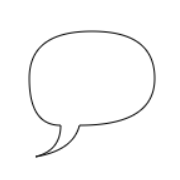

# myNote

## 实用工具

## 1、CSS相关

### 1.1 实现淡入淡出、透明度、过度

```vue

<template>
  <div class="transition-box">
    <div :class="{transition:true,isShow:isShow}" @click="isShow = !isShow">
      <span style="font-size: 28px;font-weight: 600">点击切换</span>
    </div>
  </div>
</template>

<script>
  export default {
    data() {
      return {
        isShow: false
      };
    },
  }
</script>

<style scoped lang="scss">
  .transition-box {
    width: 150px;
    display: flex;
    flex-direction: column;
    align-items: center;

    .transition {
      width: 150px;
      height: 80px;
      line-height: 80px;
      text-align: center;
      background-color: #E6A23C;
      border-radius: 30px;
      cursor: pointer;
      transition: all 1s;
      opacity: 0.3;
    }

    .isShow {
      height: 150px;
      line-height: 150px;
      border-radius: 0;
      opacity: 1;
    }
  }
</style>
```

### 1.2 svg中text标签基础使用

参考网址：https://blog.csdn.net/weixin_40779234/article/details/113701444

### 1.3 HTML跳转到页面指定位置的几种方法

#### 1.3.1 利用 id 为标记的锚点，这里作为锚点的标签可以是任意元素。

```html
<a href="#aa">跳转到 id 为 aa 标记的锚点</a>
<div id="aa">id 为 aa 标记的锚点</div>
```

#### 1.3.2 利用 a 标签的 name 属性作为锚点，这里作为锚点的标签只能是 a 标签。

```html
<a href="#bb">跳转到 name 为 bb 标记的锚点</a>
<a name="bb">name 为 bb 标记的锚点</a>
```

注意：当以`a`标签`name`属性作为锚点和利用`id`为标记的锚点同时出现（即以`name`为锚点和以`id`为锚点名字相同时），会将后者作为锚点。

#### 1.3.3 利用 scrollTo()，window.scrollTo 滚动到文档中的某个坐标。

```html
<a id="linkDom">平滑移动到cc</a>
<div id="cc">cc</div>
```

```javascript
const linkDom = document.getElementById("linkDom")
const cc = document.getElementById("cc")

function toTargetDom(el) {
    const bridge = el
    const body = document.body
    const height = 0
    // 计算该 DOM 节点到 body 顶部距离
    do {
        height += bridge.offsetTop
        bridge = bridge.offsetParent
    } while (bridge != body)
    // 滚动到指定位置
    window.scrollTo({
        top: height,
        behavior: "smooth"
    })
}

linkDom.addEventListener("click", function () {
    toTargetDom(cc)
})
```

#### 1.3.4 利用 scrollIntoView()，Element.scrollIntoView() 方法让当前的元素滚动到浏览器窗口的可视区域内。

```html
<a id="linkDom">移动到dd</a>
<div id="dd">dd</div>
```

```javascript
const linkDom = document.getElementById("linkDom")
const dd = document.getElementById("dd")

function toTargetDom(el) {
    el.scrollIntoView()
}

linkDom.addEventListener("click", function () {
    toTargetDom(dd)
})
```

#### 1.3.5 利用 scrollIntoView()，跳转到指定页面的指定位置。

```javascript
const scrollTo = (behavior = "smooth", block = "start", inline = "nearest", item) => {
    // 跳转到指定页面
    // pageIns.value.scrollIntoView({ behavior, block, inline });
    if (item) {
        /* 数据示例
        {
            "key": 979,
            "label": "第五条 抵押财产的保险",
            "pageIndex": 7,
            "position": {
                "x": 0.1914,
                "y": 0.1983
            },
            "children": []
        }
        */
        const targetPos = document.createElement("div");
        targetPos.style.width = "100px";
        targetPos.style.height = "100px";
        targetPos.style.position = "absolute";
        targetPos.style.top = item.position.y * 100 + "%";
        // pageIns是指定页面的ref
        pageIns.value.appendChild(targetPos);
        console.log("targetPos", targetPos);
        // 跳转到指定页面的指定位置
        targetPos.scrollIntoView({behavior: "smooth"});
        pageIns.value.removeChild(targetPos)
    }
};
```

### 1.4 实现回到页面顶部功能

参考网址：https://segmentfault.com/a/1190000041750000
动态显示滚动按钮
“回到顶部”并不是一直显示的，而是滚动到一定值才出现的，因此应该在window.onscroll里定义一个判断事件。

```javascript
window.onscroll = function () {
  const currentHeight = document.documentElement.scrollTop || window.pageYOffset || document.body.scrollTop;
  // 页面滚动超过300px就显示
  if (currentHeight > 300) {
    document.getElementById('backtop').style.display = 'block'
  } else {
    document.getElementById('backtop').style.display = 'none'
  }
}
```

#### 1.4.1 使用锚点实现

```html
<a href="#top">回到顶部</a>
<div id="top"></div>
```

### 1.4.2 scrollTo函数

控制滚动条回到指定位置，第一个参数是距离页面左端的距离，第二个参数是距离页面顶部的距离。

```html
<a href="javascript:scrollTo(0, 0)">回到顶部</a>
```

### 1.4.3 scrollTop函数

控制滚动条垂直偏移。

```javascript
<a onclick="byScrollTop()">回到顶部</a>

function byScrollTop() {
    document.documentElement.scrollTop = 0;
    window.pageYOffset = 0; // 兼容ios
    document.body.scrollTop = 0; // 兼容低版本ie
}
```

### 1.4.4 scrollBy函数

该方法可把内容滚动指定的像素数。第一个参数指向右滚动的像素，第二个参数指向下滚动的参数，负数可使方向相反。

```javascript
<a onclick="byScrollBy()">回到顶部</a>

function byScrollBy() {
  const topHeight = document.documentElement.scrollTop || window.pageYOffset || document.body.scrollTop;
  scrollBy(0, -topHeight);
}
```

### 1.4.4 间接回到顶部

定时器实现滚动动画。通过定时器实现固定速度的自动滚动动画效果。但是这样会有个问题，就是当页面内容十分多的时候，这个时候离顶部已经有很长一段距离了。如果还是一个固定速度的话，可能会长达10秒钟，这对用户体验来说是不友好的。

```javascript
<a onclick="scrollToTop()">回到顶部</a>

function scrollToTop() {
  const topHeight = document.documentElement.scrollTop || window.pageYOffset || document.body.scrollTop;
  scrollBy(0, -100);
  // 模拟鼠标向上滚动事件
  scrollDelay = setTimeout('scrollToTop()', 50);
  // 清除滚动事件，避免无法向下移动
  if (topHeight === 0) {
    clearTimeout(scrollDelay);
    scrollDelay = null;
  }
}
```

定时器实现滚动动画-改良版

```javascript
function scrollToTop() {
  const topHeight = document.documentElement.scrollTop || window.pageYOffset || document.body.scrollTop;
  const speed = topHeight / 10 > 100 ? topHeight / 10 : 100;
  scrollBy(0, -speed);
  // 模拟鼠标向上滚动事件
  scrollDelay = setTimeout('scrollToTop()', 50);
  // 清除滚动事件，避免无法向下移动
  if (topHeight === 0) {
    clearTimeout(scrollDelay);
    scrollDelay = null;
  }
}
```

### 1.5 鼠标悬停时显示元素

通过`hover`伪类给鼠标悬停后需要展示的元素添加display:block属性实现

```vue

<template>
  <div class="info-item">
    <div class="default-wrap">
      default-wrap
    </div>
    <div class="hover-wrap">
      hover-wrap
    </div>
  </div>
</template>

<script>
  export default {
    data() {
      return {};
    },
  }
</script>

<style scoped lang="scss">
  .info-item {
    width: 500px;
    height: 200px;

    .hover-wrap {
      display: none;
    }

    &:hover .default-wrap {
      display: none;
    }

    &:hover .hover-wrap {
      display: block;
    }
  }
</style>
```

### 1.6 CSS实现自动换行、强制换行、强制不换行的属性

1. 自动换行：

```vue

<style lang="scss">
  * {
    word-break: normal;
    word-wrap: break-word;
  }
</style>
```

2. 强制换行：

```vue

<style lang="scss">
  * {
    /* 按字符截断换行，支持IE和chrome，FF不支持 */
    word-break: break-all;
    /* 按英文单词整体截断换行，以上三个浏览器均支持 */
    word-wrap: break-word;
  }
</style>
```

* 注意：单词换行需要父盒子为块级元素

3. 强制不换行：

```vue

<style lang="scss">
  * {
    white-space: nowrap;
  }
</style>
```

```text
word-break : normal | break-all | keep-all
    normal 使用浏览器默认的换行规则，允许字内换行。
    break-all 允许在单词内换行。
    keep-all 只能在半角空格或连字符处换行。
    
word-wrap : normal | break-word
    normal : 允许内容顶开指定的容器边界，允许字内换行。
    break-word : 内容将在边界内换行，允许单词换行。
    
white-space:normal | nowrap | pre-wrap
    normal : 连续的空白符会被合并。源码中的换行符会被当作空白符来处理。并根据填充行框盒子的需要来换行。
    nowrap : 和 normal 一样合并空白符，但阻止源码中的文本换行。
    break-word : 连续的空白符会被保留。在遇到换行符或 <br> 元素时，或者根据填充行框盒子的需要换行。
```

### 1.7 实用的CSS background-image小技巧

参考网址：https://blog.csdn.net/qq_43067585/article/details/109462517

#### 1.7.1 将背景图完美适配视口

```css
body {
    background-image: url("https://1.jpg");
    background-attachment: fixed;
    background-position: center;
    background-repeat: no-repeat;
    background-size: cover;
    -webkit-background-size: cover;
    -moz-background-size: cover;
    -o-background-size: cover;
}
```

#### 1.7.2 在CSS中使用多个背景图

```css
body {
    background-image: url("https://1.jpg"), url("https://2.jpg");
    background-position: center, top;
    background-repeat: repeat, no-repeat;
    background-size: contain, cover;
}
```

#### 1.7.3 创建三角背景图

参考：https://developer.mozilla.org/zh-CN/docs/Web/CSS/clip-path

```vue

<template>
  <div class="wrap">
    <div class="day-wrap">
    </div>
    <div class="night-wrap">
    </div>
  </div>
</template>

<script>
  export default {
    data() {
      return {};
    },
  }
</script>

<style scoped lang="scss">
  .wrap {
    position: absolute;
    width: 500px;
    height: 200px;

    .day {
      background-image: url("https://1.jpg");
      background-position: center;
      background-repeat: no-repeat;
      background-size: cover;
    }

    .night {
      background-image: url("https://2.jpg");
      background-position: center;
      background-repeat: no-repeat;
      background-size: cover;
      clip-path: polygon(500px 0, 0 0, 500px 200px);
    }
  }
</style>
```

#### 1.7.4 在背景图上添加叠加渐变

```css
body {
    background-image: linear-gradient(4deg, rgb(11, 12, 13) 30%, rgb(22, 23, 24) 50%, rgb(33, 34, 35) 100%,), url("https://1.jpg");
    background-attachment: fixed;
    background-position: center;
    background-repeat: no-repeat;
    background-size: cover;
}
```

#### 1.7.5 创建变色背景图动画

```css
@keyframes background-overlay-animation {
    0% {
        background-image: linear-gradient(4deg, rgb(11, 12, 13) 30%, rgb(22, 23, 24) 50%, rgb(33, 34, 35) 100%,), url("https://1.jpg");
    }
    25% {
        background-image: linear-gradient(4deg, rgb(33, 33, 33) 30%, rgb(22, 23, 24) 50%, rgb(33, 34, 35) 100%,), url("https://1.jpg");
    }
    50% {
        background-image: linear-gradient(4deg, rgb(99, 99, 99) 30%, rgb(22, 23, 24) 50%, rgb(33, 34, 35) 100%,), url("https://1.jpg");
    }
    100% {
        background-image: linear-gradient(4deg, rgb(111, 111, 111) 30%, rgb(22, 23, 24) 50%, rgb(33, 34, 35) 100%,), url("https://1.jpg");
    }
}

@-webkit-keyframes background-overlay-animation {
    0% {
        background-image: linear-gradient(4deg, rgb(11, 12, 13) 30%, rgb(22, 23, 24) 50%, rgb(33, 34, 35) 100%,), url("https://1.jpg");
    }
    25% {
        background-image: linear-gradient(4deg, rgb(33, 33, 33) 30%, rgb(22, 23, 24) 50%, rgb(33, 34, 35) 100%,), url("https://1.jpg");
    }
    50% {
        background-image: linear-gradient(4deg, rgb(99, 99, 99) 30%, rgb(22, 23, 24) 50%, rgb(33, 34, 35) 100%,), url("https://1.jpg");
    }
    100% {
        background-image: linear-gradient(4deg, rgb(111, 111, 111) 30%, rgb(22, 23, 24) 50%, rgb(33, 34, 35) 100%,), url("https://1.jpg");
    }
}

body {
    background-image: url("https://1.jpg");
    background-attachment: fixed;
    background-position: center;
    background-repeat: no-repeat;
    background-size: cover;
    animation-name: background-overlay-animation;
    animation-delay: 5s;
    animation-iteration-count: infinite;
    animation-direction: alternate;
    animation-timing-function: linear;
}
```

#### 1.7.6 制作网格背景图

```vue

<template>
  <div class="wrap">
    <div class="itemImag"></div>
    <div class="item"></div>
    <div class="itemImag"></div>
    <div class="item"></div>
    <div class="item"></div>
    <div class="itemImag"></div>
    <div class="item"></div>
    <div class="itemImag"></div>
    <div class="item"></div>
    <div class="item"></div>
    <div class="itemImag"></div>
    <div class="item"></div>
    <div class="itemImag"></div>
    <div class="item"></div>
    <div class="itemImag"></div>
    <div class="item"></div>
  </div>
</template>

<script>
  export default {
    data() {
      return {};
    },
  }
</script>

<style scoped lang="scss">
  .wrap {
    position: absolute;
    width: 500px;
    height: 500px;
    background-color: black;
    display: grid;
    grid-template-columns: 25fr 30fr 40fr 15fr;
    grid-template-rows: 20fr 45fr 5fr 30fr;
    grid-gap: 20px;

    .itemImag {
      background-image: url("https://1.jpg");
      background-attachment: fixed;
      background-position: center;
      background-repeat: no-repeat;
      background-size: cover;
    }
  }
</style>
```

#### 1.7.7 将背景图设置为文本填充

参考：https://developer.mozilla.org/zh-CN/docs/Web/CSS/background-clip

```vue

<template>
  <div class="wrap">
    hello world
  </div>
</template>

<script>
  export default {
    data() {
      return {};
    },
  }
</script>

<style scoped lang="scss">
  .wrap {
    position: absolute;
    width: 500px;
    height: 500px;
    background-image: url("https://1.jpg");
    background-attachment: fixed;
    background-position: center;
    background-repeat: no-repeat;
    background-size: cover;
    background-clip: text;
    -webkit-background-clip: text;
    color: transparent;
  }
</style>
```

### 1.8 图解 e.clientX,e.clientY e.pageX e.pageY e.offsetX e.offsetY

```text
event.clientX、event.clientY
鼠标相对于浏览器窗口可视区域的X，Y坐标（窗口坐标），可视区域不包括工具栏和滚动条。IE事件和标准事件都定义了这2个属性

event.pageX、event.pageY
类似于event.clientX、event.clientY，但它们使用的是文档坐标而非窗口坐标。这2个属性不是标准属性，但得到了广泛支持。IE事件中没有这2个属性。

event.offsetX、event.offsetY
鼠标相对于事件源元素（srcElement）的X,Y坐标，只有IE事件有这2个属性，标准事件没有对应的属性。

event.screenX、event.screenY
鼠标相对于用户显示器屏幕左上角的X,Y坐标。标准事件和IE事件都定义了这2个属性
```


### 1.9 按钮Button、图标Svg等点击之后出现黑框的原因及解决办法

按钮Button、图标Svg等点击之后出现黑框，是因为`:focus`伪类添加了如下默认的轮廓样式

```css
:focus {
    outline: -webkit-focus-ring-color auto 5px;
}
```

解放方案：将`outline`样式设置为`none`即可

```css
svg {
    outline: none;
}
```

### 1.10 flex布局

参考：https://ruanyifeng.com/blog/2015/07/flex-grammar.html

Flex 布局是什么？
Flex 是 Flexible Box 的缩写，意为"弹性布局"，用来为盒状模型提供最大的灵活性。
任何一个容器都可以指定为 Flex 布局。

```css
.box {
    display: flex;
}
```

行内元素也可以使用 Flex 布局。

```css
.box {
    display: inline-flex;
}
```

Webkit 内核的浏览器，必须加上-webkit前缀。

```css
.box {
    display: -webkit-flex; /* Safari */
    display: flex;
}
```

注意，设为 Flex 布局以后，子元素的float、clear和vertical-align属性将失效。

采用 Flex 布局的元素，称为 Flex 容器（flex container），简称"容器"。它的所有子元素自动成为容器成员，称为 Flex 项目（flex
item），简称"项目"。
容器默认存在两根轴：水平的主轴（main axis）和垂直的交叉轴（cross axis）。主轴的开始位置（与边框的交叉点）叫做main
start，结束位置叫做main end；
交叉轴的开始位置叫做cross start，结束位置叫做cross end。项目默认沿主轴排列。单个项目占据的主轴空间叫做main
size，占据的交叉轴空间叫做cross size。


#### 容器的属性：

* flex-direction
* flex-wrap
* flex-flow
* justify-content
* align-items
* align-content

#### 1.10.1 flex-direction属性

flex-direction属性决定主轴的方向（即项目的排列方向）。

```css
.box {
    flex-direction: row;
}

/*
    row（默认值）：主轴为水平方向，起点在左端。
    row-reverse：主轴为水平方向，起点在右端。
    column：主轴为垂直方向，起点在上沿。
    column-reverse：主轴为垂直方向，起点在下沿。
*/
```


#### 1.10.2 flex-wrap属性

默认情况下，项目都排在一条线（又称"轴线"）上。flex-wrap属性定义，如果一条轴线排不下，如何换行。

```css
.box {
    flex-wrap: nowrap;
}

/*
    nowrap（默认）：不换行。
    wrap：换行，第一行在上方。
    wrap-reverse：换行，第一行在下方。
*/
```


#### 1.10.3 flex-flow属性

flex-flow属性是flex-direction属性和flex-wrap属性的简写形式，默认值为row nowrap。

```css
.box {
    flex-flow: row nowrap;
}
```

#### 1.10.4 justify-content属性

justify-content属性定义了项目在主轴上的对齐方式。

```css
.box {
    justify-content: flex-start;
}

/*
    它可能取5个值，具体对齐方式与轴的方向有关。下面假设主轴为从左到右。
    flex-start（默认值）：左对齐
    flex-end：右对齐
    center： 居中
    space-between：两端对齐，项目之间的间隔都相等。
    space-around：每个项目两侧的间隔相等。所以，项目之间的间隔比项目与边框的间隔大一倍。
*/
```


#### 1.10.5 align-items属性

align-items属性定义项目在交叉轴上如何对齐。

```css
.box {
    align-items: flex-start;
}

/*
    它可能取5个值。具体的对齐方式与交叉轴的方向有关，下面假设交叉轴从上到下。
    flex-start：交叉轴的起点对齐。
    flex-end：交叉轴的终点对齐。
    center：交叉轴的中点对齐。
    baseline: 项目的第一行文字的基线对齐。
    stretch（默认值）：如果项目未设置高度或设为auto，将占满整个容器的高度。
*/
```


#### 1.10.6 align-content属性

align-content属性定义了多根轴线的对齐方式。如果项目只有一根轴线，该属性不起作用。

```css
.box {
    align-content: stretch;
}

/*
    flex-start：与交叉轴的起点对齐。
    flex-end：与交叉轴的终点对齐。
    center：与交叉轴的中点对齐。
    space-between：与交叉轴两端对齐，轴线之间的间隔平均分布。
    space-around：每根轴线两侧的间隔都相等。所以，轴线之间的间隔比轴线与边框的间隔大一倍。
    stretch（默认值）：轴线占满整个交叉轴。
*/
```


#### 项目的属性：

* order
* flex-grow
* flex-shrink
* flex-basis
* flex
* align-self

#### 1.10.7 order属性

order属性定义项目的排列顺序。数值越小，排列越靠前，默认为0。

```css
.item {
    order: 0;
}
```


#### 1.10.8 flex-grow属性

flex-grow属性定义项目的放大比例，默认为0，即如果存在剩余空间，也不放大。
如果所有项目的flex-grow属性都为1，则它们将等分剩余空间（如果有的话）。如果一个项目的flex-grow属性为2，其他项目都为1，则前者占据的剩余空间将比其他项多一倍。

```css
.item {
    flex-grow: 0;
}
```


#### 1.10.9  flex-shrink属性

flex-shrink属性定义了项目的缩小比例，默认为1，即如果空间不足，该项目将缩小。
如果所有项目的flex-shrink属性都为1，当空间不足时，都将等比例缩小。如果一个项目的flex-shrink属性为0，其他项目都为1，则空间不足时，前者不缩小。
负值对该属性无效。

```css
.item {
    flex-shrink: 1;
}
```


#### 1.10.10  flex-basis属性

flex-basis属性定义了在分配多余空间之前，项目占据的主轴空间（main size）。浏览器根据这个属性，计算主轴是否有多余空间。它的默认值为auto，即项目的本来大小。
它可以设为跟width或height属性一样的值（比如350px），则项目将占据固定空间。

```css
.item {
    flex-basis: auto;
}
```

#### 1.10.11  flex属性

flex属性是flex-grow, flex-shrink 和 flex-basis的简写，默认值为0 1 auto。后两个属性可选。
该属性有两个快捷值：auto (1 1 auto) 和 none (0 0 auto)。
建议优先使用这个属性，而不是单独写三个分离的属性，因为浏览器会推算相关值。

```css
.item {
    flex: 0 1 auto
}
```

#### 1.10.12  align-self属性

align-self属性允许单个项目有与其他项目不一样的对齐方式，可覆盖align-items属性。默认值为auto，表示继承父元素的align-items属性，如果没有父元素，则等同于stretch。

```css
.item {
    align-self: auto;
}

/*
    该属性可能取6个值，除了auto，其他都与align-items属性完全一致。
    auto：表示继承父元素的align-items属性，如果没有父元素，则等同于stretch。
    flex-start：交叉轴的起点对齐。
    flex-end：交叉轴的终点对齐。
    center：交叉轴的中点对齐。
    baseline: 项目的第一行文字的基线对齐。
    stretch（默认值）：如果项目未设置高度或设为auto，将占满整个容器的高度。
*/
```


### 1.11 Vue移动端 / PC端适配解决方案：postcss-px-to-viewport

参考：https://juejin.cn/post/7018433228591595550

postcss-px-to-viewport就是这样一款优秀、高效、简洁的解决方案，它能完美解决上面的三个痛点，高效的将代码中px单位转为rm、rem、vw等视口单位，一份配置文件完美解决适配问题。

#### 1.11.1 开发环境`npm`安装插件

```shell
npm install postcss-px-to-viewport --save-dev
```

#### 1.11.2 项目根目录添加配置文件 postcss.config.js

#### 1.11.3 添加配置

```javascript
module.exports = {
    plugins: {
        'postcss-px-to-viewport': {
            unitToConvert: 'px', // 需要转换的单位，默认为"px"
            viewportWidth: 1920, // 设计稿的视口宽度
            unitPrecision: 5, // 单位转换后保留的精度
            propList: ['*'], // 能转化为vw的属性列表
            viewportUnit: 'vw', // 希望使用的视口单位
            fontViewportUnit: 'vw', // 字体使用的视口单位
            selectorBlackList: [], // 需要忽略的CSS选择器，不会转为视口单位，使用原有的px等单位。
            minPixelValue: 1, // 设置最小的转换数值，如果为1的话，只有大于1的值会被转换
            mediaQuery: false, // 媒体查询里的单位是否需要转换单位
            replace: true, //  是否直接更换属性值，而不添加备用属性
            exclude: undefined, // 忽略某些文件夹下的文件或特定文件，例如 'node_modules' 下的文件
            include: undefined, // 如果设置了include，那将只有匹配到的文件才会被转换
            landscape: false, // 是否添加根据 landscapeWidth 生成的媒体查询条件 @media (orientation: landscape)
            landscapeUnit: 'vw', // 横屏时使用的单位
            landscapeWidth: 1920 // 横屏时使用的视口宽度
        }
    }
}
```

#### 1.11.4 重新运行项目，触发配置文件生效

### 1.12 标准盒模型和怪异盒子模型的区别

参考：https://blog.csdn.net/karlaofsky/article/details/140264692

盒模型描述了一个 HTML 元素所占用的空间，由内容（content）、内边距（padding）、边框（border）和外边距（margin）组成。

```text
可以通过修改元素的box-sizing属性来改变元素的盒模型：
box-sizing: content-box; 表示标准盒模型（默认值）
box-sizing: border-box; 表示IE盒模型（怪异盒模型）
```

#### 1.12.1 标准盒模型

标准盒模型中，元素的宽度和高度只计算内容的宽度和高度，内边距、边框和外边距不包含在元素的宽度和高度之内。

#### 1.12.1 怪异盒模型

怪异盒模型（IE 盒模型）中，元素的宽度和高度包含了内容、内边距和边框， 外边距不包含在内。

例如，一个设置了宽度高度为 200px，内边距为 10px，边框为 2px ，外边距为 20px 的元素：


在怪异盒模型下，元素在页面上占据的总宽度就是设置的 200px ，因为内边距和边框都包含在这 200px 之内。


当需要精确控制元素的尺寸，且不希望添加内边距（padding）或边框（border）时导致元素的实际占用空间发生变化的情况下，可以使用怪异盒子模型（IE
盒模型），即设置`box-sizing: border-box;`。

### 1.13 获取浏览器可视区域的宽度和高度

参考：https://blog.csdn.net/lifangfang0607/article/details/107376369

```javascript
const width = window.innerWidth || document.documentElement.clientWidth || document.body.clientWidth;
const width = window.innerHeight || document.documentElement.clientHeight || document.body.clientHeight;
```

## 2、JavaScript相关

### 2.1 获取图片实际宽高

```javascript
const img_url = '13643608813441.jpg'
const img = new Image()
img.src = img_url
if (img.complete) {
    // 判断是否有缓存
    alert('from:complete : width:' + img.width + ',height:' + img.height)
} else {
    // 加载完成执行
    img.onload = function () {
        alert('width:' + img.width + ',height:' + img.height)
    }
}
```

### 2.2 JavaScript中封装手机触屏判断滑动方向和滑动距离

参考：https://blog.csdn.net/qq_39460057/article/details/134651637

```javascript
export const onTouchMove = (el, callback) => {
  let [startX, startY, moveEndX, moveEndY] = [0, 0, 0, 0]
  el.addEventListener("touchstart", e => {
    console.log(`changedTouches: ${e.changedTouches}`)
    startX = e.changedTouches[0].pageX
    startY = e.changedTouches[0].pageY
  })
  el.addEventListener("touchmove", e => {
    // 阻止默认滚动行为
    e.preventDefault()
  })
  el.addEventListener("touchend", e => {
    moveEndX = e.changedTouches[0].pageX
    moveEndY = e.changedTouches[0].pageY
    const [disX, disY] = [moveEndX - startX, moveEndY - startY]
    let [direction, distance] = ["", 0]
    if (Math.abs(disX) > Math.abs((disY))) {
      direction = disX > 0 ? "right" : "left"
      distance = disX
    } else if (Math.abs(disX) < Math.abs((disY))) {
      direction = disY > 0 ? "down" : "up"
      distance = disY
    }
    callback({direction, distance})
  })
}

// 调用方式
onTouchMove(el, info => {
  console.log(info)
})
```

### 2.3 函数节流和函数防抖及其区别

参考：https://juejin.cn/post/7103365414776176648

浏览器中总是有一些操作非常耗费性能。所以就有了函数节流和函数防抖来提高浏览器性能。

```text
函数节流：频繁触发一个事件时候，每隔一段时间，函数只会执行一次。
函数防抖：当触发一个时间后的n秒内，如果该事件没有被第二次触发，则执行。否，则重新开始计时。
```

#### 2.3.1 函数节流

函数节流应用场景：滚动条滚动事件，dom的拖拽事件等

例： 我们都知道滚动条滚动的时候触发事件的频率极其地频繁。监控滚动条的滚动事件，滚动一次该事件可以触发上百次。很显然，有时候，我们并不需要触发如此多的次数。函数节流，由此而生。在固定的时间内，只触发一次。

```javascript
// 节流函数。callback 需要节流的函数，time 节流间隔时间点，默认值 300 毫秒
export const onScroll = (callback, time = 300) => {
  let state = true;
  // 判断如否有函数传入
  if (typeof callback !== "function") {
    throw "第一个入参必须是函数,需要被节流的函数"
  }
  return () => {
    if (state) {
      callback();
      state = false;
      setTimeout(() => {
        state = true;
      }, time)
    }
  }
}
```

调用方式

```vue

<template>
  <div class="wrap" @scroll="onScroll(callback,300)">
  </div>
</template>

<script>
  export default {
    data() {
      return {};
    },
    methods: {
      callback() {
        console.log("节流函数")
      }
    }
  }
</script>

<style scoped lang="scss">
</style>
```

#### 2.3.2 函数防抖

函数防抖应用场景:搜索框的搜索事件等

例：搜索框实际上是监控搜索框内容改变，请求后台搜索查询。 比如我们输入一个`search`单词，搜索框内部的`change`
事件会触发六次，每输入一个字母触发一次`change`事件。但是，我们真的需要发送六个请求去查询吗？完全不必要。
实际上我们只需要在`search`单词输入完毕后查询一次即可。函数防抖，由此而生。在规定时间内，受防抖的函数被触发第二次时候后，上一次触发销毁，下一次重新开始计时，计时完毕后触发执行。

```javascript
// 防抖函数。callback 需要节流的函数，time 节流间隔时间点，默认值 300 毫秒
export const onchange = (callback, time = 300) => {
  let asyncFun;
  if (typeof callback !== "function") {
    throw "第一个入参必须是函数,需要进行防抖的函数"
  }
  return () => {
    // 在上一个函数被触发前，销毁他
    if (asyncFun !== undefined) clearTimeout(asyncFun);
    asyncFun = setTimeout(() => {
      callback();
    }, time)
  }
}
```

调用方式

```vue

<template>
  <input @input="onchange(callback,300)">
</template>

<script>
  export default {
    data() {
      return {};
    },
    methods: {
      callback() {
        console.log("防抖函数")
      }
    }
  }
</script>

<style scoped lang="scss">
</style>
```

不论是函数防抖还是函数节流，都是性能优化的一种手段，都是为阻止函数无意义的执行，减小dom压力，避免不必要的性能浪费。

### 2.4 JavaScript删除对象属性及判定是否包含某属性

#### 2.4.1 删除对象属性

##### 2.4.1.1 delete

```text
语法： delete 对象.属性名
```

```javascript
const obj = {name: "zhangsan", age: 18}
delete obj.name
console.log(obj)
// {age:18}
delete obj["name"]
console.log(obj)
// {age:18}
```

##### 2.4.1.2 ES6解构赋值

```text
语法： const {属性名1,属性名2...} = 对象
```

```javascript
const obj = {name: "zhangsan", age: 18}
const {name, ...newObj} = obj
console.log(newObj)
// {age:18}
```

##### 2.4.1.3 ES6反射

```text
语法： Reflect.defineProperty(对象,属性名)
```

```javascript
const obj = {name: "zhangsan", age: 18}
Reflect.defineProperty(obj, "name")
console.log(obj)
// {age:18}
```

#### 2.4.2 对象是否包含某属性

##### 2.4.2.1 delete

```text
语法： obj.hasOwnProperty(属性名)
```

```javascript
const obj = {name: "zhangsan", age: 18}
console.log(obj.hasOwnProperty("name"))
// true
console.log(obj.hasOwnProperty("sex"))
// false
```

##### 2.4.2.2 属性判断

```text
语法： 对象.属性名 !== undefined
```

```javascript
const obj = {name: "zhangsan", age: 18}
console.log(obj.name !== undefined)
// true
console.log(obj.sex !== undefined)
// false
```

##### 2.4.2.3 Object.keys

```text
语法： Object.keys(对象).indexOf(属性名) !== -1
```

```javascript
const obj = {name: "zhangsan", age: 18}
console.log(Object.keys(obj).indexOf("name") !== -1)
// true
console.log(Object.keys(obj).indexOf("sex") !== -1)
// false
```

##### 2.4.2.4 ES6属性名in对象

```text
语法： 属性名 in 对象
```

```javascript
const obj = {name: "zhangsan", age: 18}
console.log("name" in obj)
// true
console.log("sex" in obj)
// false
```

### 2.5 forEach和map的区别

参考：https://juejin.cn/post/7271846986998054971

map会返回一个新的数组，而forEach不会，实际上是因为forEach不会返回任何值（实际上返回的是undefined），而map 是有返回值的，是一个新数组

上述说法是错误的，是否改变原数组，取决于循环中的item是引用类型还是基础类型，引用类型都会发生变化。因为引用类型的元素实际上存储的是引用（内存地址），而非值本身。所以引用类型元素的修改会直接反映在原始数组中。而number,string,Boolean,null,undefined这些基础类型是在栈内存中直接存储变量与值

foreach可以使用return跳出本次循环，而map不能。foreach不支持链式调用，而map支持链式调用，可以继续对返回的新数组进行操作。

**注意：不能使用break语句来中断循环。break语句用于中断循环的功能只适用于for循环或while循环**

### 2.6 JavaScript 中使用媒体查询

参考：https://juejin.cn/post/7206134581744435258

媒体查询想必大家最先想到的都是CSS中@media。没错，这是我们最常用的媒体查询方法，主要用来为我们的网站做适配处理。

```css
h1 {
  font-size: 2rem;
  color: green;
}

@media (min-width: 600px) {
  h1 {
    font-size: 4rem;
  }
}

/* 标题需要为绿色，字体大小为 2rem。但是当屏幕宽度超过 600px 时，字体大小需要增加到 4rem */
```

**在JavaScript中使用媒体查询**

我们可以在`JavaScript`代码中使用与上面相同的媒体查询。主要API就是 `Window.matchMedia()`

`Window`的`matchMedia()`方法返回一个新的`MediaQueryList`对象，表示指定的媒体查询`(en-US)`
字符串解析后的结果。返回的`MediaQueryList`可被用于判定`Document`是否匹配媒体查询，或者监控一个`Document`
来判定它匹配了或者停止匹配了此媒体查询。

**语法**

```javascript
mqList = window.matchMedia(mediaQueryString)
```

**参数**

matchMedia()方法接受单个参数作为其值，即您要检查的媒体查询。

mediaQueryString：一个被用于媒体查询解析的字符串。

**返回值**

一个用来媒体查询的新的MediaQueryList对象
它包含两个属性：

* media，它将媒体查询存储为序列化字符串

* matches，它基本上是一个布尔值，如果我们作为参数提供的媒体查询与文档匹配则返回true

```vue

<template>
  <div>
    <div id="home"></div>
    <div id="home2"></div>
  </div>
</template>

<script>
  export default {
    data() {
      return {};
    },
    methods: {
      watchWidthMedia(target, mqList, cnt) {
        if (mqList.matches) {
          target.innerHTML = `<p> >600px ${cnt}次</p>`;
        } else {
          target.innerHTML = `<p> <=600px ${cnt}次</p>`;
        }
      },
      watchWidthChange(target, cnt) {
        if (window.innerWidth > 600) {
          target.innerHTML = `<p> >600px ${cnt}次</p>`;
        } else {
          target.innerHTML = `<p> <=600px ${cnt}次</p>`;
        }
      },
    },
    mounted() {
      let cnt = 0
      const target = document.getElementById("home")
      const mqList = window.matchMedia("(min-width: 600px)")
      mqList.onchange = (e) => {
        cnt++
        this.watchWidthMedia(target, e, cnt)
      }
      this.watchWidthMedia(target, mqList, cnt)

      let cnt2 = 0
      const target2 = document.getElementById("home2")
      window.addEventListener('resize', e => {
        cnt2++
        this.watchWidthChange(target2, cnt2)
      });
      this.watchWidthChange(target2, cnt2);
    }
  }
</script>

<style scoped lang="scss">
</style>
```

**性能对比**

每次调整窗口大小时，`resize`事件侦听器都会触发`watchWidthChange`函数。这仅在某些情况下需要响应窗口大小更改的每个实例，例如更新画布。
但在只有当宽度或高度达到某个阈值时才需要发生某些事情，例如文本更新。在这种情况下，`matchMedia`
将会获得更好的性能，因为它仅在媒体查询条件的实际更改时触发回调。

### 2.7 从生成器函数Generator角度思考async await

参考：https://juejin.cn/post/7412487295729139712
https://zhuanlan.zhihu.com/p/558431779
https://github.com/Sunny-lucking/blog/issues/6

#### 2.7.1 Generator函数基础

所谓 Generator 函数，最大特点就是可以交出函数的执行权（即拥有暂停函数执行的效果）。

```javascript
function* gen() {
  yield 'a'
  yield 'b'
}

const g = gen()
g.next()
// {"value": "a", "done": false}
g.next()
// {"value": "b", "done": false}
g.next()
// {"value": undefined, "done": true}
```

调用生成器函数会返回一个`Generator{}`生成器实例对象。返回的`g`生成器对象可以近似地理解成为下面的对象结构:

```javascript
{
  next: () => {
    return {
      value: VALUE, // value表示生成器函数本次调用返回的值
      done: Boolean, // done表示生成器函数是否执行完毕
    }
  }
}
```

`let g = gen()`调用生成器函数创建了一个生成器对象`g`，`g`拥有上述结构的`next`方法。然后生成器对象中的`next`
方法每次调用会返回一次`{ value: VALUE, done: boolean }`的`gObject`对象。

`yield`关键字会停止函数执行并将`yield`后的值返回作为本次调用`next`的`value`进行返回。如果本次调用`g.next()`
导致生成器函数执行完毕，那么此时`done`会变成`true`表示该函数执行完毕，反之则为`false`。

**注意：当生成器函数执行完毕时，再调用`next`，`done`会变为`true`。同时因为函数不存在返回值，`value`为`undefined`。**

#### 2.7.2 Generator函数返回值

```javascript
function* gen() {
  const a = yield 'a'
  console.log(`step ${a}`)
  const b = yield 'b'
  console.log(`step ${b}`)
}

const g = gen()
g.next()
// {"value": "a", "done": false}
g.next("A")
// {"value": "b", "done": false}
g.next("B")
// {"value": undefined, "done": true}

// 控制台打印结果如下：
// step A
// step B
```

`yield`关键字会暂停函数的运行。第一次调用`next`方法，函数执行到`yield a`语句，此时函数会被暂停。第二次调用`next`
方法，生成器函数会从上一次暂停的语句继续执行。

**注意：当生成器函数恢复执行时，因为上一次执行到`const a = yield a`语句的右半段并没有给`const a`进行赋值。**

`g.next("A")`的参数`A`会作为上一次`yield a`的返回值进行执行。即调用`g.next("A")`时，将生成器函数中的`const a = yield a;`
变为`const a = A;`进行执行。所以调用`g.next("A")`会打印出`step A`。同样的，`g.next("B")`的参数`B`会被当作`yield b`
的返回值赋值给`b`变量，其打印结果为`step B`

**当使用`next`进行传参时，传入的参数会作为上一次生成器函数暂停时`yield`的返回值。第一次调用`next`
的传参是无意义的。因为此时的生成器函数并没有执行，自然也没有`yield`关键字处理。**

#### 2.7.3 Generator函数中的return

```javascript
function* gen() {
  const a = yield 'a'
  console.log(`step ${a}`)
  const b = yield 'b'
  console.log(`step ${b}`)
  return "return step"
  const c = yield 'c'
  console.log(`step ${c}`)
}

const g = gen()
g.next()
// {"value": "a", "done": false}
g.next("A")
// {"value": "b", "done": false}
g.next("B")
// {"value": "return step", "done": true}
g.next()
// {"value": undefined, "done": true}
```

生成器函数存在`return returnValue`时，在`return`前的最后一个`yield`关键字执行完毕后，生成器函数执行完毕。执行`next`
函数，会返回`{ value: returnValue, done: true }`的对象。再次执行`next`会返回`{ value: undefined, done: true }`
的对象。

本例在第三次调用`next`时生成器函数执行完毕，返回含有`returnValue`的对象。

#### 2.7.4 Generator函数异步解决方案

```javascript
function promise1() {
  return new Promise((resolve) => {
    setTimeout(() => {
      resolve("promise1")
    }, 1000)
  })
}

function promise2(value) {
  return new Promise((resolve) => {
    setTimeout(() => {
      resolve(`promise2 => ${value}`)
    }, 1000)
  })
}

function* fn() {
  const value = yield promise1()
  console.log(`value : ${value}`)
  const result = yield promise2(value)
  console.log(`result : ${result}`)
  return result
}

function asyncGenerator(generator) {
  // 调用传入的生成器函数，返回生成器对象。期望返回一个Promise
  const g = generator()
  return new Promise((resolve) => {
    // 执行 yield promise1()，将 promise1 作为 value 返回对象
    const {value, done} = g.next()
    // promise1 等待返回值进行相应操作
    value.then((v) => {
      // 将 promise1 的返回值作为参数执行 yield promise2()，将 promise2 作为 value 返回对象
      const {value, done} = g.next(v)
      // 将 promise2 作为返回参数
      resolve(value)
    })
  })
}

asyncGenerator(fn).then((res) => {
  console.log(`res : ${res}`)
})

// 控制台打印结果
// value : promise1
// res : promise2 => promise1
```

通过`asyncGenerator`函数包裹`generator`生成器函数，结合生成器、`yield`关键字暂停特点及`Promise.then`
方法的特性可以实现类似于`async`函数的异步功能。

**看上去它和`async`很像对吧，不过目前的代码存在一个致命的问题：`asyncGenerator`函数并不具备通用性**

`fn`封装了两层`yield`处理`Promise`的方法，相同的`asyncGenerator`函数内部调用了两次`next`方法。`fn`如果封装了三层`yield`
处理`Promise`的方法，那就需要调整`asyncGenerator`函数的逻辑。再比如`fn`中存在类似`yield 'a'`的方法，使用的`then`方法会报错。

**对`asyncGenerator`代码进行优化**

```javascript
function asyncGenerator2(generator) {
  return new Promise((resolve, reject) => {
    const g = generator();

    function next(param) {
      const {done, value} = g.next(param);
      if (!done) {
        // 未完成 继续递归
        Promise.resolve(value).then((res) => {
          next(res)
        });
      } else {
        // 完成直接重置 Promise 状态
        resolve(value);
      }
    }

    next();
  });
}

asyncGenerator2(fn).then((res) => {
  console.log(`res : ${res}`)
});

// 控制台打印结果
// value : promise1
// result : promise2 => promise1
// res : promise2 => promise1
```

`asyncGenerator2`返回一个`Promise`作为函数的返回值。同时首次调用`asyncGenerator2`函数时会调用`generator()`
得到生成器对象。然后定义`next`函数，只要迭代器未完成就会在`value`的`then`方法中在此递归调用该`next`函数。

**注意：**

* `next`函数接受接收`param`参数。这是因为`Generator`处理异步时，通过`const a = yield Promise`将`Promise`的`resolve`
  参数赋值给`a`，所以需要在`then`函数中将`res`传递给`next(res)`执行并将其结果作为上次`yield`执行的返回值。
* 对`value`使用`Promise.resolve`进行包裹。这是因为需要统一调用`.then`方法进行递归传参，当`yield`后不是`Promise`
  时，需要统一当作`Promise`进行处理。
* 首次调用`next`方法时，并没有传入`param`参数。

#### 2.7.5 总结

生成器函数具有可暂停的特点，调用生成器函数后会返回一个生成器对象。
调用生成器对象的`next`方法，生成器函数会继续执行直到遇到下一个`yield`关键字。调用`next`方法会返回一个对象，其中`done`
表示生成器函数是否执行完毕,`value`表示生成器函数中本次`yield`的返回值。

同时每次调用生成器对象的`next(param)`方法时，可以传入一个参数作为上一次`yield`语句的返回值。所以`async await`
本质上还是利用`Generator`函数内部可以被暂停执行的特性结合`Promise.then`中进行递归调用从而实现`Async await`的语法糖。

## 3、HTML5相关

### 3.1 HTML5触摸事件

参考：https://developer.mozilla.org/zh-CN/docs/Web/API/Element/touchstart_event
https://www.cnblogs.com/wasbg/p/10951926.html
https://juejin.cn/post/6844903695415525383

#### 3.1.1 触摸事件基础

触摸事件组成有如下四部分：

* `touchstart`事件：在一个或多个触点与触控设备表面接触时被触发。
* `touchmove`事件：在触点于触控平面上移动时触发。
* `touchend`事件：在一个或多个触点从触控平面上移开时触发。注意，也有可能触发`touchcancel`事件。
* `touchcancel`事件：在触点被中断时触发，中断方式基于特定实现而有所不同（例如，创建了太多的触点）。

触摸事件都会冒泡，也可以取消。虽然触摸事件没有在`DOM`规范中定义，但是它们却是以兼容`DOM`的方式实现。触摸事件的`event`
对象提供了鼠标事件中的常见属性：

* `bubbles`：事件是否会沿`DOM`树向上冒泡
* `cancelable`：是否可以用`preventDefault()`方法阻止默认事件
* `clientX`：鼠标在视口内的水平坐标
* `clientY`：鼠标在视口内的垂直坐标
* `screenX`：鼠标在屏幕的水平坐标
* `screenY`：鼠标在屏幕的垂直坐标

除了常见的`DOM`属性，触摸事件还包含如下三个用于跟踪触摸的属性。

* `touches`：`touch`对象数组。表示当前与表面接触的触点（不论事件目标或状态变化）。
* `targetTouches`：`touch`对象数组。表示当前与触摸表面接触的触点，且触点起始于事件发生的目标元素。
* `changeTouches`：`touch`对象数组。表示在前一个`touch`事件和当前的事件之间，状态发生变化的独立触点。

`touch`对象属性

* `identifier`：`touch`对象的唯一标识符
* `screenX`：触点相对于屏幕上边缘的`X`坐标
* `screenY`：触点相对于屏幕上边缘的`Y`坐标
* `clientX`：触点相对于可见视区左边缘的`X`坐标。不包括任何滚动偏移。
* `clientY`：触点相对于可见视区左边缘的`Y`坐标。不包括任何滚动偏移。
* `pageX`：触点相对于`HTML`文档左边缘的`X`坐标。当存在水平滚动的偏移时，这个值包含了水平滚动的偏移。
* `pageY`：触点相对于`HTML`文档左边缘的`Y`坐标。当存在水平滚动的偏移时，这个值包含了水平滚动的偏移。
* `target`：返回触摸点最初接触的`Element` ，即使触摸点已经移出那个元素的交互区域。
  **注意：如果这个元素在触摸过程中被移除，这个事件仍然会指向它，因此这个事件也不会冒泡到`window`或`document`对象。**

#### 3.1.2 使用场景示例

实现左滑带出删除按钮，监听长按事件并向上冒泡事件

```vue

<template>
  <div>
    <div ref="wrap" class="wrap" @touchstart="touchStart">
      <div class="wrapDelete">{{"删除"}}</div>
    </div>
  </div>
</template>

<script>
  export default {
    data() {
      return {
        longPress: null,
        pressTime: 0,
      };
    },
    methods: {
      touchStart(event) {
        clearTimeout(this.longPress);
        this.pressTime = 0;
        this.longPress = setTimeout(() => {
          this.pressTime = 1000;
        }, 1000);
        const startPos = {
          x: event.targetTouches[0]?.pageX ?? 0,
          y: event.targetTouches[0]?.pageY ?? 0,
        };
        const move = (e) => {
          const touches = e.targetTouches;
          if (touches.length === 1) {
            const movePos = {
              x: e.targetTouches[0]?.pageX ?? 0,
              y: e.targetTouches[0]?.pageY ?? 0,
            };
            const xDis = movePos.x - startPos.x;
            if (Math.abs(xDis) > 50) {
              if (xDis < 0) {
                this.$refs.wrap.style.transform = "translate(-20%,0)";
              } else {
                this.$refs.wrap.style.transform = "translate(0,0)";
              }
            }
          }
        };
        const stop = () => {
          clearTimeout(this.longPress);
          if (this.pressTime === 1000) {
            // 长按事件向上冒泡事件
            this.$emit("longPressEmits");
          }
          document.removeEventListener("touchmove", move);
          document.removeEventListener("touchend", stop);
        };
        document.addEventListener("touchmove", move);
        document.addEventListener("touchend", stop);
      }
    },
  }
</script>

<style scoped lang="scss">
  .wrap {
    position: relative;

    .sealDelete {
      width: 15%;
      position: absolute;
      top: 15%;
      right: -20%;
      text-align: center;
      color: #FFFFFF;
      background-color: red;
    }
  }
</style>
```

### 3.2 IntersectionObserver使用

参考：https://developer.mozilla.org/zh-CN/docs/Web/API/IntersectionObserver/IntersectionObserver
https://www.ruanyifeng.com/blog/2016/11/intersectionobserver_api.html
https://juejin.cn/post/6844903874302574599

#### 3.2.1 IntersectionObserver基础

`IntersectionObserver`接口（从属于`Intersection Observer API`）提供了一种**异步**
观察目标元素与其祖先元素或顶级文档视口（`viewport`）交叉状态的方法。其祖先元素或视口被称为根（`root`）。

当一个`IntersectionObserver`对象被创建时，其被配置为监听根中一段给定比例的可见区域。一旦`IntersectionObserver`
被创建，则无法更改其配置，所以一个给定的观察者对象只能用来监听可见区域的特定变化值；然而，你可以在同一个观察者对象中配置监听多个目标元素。

**语法**

```javascript
const observer = new IntersectionObserver(callback, options);
```

**参数**

`callback`：当元素可见比例超过指定阈值后，会调用一个回调函数，此回调函数接受两个参数：

* `entries`：一个`IntersectionObserverEntry`对象的数组，每个被触发的阈值，都跟指定阈值有或多或少的偏差。
* `observer`：被调用的`IntersectionObserver`实例。

`options`（可选项）：一个可以用来配置`observer`实例的对象。如果`options`未指定，`observer`实例默认使用文档视口作为`root`
，并且没有`margin`，阈值为0%（即一像素的改变都会触发回调函数）。你可以指定以下配置：

* `root`：监听元素的祖先元素`Element`
  对象，其边界盒将被视作视口。目标在根的可见区域的任何不可见部分都会被视为不可见。如果构造函数未传入`root`或其值为`null`
  ，则默认使用顶级文档的视口。
* `rootMargin`：在计算与根节点交叉值的一组偏移量，可以缩小/扩大判定范围从而满足计算需要。语法大致和`CSS`中的`margin`
  属性等同;默认值是`0px 0px 0px 0px`。
* `threshold`：规定的监听目标与边界盒交叉区域的比例值，可以是具体数值或是`0`到`1`之间的数组。若指定值为`0`
  则监听元素即使与根有`1`像素交叉，也被视为可见。若指定值为`1`，则整个元素都在可见范围内时才算可见。阈值的默认值为`0`。

**返回值**

可以使用阈值监听目标元素可见部分与`root`交叉状况的新的`IntersectionObserver`实例。调用自身的observe() 方法开始使用规定的阈值监听指定目标。

**实例方法**

```javascript
IntersectionObserver.disconnect()
// 使 IntersectionObserver 对象停止监听目标。
IntersectionObserver.observe()
// 使 IntersectionObserver 开始监听一个目标元素。
IntersectionObserver.takeRecords()
// 返回所有观察目标的 IntersectionObserverEntry 对象数组。
IntersectionObserver.unobserve()
// 使 IntersectionObserver 停止监听特定目标元素。
```

#### 3.2.2 IntersectionObserverEntry对象

`IntersectionObserverEntry`描述了目标元素与根元素容器在某一特定过渡时刻的交叉状态。其实例对象作为`entries`
参数被传递到一个`IntersectionObserver`的回调函数中;这些对象只能通过调用`IntersectionObserver.takeRecords()`来获取。

**属性**

* `boundingClientRect`：返回一个`DOMRectReadOnly`用来描述包含目标元素的边界信息，
  计算方式与`Element.getBoundingClientRect()`相同。
* `intersectionRatio`：返回`intersectionRect`与`boundingClientRect`的比例值。
* `intersectionRect`：返回一个`DOMRectReadOnly`用来描述根和目标元素的相交区域。
* `isIntersecting`：如果目标元素与交叉区域观察者对象的根相交，返回`true`，否则返回`false`。
* `isVisible`：实验性属性，暂时不与记录
* `rootBounds`：返回一个`DOMRectReadOnly`用来描述根元素的边界信息。
* `target`：与根出现相交区域改变的元素
* `time`：可见性发生变化的时间，是一个高精度时间戳，单位为毫秒


上图中，灰色的水平方框代表视口，深红色的区域代表四个被观察的目标元素。它们各自的`intersectionRatio`图中都已经注明。

#### 3.2.3 使用场景示例

##### 3.2.3.1 惰性加载（lazy load）

有时，我们希望某些静态资源（比如图片），只有用户向下滚动，它们进入视口时才加载，这样可以节省带宽，提高网页性能。这就叫做“惰性加载”。

```javascript
// 图片懒加载
const observer = new IntersectionObserver((entries) => {
  entries.forEach((entry) => {
    if (entry.isIntersecting) {
      entry.target.src = entry.target.dataset.src
      // 图片加载后，停止监听元素
      observer.unobserve(entry.target)
    }
  });
}, {
  root: document.querySelector(".root")
});

Array.from(document.querySelectorAll("img")).forEach((img) => {
  observer.observe(img);
});
```

##### 3.2.3.2 无限滚动

无限滚动时，在页面底部添加页尾栏（又称边界哨兵）。页尾栏可见表示用户到达了页面底部，从而加载新的条目放在页尾栏前面。这样做的好处是，不需要再一次调用`observe()`
方法，现有的`IntersectionObserver`可以保持使用。

```javascript
// 无限滚动
const observer = new IntersectionObserver((entries) => {
  if (entries[0].intersectionRatio > 0) {
    loadItem(10)
    console.log("load new item")
  }
});

observer.observe(document.querySelector(".scrollerFooter"));
```

### 3.3 Canvas学习

参考：https://developer.mozilla.org/zh-CN/docs/Web/API/Canvas_API/Tutorial/Basic_usage

#### 3.3.1 Canvas基本用法

除一些过时的浏览器不支持`<canvas>`元素外，所有的新版本主流浏览器都支持它。`canvas`的默认大小为`300`像素×`150`
像素。可以使用高度和宽度属性来自定义`canvas`的尺寸。为了在`canvas`上绘制图形，需要使用上下文对象，它能动态创建图像。

##### 3.3.1.1 Canvas元素

```html

<canvas width="150" height="150"></canvas>
```

`<canvas>`元素有`width`、`height`、`mozOpaque`（非标准）和`mozPrintCallback`
（非标准）属性。这些都是可选的，并且同样利用`DOM properties` 来设置。当没有设置宽度和高度的时候，`canvas`
会初始化为`300 X 150`像素。该元素可以使用`CSS`来定义大小，但在绘制时图像会伸缩以适应它的框架尺寸：如果`CSS`
的尺寸与初始画布的比例不一致，它会出现扭曲。

**备注：如果你绘制出来的图像是扭曲的，尝试用`width`和`height`属性为`<canvas>`明确规定宽高，而不是使用`CSS`。**

`<canvas>`元素可以像任何一个普通的图像一样（有`margin`，`border`，`background`等属性）被设计。然而，这些样式不会影响在`canvas`
中的实际图像。若开始时没有为`canvas`规定样式规则，其将会完全透明。

`<canvas>`很容易定义一些替代内容。在一些较老的浏览器（IE9及以下）或者不支持`canvas`的文本浏览器上总是展示替代内容。

```html
<!--
    不支持<canvas>的浏览器将会忽略容器并在其中渲染后备内容。
    而支持<canvas>的浏览器将会忽略在容器中包含的内容，并且只是正常渲染canvas。
-->
<canvas id="draw" width="150" height="150">
  Not supporting canvas
</canvas>

<canvas id="clock" width="150" height="150">
  
</canvas>
```

**注意：`<canvas>` 元素需要结束标签`</canvas>`。如果结束标签不存在，则文档的其余部分会被认为是替代内容，将不会显示出来。**

##### 3.3.1.2 渲染上下文（The rendering context）

`<canvas>`元素创造了一个固定大小的画布，它公开了一个或多个渲染上下文，其可以用来绘制和处理要展示的内容。我们将会将注意力放在
`2D`渲染上下文中。其他种类的上下文也许提供了不同种类的渲染方式；比如，`WebGL`使用了基于`OpenGL ES`的`3D`上下文。

`canvas`起初是空白的。为了展示，首先脚本需要找到渲染上下文，然后在它的上面绘制。`<canvas>`元素有`getContext()`
的方法用来获得渲染上下文和它的绘画功能。`getContext()`接受一个参数，即上下文的类型。

```javascript
const canvas = document.getElementById("draw");
// 检查支持性
if (canvas.getContext) {
  const ctx = canvas.getContext("2d");
  // drawing code here
} else {
  // canvas-unsupported code here
}
```

#### 3.3.2 使用Canvas来绘制图形

##### 3.3.2.1 栅格（canvas grid）


如上图所示，`canvas`元素默认被网格所覆盖。网格中的一个单元相当于`canvas`
元素中的一像素。栅格的起点为左上角（坐标为（0,0））。蓝色方形左上角距离左边（X轴）x像素，距离上边（Y轴）y像素（坐标为（x,y））。

##### 3.3.2.2 绘制矩形

`<canvas>`元素只支持两种形式的图形绘制：矩形和路径（由一系列点连成的线段）。所有其他类型的图形都是通过一条或者多条路径组合而成的。

`canvas`提供了三种方法绘制矩形：

```javascript
fillRect(x, y, width, height)
// 绘制一个填充的矩形
strokeRect(x, y, width, height)
// 绘制一个矩形的边框
clearRect(x, y, width, height)
// 清除指定矩形区域，让清除部分完全透明。
// 上述方法的参数相同。x与y指定了在canvas画布上所绘制的矩形的左上角（相对于原点）的坐标。width和 height设置矩形的尺寸。
```

**示例**

```javascript
function draw() {
  const canvas = document.getElementById("canvas");
  if (canvas.getContext) {
    const ctx = canvas.getContext("2d");
    ctx.fillRect(25, 25, 100, 100);
    // fillRect()函数绘制了一个边长为 100 的黑色正方形
    ctx.clearRect(45, 45, 60, 60);
    // clearRect()函数从正方形的中心开始擦除了一个 60*60 的正方形，
    ctx.strokeRect(50, 50, 50, 50);
    // strokeRect()在清除区域内生成一个 50*50 的正方形边框。
  }
}
```


##### 3.3.2.3 绘制路径

图形的基本元素是路径。路径是通过不同颜色和宽度的线段或曲线相连形成的不同形状的点的集合。一个路径，甚至一个子路径，都是闭合的。使用路径绘制图形需要一些额外的步骤。

```text
1、首先，你需要创建路径起始点。
2、然后你使用画图命令去画出路径。
3、之后你把路径封闭。
4、一旦路径生成，你就能通过描边或填充路径区域来渲染图形。
```

以下是所要用到的函数：

```javascript
beginPath()
// 新建一条路径，生成之后，图形绘制命令被指向到路径上生成路径。
closePath()
// 闭合路径之后图形绘制命令又重新指向到上下文中。
stroke()
// 通过线条来绘制图形轮廓。
fill()
// 通过填充路径的内容区域生成实心的图形。
```

第一步，调用`beginPath()`
。本质上，路径是由很多子路径构成，这些子路径都是在一个列表中，所有的子路径（线、弧形等）构成图形。调用`beginPath()`
后会清空重置列表，然后我们就可以重新绘制新的图形。

**备注：当前路径为空，即调用`beginPath()`之后，或者`canvas`刚建的时候，第一条路径构造命令通常被视为是`moveTo()`
，无论实际上是什么。出于这个原因，你几乎总是要在设置路径之后专门指定你的起始位置。**

第二步，调用函数指定绘制路径。

第三步，闭合路径`closePath()`（非必需）。这个方法会通过绘制一条从当前点到开始点的直线来闭合图形。如果图形是已经闭合了的，即当前点为开始点，该函数什么也不做。

**备注：当你调用`fill()`函数时，所有没有闭合的形状都会自动闭合，所以你不需要调用`closePath()`函数。但是调用`stroke()`
时不会自动闭合。**

###### 3.3.2.3.1 绘制一个三角形

```javascript
function draw() {
  const canvas = document.getElementById("canvas");
  if (canvas.getContext) {
    const ctx = canvas.getContext("2d");
    ctx.beginPath();
    ctx.moveTo(75, 50);
    // 移动到(75, 50)（三角形左顶点）
    ctx.lineTo(100, 75);
    // 移动并连接到(100, 75)（三角形下顶点）
    ctx.lineTo(100, 25);
    // 移动并连接到(100, 25)（三角形上顶点）
    ctx.fill();
    // 填充路径区域生成实心的三角形
  }
}
```


###### 3.3.2.3.2 移动笔触

```javascript
moveTo(x, y)
// 将笔触移动到指定的坐标(x, y)上。
```

当`canvas`初始化或`beginPath()`调用后，通常会使用`moveTo()`函数设置起点。我们也能够使用`moveTo()`
绘制一些不连续的路径。例如下面的笑脸示例。

**注意：`moveTo()`并不能画出任何东西**

```javascript
function draw() {
  const canvas = document.getElementById("canvas");
  if (canvas.getContext) {
    const ctx = canvas.getContext("2d");
    ctx.beginPath();
    ctx.arc(75, 75, 50, 0, Math.PI * 2, true);
    // 绘制脸的圆（逆时针）
    ctx.moveTo(110, 75);
    ctx.arc(75, 75, 35, 0, Math.PI, false);
    // 绘制口的半圆（顺时针）
    ctx.moveTo(65, 65);
    ctx.arc(60, 65, 5, 0, Math.PI * 2, true);
    // 绘制左眼
    ctx.moveTo(95, 65);
    ctx.arc(90, 65, 5, 0, Math.PI * 2, true);
    // 绘制右眼
    ctx.stroke();
    // 绘制路径（不调用的话，并不会真正的绘制图形）
  }
}
```


###### 3.3.2.3.3 线

绘制直线，需要用到的方法`lineTo()`。

```javascript
lineTo(x, y)
// 绘制一条从当前位置到指定(x, y)位置的直线。
```

该方法有两个参数：x和y，代表坐标系中直线结束的点。开始点和之前绘制的路径有关，之前的结束点作为接下来的开始点。开始点也可以通过`moveTo()`
函数改变。

```javascript
function draw() {
  const canvas = document.getElementById("canvas");
  if (canvas.getContext) {
    const ctx = canvas.getContext("2d");
    // 填充三角形
    ctx.beginPath();
    ctx.moveTo(25, 25);
    ctx.lineTo(105, 25);
    ctx.lineTo(25, 105);
    ctx.fill();
    // 描边三角形
    ctx.beginPath();
    ctx.moveTo(125, 125);
    ctx.lineTo(125, 45);
    ctx.lineTo(45, 125);
    ctx.closePath();
    ctx.stroke();
  }
}
```

**注意：因为路径使用填充`fill`时，路径自动闭合。而使用描边`stroke`不会闭合路径。如果不使用`closePath()`
闭合路径，则只绘制了两条线段，并不是一个完整的三角形。**


###### 3.3.2.3.4 圆弧

绘制圆弧或者圆，可以使用`arc()`方法。也可以使用`arcTo()`，不过这个的实现并不是那么的可靠，所以我们这里不作介绍。

```javascript
arc(x, y, radius, startAngle, endAngle, anticlockwise = false)
// 画一个以（x,y）为圆心的以 radius 为半径的圆弧（圆），角度从 startAngle 开始到 endAngle 结束，按照 anticlockwise 给定的方向（默认为顺时针）来生成。
// 该方法有六个参数：
// x,y为绘制圆弧所在圆上的圆心坐标。radius为半径。
// startAngle以及endAngle参数用弧度定义了开始以及结束的弧度。这些都是以 x 轴为基准。
// 参数anticlockwise为一个布尔值。为 true 时，是逆时针方向，否则顺时针方向。

arcTo(x1, y1, x2, y2, radius)
// 根据给定的控制点和半径画一段圆弧，再以直线连接两个控制点。
```

**备注：`arc()`函数中表示角的单位是弧度，不是角度。角度与弧度的`js`表达式：弧度=(`Math.PI/180`) X 角度。**

```javascript
function draw() {
  const canvas = document.getElementById("canvas");
  if (canvas.getContext) {
    const ctx = canvas.getContext("2d");
    for (let i = 0; i < 4; i++) {
      for (let j = 0; j < 3; j++) {
        ctx.beginPath();
        const x = 25 + j * 50; // x 坐标值
        const y = 25 + i * 50; // y 坐标值
        const radius = 20; // 圆弧半径
        const startAngle = 0; // 开始点
        const endAngle = Math.PI + (Math.PI * j) / 2; // 结束点
        const anticlockwise = i % 2 == 0 ? false : true; // 顺时针或逆时针
        ctx.arc(x, y, radius, startAngle, endAngle, anticlockwise);
        if (i > 1) {
          ctx.fill();
        } else {
          ctx.stroke();
        }
      }
    }
  }
}
```


###### 3.3.2.3.5 二次贝塞尔曲线及三次贝塞尔曲线

二次及三次贝塞尔曲线都十分有用，一般用来绘制复杂有规律的图形。

```javascript
quadraticCurveTo(cp1x, cp1y, x, y)
// 绘制二次贝塞尔曲线，cp1x,cp1y 为一个控制点，x,y 为结束点。
bezierCurveTo(cp1x, cp1y, cp2x, cp2y, x, y)
// 绘制三次贝塞尔曲线，cp1x,cp1y为控制点一，cp2x,cp2y为控制点二，x,y为结束点。
```

下图能够很好地描述两者的关系，二次贝塞尔曲线有一个开始点（蓝色）、一个结束点（蓝色）以及一个控制点（红色），而三次贝塞尔曲线有两个控制点。


参数x、y在这两个方法中都是结束点坐标。cp1x,cp1y为坐标中的第一个控制点，cp2x,cp2y为坐标中的第二个控制点。

使用二次以及三次贝塞尔曲线是有一定的难度的，因为不同于像`Adobe Illustrators`
这样的矢量软件，我们所绘制的曲线没有给我们提供直接的视觉反馈。这让绘制复杂的图形变得十分困难。

```javascript
// 使用二次贝塞尔曲线来渲染对话气泡。
function draw() {
  const canvas = document.getElementById("canvas");
  if (canvas.getContext) {
    const ctx = canvas.getContext("2d");
    // 二次贝塞尔曲线
    ctx.beginPath();
    ctx.moveTo(75, 25); // 上中点
    ctx.quadraticCurveTo(25, 25, 25, 62.5); // 左中点
    ctx.quadraticCurveTo(25, 100, 50, 100); // 话柄左上顶点
    ctx.quadraticCurveTo(50, 120, 30, 125); // 话柄左下顶点
    ctx.quadraticCurveTo(60, 120, 65, 100); // 话柄右上顶点
    ctx.quadraticCurveTo(125, 100, 125, 62.5); // 右中点
    ctx.quadraticCurveTo(125, 25, 75, 25); // 上中点
    ctx.stroke();
  }
}
```



```javascript
// 使用三次贝塞尔曲线绘制心形。
function draw() {
  const canvas = document.getElementById("canvas");
  if (canvas.getContext) {
    const ctx = canvas.getContext("2d");
    //三次贝塞尔曲线
    ctx.beginPath();
    ctx.moveTo(75, 40); // 心上中点
    ctx.bezierCurveTo(75, 37, 70, 25, 50, 25); // 左半心上中点
    ctx.bezierCurveTo(20, 25, 20, 62.5, 20, 62.5); // 左半心左中点
    ctx.bezierCurveTo(20, 80, 40, 102, 75, 120); // 心下中点
    ctx.bezierCurveTo(110, 102, 130, 80, 130, 62.5); // 右半心右中点
    ctx.bezierCurveTo(130, 62.5, 130, 25, 100, 25); // 右半心上中点
    ctx.bezierCurveTo(85, 25, 75, 37, 75, 40); // 心上中点
    ctx.fill();
  }
}
```


###### 3.3.2.3.6 矩形

除了直接在画布上绘制矩形的三个方法，还有`rect()`方法，将一个矩形路径增加到当前路径上。

```javascript
rect(x, y, width, height)
// 绘制一个左上角坐标为（x,y），宽高为 width 以及 height 的矩形。
```

当该方法执行的时候，`moveTo()`方法自动设置坐标参数`(0,0)`。也就是说，当前笔触自动重置回默认坐标。

###### 3.3.2.3.7 组合使用

```html
<!-- 因为宽高只有150px所以看不到最外两层矩形的下，右边框 -->
<canvas id="canvas" width="150" height="150"></canvas>
```

```javascript
// 封装的一个用于绘制圆角矩形的函数。
function roundedRect(ctx, x, y, width, height, radius) {
  ctx.beginPath();
  ctx.moveTo(x, y + radius); // 矩形左上直线开始点
  ctx.lineTo(x, y + height - radius);  // 矩形左下直线结束点
  ctx.quadraticCurveTo(x, y + height, x + radius, y + height); // 矩形左下圆弧（到下左直线开始点）
  ctx.lineTo(x + width - radius, y + height); // 矩形下右直线结束点
  ctx.quadraticCurveTo(x + width, y + height, x + width, y + height - radius); // 矩形右下圆弧（到右下直线开始点）
  ctx.lineTo(x + width, y + radius); // 矩形右上直线结束点
  ctx.quadraticCurveTo(x + width, y, x + width - radius, y); // 矩形右上圆弧（到上右直线开始点）
  ctx.lineTo(x + radius, y);  // 矩形上左直线结束点
  ctx.quadraticCurveTo(x, y, x, y + radius); // 矩形左上圆弧（到左上直线开始点）
  ctx.stroke();
}

function draw() {
  const canvas = document.getElementById("canvas");
  if (canvas.getContext) {
    const ctx = canvas.getContext("2d");
    roundedRect(ctx, 12, 12, 150, 150, 15);
    roundedRect(ctx, 19, 19, 150, 150, 9);
    roundedRect(ctx, 53, 53, 49, 33, 10);
    roundedRect(ctx, 53, 119, 49, 16, 6);
    roundedRect(ctx, 135, 53, 49, 33, 10);
    roundedRect(ctx, 135, 119, 25, 49, 10);

    ctx.beginPath();
    ctx.arc(37, 37, 13, Math.PI / 7, -Math.PI / 7, false);
    ctx.lineTo(31, 37);
    ctx.fill(); // 左上小人

    for (let i = 0; i < 8; i++) {
      ctx.fillRect(51 + i * 16, 35, 4, 4); // 第一行小点
    }

    for (i = 0; i < 6; i++) {
      ctx.fillRect(115, 51 + i * 16, 4, 4);  // 第一列小点
    }

    for (i = 0; i < 8; i++) {
      ctx.fillRect(51 + i * 16, 99, 4, 4); // 第二行小点
    }

    ctx.beginPath();
    ctx.moveTo(83, 116);
    ctx.lineTo(83, 102);
    ctx.bezierCurveTo(83, 94, 89, 88, 97, 88);
    ctx.bezierCurveTo(105, 88, 111, 94, 111, 102);
    ctx.lineTo(111, 116);
    ctx.lineTo(106.333, 111.333);
    ctx.lineTo(101.666, 116);
    ctx.lineTo(97, 111.333);
    ctx.lineTo(92.333, 116);
    ctx.lineTo(87.666, 111.333);
    ctx.lineTo(83, 116);
    ctx.fill(); // 第二行小人整体

    ctx.fillStyle = "white";
    ctx.beginPath();
    ctx.moveTo(91, 96);
    ctx.bezierCurveTo(88, 96, 87, 99, 87, 101);
    ctx.bezierCurveTo(87, 103, 88, 106, 91, 106);
    ctx.bezierCurveTo(94, 106, 95, 103, 95, 101);
    ctx.bezierCurveTo(95, 99, 94, 96, 91, 96);
    ctx.moveTo(103, 96);
    ctx.bezierCurveTo(100, 96, 99, 99, 99, 101);
    ctx.bezierCurveTo(99, 103, 100, 106, 103, 106);
    ctx.bezierCurveTo(106, 106, 107, 103, 107, 101);
    ctx.bezierCurveTo(107, 99, 106, 96, 103, 96);
    ctx.fill(); // 第二行小人眼球

    ctx.fillStyle = "black";
    ctx.beginPath();
    ctx.arc(101, 102, 2, 0, Math.PI * 2, true);
    ctx.fill(); // 第二行小人黑眼仁

    ctx.beginPath();
    ctx.arc(89, 102, 2, 0, Math.PI * 2, true);
    ctx.fill(); // 第二行小人黑眼仁
  }
}
```


##### 3.3.2.4 Path2D对象

根据之前例子，你可以用一系列的路径和绘画命令将对象画在画布上。为了简化代码和提高性能，`Path2D`
对象已可以在较新版本的浏览器中使用，用来缓存或记录绘画命令，这样你将能快速地回顾路径。

`Path2D()`会返回一个新初始化的`Path2D`对象（可能将某一个路径作为变量——创建一个它的副本，或将一个包含`SVG path`
数据的字符串作为变量）。

```javascript
new Path2D(); // 空的 Path 对象
new Path2D(path); // 克隆 Path 对象
new Path2D(d); // 从 SVG 建立 Path 对象
```

所有的路径方法比如`moveTo`,`rect`,`arc`或`quadraticCurveTo`等，如我们前面见过的，都可以在`Path2D`中使用。

`Path2D API`添加了`addPath`作为将`path`结合起来的方法。当你想要从几个元素中来创建对象时，可以使用如下代码：

```javascript
Path2D.addPath(path, transform)
// 添加了一条路径到当前路径（可能添加了一个变换矩阵）。
```

**示例**

随着`Path2D API`的产生，可以使用带路径参数（使用`Path2D`对象而不是当前路径）的`stroke`和`fill`方法将对象画在画布上。

```javascript
function draw() {
  const canvas = document.getElementById("canvas");
  if (canvas.getContext) {
    const ctx = canvas.getContext("2d");
    const rectangle = new Path2D();
    rectangle.rect(10, 10, 50, 50);
    const circle = new Path2D();
    circle.moveTo(125, 35);
    circle.arc(100, 35, 25, 0, 2 * Math.PI);
    ctx.stroke(rectangle);
    ctx.fill(circle);
  }
}
```


使用`SVG paths`

新的`Path2D API`可以使用`SVG path data`来初始化`canvas`上的路径。这意味着你在获取路径时可以用`SVG`或`canvas`的方式来重用它们。

这条路径将先移动到`(10,10)`位置`(M10 10)`然后再水平移动`80`个单位`(h 80)`，然后下移`80`个单位`(v 80)`，接着左移`80`
个单位`(h -80)`，再回到起点处`(Z)`。你可以在Path2D constructor 查看这个例子。

```javascript
const canvas = document.getElementById("canvas");
const ctx = canvas.getContext("2d");
const p = new Path2D("M10 10 h 80 v 80 h -80 Z");
ctx.fill(p);
```


#### 3.3.3 应用样式和色彩

##### 3.3.3.1 色彩

```javascript
fillStyle = color
// 设置图形的填充颜色。
strokeStyle = color
// 设置图形轮廓的颜色。
// color可以是表示CSS颜色值的字符串，渐变对象或者图案对象。默认情况下，线条和填充颜色都是黑色（即#000000）。
```

**备注：一旦你设置了`strokeStyle`或者`fillStyle`的值，那么这个新值就会成为新绘制的图形的默认值。如果你要给每个图形上不同的颜色，你需要重新设置
`fillStyle`或`strokeStyle`的值。**

```javascript
// 这些 fillStyle 的值均为橙色
ctx.fillStyle = "orange";
ctx.fillStyle = "#FFA500";
ctx.fillStyle = "rgb(255,165,0)";
ctx.fillStyle = "rgba(255,165,0,1)";
```

**`fillStyle`示例**

```javascript
function draw() {
  // 绘制方格颜色阵列
  const ctx = document.getElementById("canvas").getContext("2d");
  for (let i = 0; i < 6; i++) {
    for (let j = 0; j < 6; j++) {
      ctx.fillStyle = `rgb(${Math.floor(255 - 42.5 * i)},
        ${Math.floor(255 - 42.5 * j)}, 0)`;
      ctx.fillRect(j * 25, i * 25, 25, 25);
    }
  }
}
```

**`strokeStyle`示例**

```javascript
function draw() {
  // 绘制方格颜色阵列
  const ctx = document.getElementById("canvas").getContext("2d");
  for (let i = 0; i < 6; i++) {
    for (let j = 0; j < 6; j++) {
      ctx.fillStyle = `rgb(${Math.floor(255 - 42.5 * i)},
        ${Math.floor(255 - 42.5 * j)}, 0)`;
      ctx.arc(12.5 + j * 25, 12.5 + i * 25, 10, 0, Math.PI * 2, true);
      ctx.stroke();
    }
  }
}
```


##### 3.3.3.2 透明度

除了可以绘制实色图形，我们还可以用`canvas`来绘制半透明的图形。通过设置`globalAlpha`属性或者使用一个半透明颜色作为轮廓或填充的样式。

```javascript
globalAlpha = transparencyValue
// 这个属性影响到 canvas 里所有图形的透明度，有效的值范围是 0.0（完全透明）到 1.0（完全不透明），默认是 1.0。
```

`globalAlpha`属性在需要绘制大量拥有相同透明度的图形时候相当高效。不过，我认为下面的方法可操作性更强一点。

因为`strokeStyle`和`fillStyle`属性接受符合`CSS3`规范的颜色值，那我们可以用下面的写法来设置具有透明度的颜色。

```javascript
// 指定透明颜色，用于描边和填充样式
ctx.strokeStyle = "rgba(255,0,0,0.5)";
ctx.fillStyle = "rgba(255,0,0,0.5)";
```

**`globalAlpha`示例**

```javascript
function draw() {
  const ctx = document.getElementById("canvas").getContext("2d");
  // 画背景
  ctx.fillStyle = "#FD0";
  ctx.fillRect(0, 0, 75, 75);
  ctx.fillStyle = "#6C0";
  ctx.fillRect(75, 0, 75, 75);
  ctx.fillStyle = "#09F";
  ctx.fillRect(0, 75, 75, 75);
  ctx.fillStyle = "#F30";
  ctx.fillRect(75, 75, 75, 75);
  ctx.fillStyle = "#FFF";
  // 设置透明度值
  ctx.globalAlpha = 0.2;
  // 画半透明圆
  for (let i = 0; i < 7; i++) {
    ctx.beginPath();
    ctx.arc(75, 75, 10 + 10 * i, 0, Math.PI * 2, true);
    ctx.fill();
  }
}
```


**`rgba`示例**

```javascript
function draw() {
  const ctx = document.getElementById("canvas").getContext("2d");
  // 画背景
  ctx.fillStyle = "rgb(255,221,0)";
  ctx.fillRect(0, 0, 150, 37.5);
  ctx.fillStyle = "rgb(102,204,0)";
  ctx.fillRect(0, 37.5, 150, 37.5);
  ctx.fillStyle = "rgb(0,153,255)";
  ctx.fillRect(0, 75, 150, 37.5);
  ctx.fillStyle = "rgb(255,51,0)";
  ctx.fillRect(0, 112.5, 150, 37.5);
  // 画半透明矩形
  for (let i = 0; i < 10; i++) {
    ctx.fillStyle = "rgba(255,255,255," + (i + 1) / 10 + ")";
    for (let j = 0; j < 4; j++) {
      ctx.fillRect(5 + i * 14, 5 + j * 37.5, 14, 27.5);
    }
  }
}
```


##### 3.3.3.3 线型

可以通过一系列属性来设置线的样式。

```javascript
lineWidth = value
// 设置线条宽度。
lineCap = type
// 设置线条末端样式。
lineJoin = type
// 设定线条与线条间接合处的样式。
miterLimit = value
// 限制当两条线相交时交接处最大长度；所谓交接处长度（斜接长度）是指线条交接处内角顶点到外角顶点的长度。
getLineDash()
// 返回一个包含当前虚线样式，长度为非负偶数的数组。
setLineDash(segments)
// 设置当前虚线样式。例如：[10, 20]
lineDashOffset = value
// 设置虚线样式的起始偏移量。
```

**`lineWidth`示例**

设置当前绘线的粗细。属性值必须为正数。默认值是`1.0`。

线宽是指给定路径的中心到两边的粗细。**换句话说就是在路径的两边各绘制线宽的一半。**
因为画布的坐标并不和像素直接对应，当需要获得精确的水平或垂直线的时候要特别注意。

下例中，用递增的宽度绘制了`10`条直线。最左边的线宽`1.0`单位。**所有宽度为奇数的线并不能精确呈现，这就是因为路径的定位问题。**

```javascript
function draw() {
  const ctx = document.getElementById("canvas").getContext("2d");
  for (let i = 0; i < 10; i++) {
    ctx.lineWidth = 1 + i;
    ctx.beginPath();
    ctx.moveTo(5 + i * 14, 5);
    ctx.lineTo(5 + i * 14, 140);
    ctx.stroke();
  }
}
```


**想要获得精确的线条，必须对线条是如何描绘出来的有所理解。**

如下图，用网格代表`canvas`的坐标格，每一格对应屏幕上一个像素点。如图一所示，填充了`(2,1)`至`(5,5)`
的矩形，整个区域的边界刚好落在像素边缘上，这样就可以得到有着清晰边缘的矩形。

如果你想绘制一条从`(3,1)`到`(3,5)`，宽为`1.0`的线条，其效果如图二所示。
实际填充区域（深蓝色部分）会在路径两边各延伸半像素。而这半个像素又是以近似的方式进行渲染，这意味着那些像素只是部分着色，结果就是以实际笔触颜色一半色调的颜色来填充整个区域（浅蓝和深蓝的部分）。这就是上例中为何宽度为`1.0`
的线并不准确的原因。

要解决这个问题，必须对路径施加更精确地控制。已知宽为`1.0`的线条会在路径两边各延伸半像素，按图三的方式绘制从`(3.5,1)`
到`(3.5,5)`，宽为`1.0`的线条，其边缘正好落在像素边界，填充出来就是准确的宽为`1.0`的线条。


**备注： 图三中，其`Y`坐标刚好落在网格线上。若非如此则会出现渲染半个像素的情况（注意：这种现象受到当前`lineCap`（默认为`butt`
）的影响；将`lineCap`设置为`square`，可以得到宽为奇数宽度一半像素的笔画；因此，端点的外轮廓会自动延伸并完全覆盖整个像素格）。**

**注意，只有起点和终点受此影响：若路径使用`closePath()`封闭，它是没有起点和终点的；
其他情况下，路径上的所有端点都与上一个点相连，下一段路径使用当前的`lineJoin`设置（默认为`miter`
），若连接处是水平/垂直及相交的情况，会导致连接处的外轮廓根据相交点自动延伸，因此渲染出的路径轮廓会覆盖整个像素格。**

对于宽为偶数的线条，路径两边的像素数都是整数，那么你想要其路径是落在像素点之间（比如从`(3,1)`到`(3,5)`
）而不是在像素点的中间。同样，注意图三的垂直线条，其`Y`坐标刚好落在网格线上。若非如此，端点同样会出现渲染半个像素的情况。

**尽早地注意到像素网格与路径位置之间的关系，可以尽可能保证图形在经过缩放或者其他变形后都能保持较好的视觉效果：宽为`1.0`
的垂线在放大`2`倍后，会变成清晰的宽为`2.0`并且坐标刚好落在网格线上，不会出现渲染半个像素的情况。**

**`lineCap`示例**

`lineCap`决定了线段端点显示的样子。属性值如下：

* `butt`（默认值）：线条末端呈正方形。
* `round`：线条末端呈圆形的。
* `square`：线条末端呈方形，通过添加一个宽与线宽相同且高为线宽一半的盒子实现。

```javascript
function draw() {
  const ctx = document.getElementById("canvas").getContext("2d");
  const lineCap = ["butt", "round", "square"];
  // 创建路径
  ctx.strokeStyle = "#09f";
  ctx.beginPath();
  ctx.moveTo(10, 10);
  ctx.lineTo(140, 10);
  ctx.moveTo(10, 140);
  ctx.lineTo(140, 140);
  ctx.stroke();
  // 画线条
  ctx.strokeStyle = "black";
  for (let i = 0; i < lineCap.length; i++) {
    ctx.lineWidth = 15;
    ctx.lineCap = lineCap[i];
    ctx.beginPath();
    ctx.moveTo(25 + i * 50, 10);
    ctx.lineTo(25 + i * 50, 140);
    ctx.stroke();
  }
}
```


**`lineJoin`示例**

`lineJoin`决定了两线段连接处所显示的样子。属性值如下：

* `round`：通过填充一个额外的，圆心在相连部分末端的扇形，绘制拐角的形状。圆角的半径是线段的宽度。
* `bevel`：在相连部分的末端填充一个额外的以三角形为底的区域，每个部分都有各自独立的矩形拐角。
* `miter`（默认值）：通过延伸相连部分的外边缘，使其相交于一点，形成一个额外的菱形区域。这个设置受到`miterLimit`属性的影响。

```javascript
function draw() {
  const ctx = document.getElementById("canvas").getContext("2d");
  const lineJoin = ["round", "bevel", "miter"];
  ctx.lineWidth = 10;
  for (let i = 0; i < lineJoin.length; i++) {
    ctx.lineJoin = lineJoin[i];
    ctx.beginPath();
    ctx.moveTo(-5, 5 + i * 40);
    ctx.lineTo(35, 45 + i * 40);
    ctx.lineTo(75, 5 + i * 40);
    ctx.lineTo(115, 45 + i * 40);
    ctx.lineTo(155, 5 + i * 40);
    ctx.stroke();
  }
}
```


**`miterLimit`示例**

如上例所示，使用`miter`效果，线段的外侧边缘会被延伸交汇于一点上。线段之间夹角比较大时，交点不会太远，但随着夹角变小，交点距离会呈指数级增大。

`miterLimit`属性就是用来设定外延交点与连接点的最大距离，如果交点距离大于此值，连接效果会变成了`bevel`
。**注意，最大斜接长度（即交点距离）是当前坐标系测量线宽与此`miterLimit`属性值（`canvas`默认为`10.0`）的乘积，所以`miterLimit`
可以单独设置，不受显示比例改变或任何仿射变换的影响：它只影响线条边缘的有效绘制形状。**

更准确的说，斜接限定值`miterLimit`是延伸长度与线宽一半的最大允许比值。它也可以被等效定义为线条内外连接点距离`miterLength`
与线宽`lineWidth`的最大允许比值（因为路径点是内外连接点的中点）。这等同于相交线段最小内夹角`θ`
的一半的余割值，小于此角度的斜接将不会被渲染，而仅渲染斜边连接：

* `miterLimit = max miterLength / lineWidth = 1 / sin ( min θ / 2 )`
* 斜接限定值默认为`10.0`，这将会去除所有小于大约`11`度的斜接（`sin(5.75°) ≈ 0.100188`）。
* 斜接限定值为`√2 ≈ 1.4142136`（四舍五入）时，将去除所有锐角的斜接，仅保留钝角或直角。
* `1.0` 是合法的斜接限定值，但这会去除所有斜接。
* 小于`1.0`的值不是合法的斜接限定值。


```javascript
// 仅包含javascript代码，详见line.html文件
function draw() {
  const ctx = document.getElementById("canvas").getContext("2d");
  // 清空画布
  ctx.clearRect(0, 0, 150, 150);
  // 绘制参考线
  ctx.strokeStyle = "#09f";
  ctx.lineWidth = 2;
  ctx.strokeRect(-5, 50, 160, 50);
  // 设置线条样式
  ctx.strokeStyle = "#000";
  ctx.lineWidth = 10;
  // 检查输入
  if (document.getElementById("miterLimit").value.match(/\d+(\.\d+)?/)) {
    ctx.miterLimit = parseFloat(document.getElementById("miterLimit").value);
  } else {
    alert("Value must be a positive number");
  }
  // 绘制线条
  ctx.beginPath();
  ctx.moveTo(0, 100);
  for (let i = 0; i < 24; i++) {
    const dy = i % 2 === 0 ? 25 : -25;
    ctx.lineTo(Math.pow(i, 1.5) * 2, 75 + dy);
  }
  ctx.stroke();
  return false;
}
```

在此示例中，当你设定`miterLimit`的值小于`4.2`
时，图形可见部分的边角不会延伸相交，而是在蓝色线条边呈现斜边连接效果；当`miterLimit`的值大于
`10.0` 时，此例中大部分的边角都会在远离蓝线的位置相交，且从左至右，距离随着夹角的增大而减小；而介于上述值之间的值所呈现的效果，也介于两者之间。


**虚线示例**

使用`setLineDash`方法和`lineDashOffset`属性来制定虚线样式。`setLineDash`
方法接受一个数组，来指定线段与间隙的交替；`lineDashOffset`属性设置起始偏移量。

在这个例子中，我们创建了一个蚂蚁线的效果。它往往应用在计算机图形程序选区工具动效中。它可以帮助用户通过动画的边界来区分图像背景选区边框。

```javascript
const ctx = document.getElementById("canvas").getContext("2d");
const offset = 0;

function draw() {
  ctx.clearRect(0, 0, canvas.width, canvas.height);
  ctx.setLineDash([4, 2]);
  ctx.lineDashOffset = -offset;
  ctx.strokeRect(10, 10, 100, 100);
}

function march() {
  offset++;
  if (offset > 16) {
    offset = 0;
  }
  draw();
  setTimeout(march, 20);
}

march();
```


##### 3.3.3.4 渐变

可以用线性或径向渐变来填充或描边。新建一个`canvasGradient`对象，并且赋给图形的`fillStyle`或`strokeStyle`属性。

```javascript
createLinearGradient(x1, y1, x2, y2)
// 接受 4 个参数，表示渐变的起点 (x1,y1) 与终点 (x2,y2)。
createRadialGradient(x1, y1, r1, x2, y2, r2)
// 接受 6 个参数，前三个定义一个以 (x1,y1) 为原点，半径为 r1 的圆，后三个参数则定义另一个以 (x2,y2) 为原点，半径为 r2 的圆。
```

创建出`canvasGradient`对象后，我们就可以用`addColorStop`方法给它上色了。

```javascript
gradient.addColorStop(position, color)
// 接受 2 个参数，position 参数必须是一个 0.0 与 1.0 之间的数值，表示渐变中颜色所在的相对位置。color 参数必须是一个有效的 CSS 颜色值（如 #FFF，rgba(0,0,0,1)等）。
```

你可以根据需要添加任意多个色标（`color stops`）。

```javascript
// 线性黑白渐变
const lineargradient = ctx.createLinearGradient(0, 0, 150, 150);
lineargradient.addColorStop(0, "white");
lineargradient.addColorStop(1, "black");
```

**`createLinearGradient`示例**

本例涉及了两种渐变。第一种是背景色渐变，不难发现，给同一位置色标设置两种颜色可以实现突变的效果，就像本例中从白色到绿色的突变。一般情况下，色标的定义顺序是无所谓的，但是色标位置重复时，顺序就变得非常重要了。所以，保持色标定义顺序和它理想的顺序一致，结果应该没什么大问题。第二种渐变，并不是从`0.0`
位置开始定义色标，因为那并不是那么严格的。在`0.5`
处设置黑色色标，渐变会默认认为从起点到色标之间都是黑色。可以发现，`strokeStyle`和`fillStyle`属性都可以接受`canvasGradient`
对象。

```javascript
function draw() {
  const ctx = document.getElementById("canvas").getContext("2d");
  // 创建渐变对象
  const lingrad = ctx.createLinearGradient(0, 0, 0, 150);
  lingrad.addColorStop(0, "#00ABEB");
  lingrad.addColorStop(0.5, "#fff");
  lingrad.addColorStop(0.5, "#26C000");
  lingrad.addColorStop(1, "#fff");
  const lingrad2 = ctx.createLinearGradient(0, 50, 0, 95);
  lingrad2.addColorStop(0.5, "#000");
  lingrad2.addColorStop(1, "rgba(0,0,0,0)");
  // 指定填充和笔划渐变样式
  ctx.fillStyle = lingrad;
  ctx.strokeStyle = lingrad2;
  // 绘制图形
  ctx.fillRect(10, 10, 130, 130);
  ctx.strokeRect(50, 50, 50, 50);
}
```


**`createRadialGradient`示例**

本例定义了`4`个不同的径向渐变。由于可以控制渐变的起始与结束点，所以我们可以实现一些比经典的径向渐变更为复杂的效果（经典的径向渐变是只有一个中心点，简单地由中心点向外围的圆形扩张）。

```javascript
function draw() {
  const ctx = document.getElementById("canvas").getContext("2d");
  // 创建渐变
  const radgrad = ctx.createRadialGradient(45, 45, 10, 52, 50, 30);
  radgrad.addColorStop(0, "#A7D30C");
  radgrad.addColorStop(0.9, "#019F62");
  radgrad.addColorStop(1, "rgba(1,159,98,0)");
  const radgrad2 = ctx.createRadialGradient(105, 105, 20, 112, 120, 50);
  radgrad2.addColorStop(0, "#FF5F98");
  radgrad2.addColorStop(0.75, "#FF0188");
  radgrad2.addColorStop(1, "rgba(255,1,136,0)");
  const radgrad3 = ctx.createRadialGradient(95, 15, 15, 102, 20, 40);
  radgrad3.addColorStop(0, "#00C9FF");
  radgrad3.addColorStop(0.8, "#00B5E2");
  radgrad3.addColorStop(1, "rgba(0,201,255,0)");
  const radgrad4 = ctx.createRadialGradient(0, 150, 50, 0, 140, 90);
  radgrad4.addColorStop(0, "#F4F201");
  radgrad4.addColorStop(0.8, "#E4C700");
  radgrad4.addColorStop(1, "rgba(228,199,0,0)");
  // 绘制图形
  ctx.fillStyle = radgrad4;
  ctx.fillRect(0, 0, 150, 150);
  ctx.fillStyle = radgrad3;
  ctx.fillRect(0, 0, 150, 150);
  ctx.fillStyle = radgrad2;
  ctx.fillRect(0, 0, 150, 150);
  ctx.fillStyle = radgrad;
  ctx.fillRect(0, 0, 150, 150);
}
```


##### 3.3.3.5 图案样式（Patterns）

在`3.3.2.3.7 组合使用`中，使用循环来实现图案的效果。`createPattern`也可以实现这种效果。

```javascript
createPattern(image, type)
// 接受两个参数。Image 可以是一个 Image 或 canvas 对象。Type 为以下枚举值：repeat，repeat-x，repeat-y 和 no-repeat。
```

**备注：用`canvas`对象作为`Image`参数在`Firefox 1.5 (Gecko 1.8)`中是无效的。**

图案的应用跟渐变很类似的，创建出一个`pattern`之后，赋给`fillStyle`或`strokeStyle`属性即可。

```javascript
const img = new Image();
img.src = "someimage.png";
const ptrn = ctx.createPattern(img, "repeat");
```

**备注：与`drawImage`不同，你需要确认`image`对象已经装载完毕，否则图案可能效果不对的。**

**`createPattern`示例**

```javascript
// 详见patterns.html文件
const ctx = document.getElementById("canvas").getContext("2d");
// 创建一个 image 对象
const img = new Image();
img.src = "./1.png";
img.onload = function () {
  // 确保设置图案样式之前图像已经装载完毕
  ctx.fillStyle = ctx.createPattern(img, "repeat");
  ctx.fillRect(0, 0, 150, 150);
};
```

##### 3.3.3.6 阴影

```javascript
shadowOffsetX = float
// shadowOffsetX 和 shadowOffsetY 用来设定阴影在 X 和 Y 轴的延伸距离，它们是不受变换矩阵所影响的。负值表示阴影会往上或左延伸，正值则表示会往下或右延伸，它们默认都为 0。
shadowOffsetY = float
// shadowOffsetX 和 shadowOffsetY 用来设定阴影在 X 和 Y 轴的延伸距离，它们是不受变换矩阵所影响的。负值表示阴影会往上或左延伸，正值则表示会往下或右延伸，它们默认都为 0。
shadowBlur = float
// shadowBlur 用于设定阴影的模糊程度，其数值并不跟像素数量挂钩，也不受变换矩阵的影响，默认为 0。
shadowColor = color
// shadowColor 是标准的 CSS 颜色值，用于设定阴影颜色效果，默认是全透明的黑色。
```

**文字阴影示例**

```javascript
```


**``示例**

```javascript
function draw() {
  const ctx = document.getElementById("canvas").getContext("2d");
  ctx.shadowOffsetX = 2;
  ctx.shadowOffsetY = 2;
  ctx.shadowBlur = 2;
  ctx.shadowColor = "rgba(0, 0, 0, 0.5)";
  ctx.font = "20px Times New Roman";
  ctx.fillStyle = "Black";
  ctx.fillText("Sample String", 5, 30);
}
```


##### 3.3.3.7 Canvas填充规则

参考：https://www.zhangxinxu.com/wordpress/2018/10/nonzero-evenodd-fill-mode-rule/

当使用`fill`，`clip`或`isPointinPath`时，可以指定填充规则。填充规则根据某处在路径内/外侧情况来决定该处是否需要填充，对于路径与自己相交或路径嵌套的场景是非常实用的。

* `nonzero`（默认值）：非零规则`non-zero winding rule`。起始值为`0`，射线会和路径相交，形成一个转向的箭头。若为顺时针方向则`+1`
  ，若为逆时针方向则`-1`。若总计数值非`0`，则认为是路径内部（填充）；若总计数值为`0`，则认为是路径外部（不填充）。
* `evenodd`：奇偶规则`even-odd winding rule`。起始值为`0`，射线会和路径相交，每交叉一条路径，计数就`+1`
  。若总计数值为奇数，则认为是路径内部（填充）；若为偶数，则认为是路径外部（不填充）。

**注意：`nonzero`规则和`evenodd`规则统计的东西不一样，`nonzero`是计算顺时针逆时针数量，`evenodd`是交叉路径数量。**

**`evenodd`示例**

```javascript
function draw() {
  const ctx = document.getElementById("canvas").getContext("2d");
  ctx.beginPath();
  ctx.arc(50, 50, 30, 0, Math.PI * 2, true);
  ctx.arc(50, 50, 15, 0, Math.PI * 2, true);
  ctx.fill("evenodd");
}
```


#### 3.3.4 绘制文本

##### 3.3.4.1 绘制文本

canvas 提供了两种方法来渲染文本：

```javascript
fillText(text, x, y, maxWidth)
// 在指定的 (x,y) 位置填充指定的文本，绘制的最大宽度是可选的。
strokeText(text, x, y, maxWidth)
// 在指定的 (x,y) 位置绘制文本边框，绘制的最大宽度是可选的。
```

**填充文本示例**

```javascript
function draw() {
  const ctx = document.getElementById("canvas").getContext("2d");
  ctx.font = "48px serif";
  ctx.fillText("Hello world", 10, 50);
}
```


**文本边框示例**

```javascript
function draw() {
  const ctx = document.getElementById("canvas").getContext("2d");
  ctx.font = "48px serif";
  ctx.strokeText("Hello world", 10, 50);
}
```


##### 3.3.4.2 有样式的文本

```javascript
font = value
// 当前我们用来绘制文本的样式。这个字符串使用和 CSS font 属性相同的语法。默认的字体是 10px sans-serif。
textAlign = value
// 文本对齐选项。可选的值包括：start, end, left, right or center. 默认值是 start。
textBaseline = value
// 基线对齐选项。可选的值包括：top, hanging, middle, alphabetic, ideographic, bottom。默认值是 alphabetic。
direction = value
// 文本方向。可能的值包括：ltr, rtl, inherit。默认值是 inherit。
```

下图展示了`textBaseline`属性支持的不同基线的情况：


**`textBaseline`示例**

```javascript
// 仅包含javascript代码，详见text.html文件
ctx.font = "48px serif";
ctx.textBaseline = "hanging";
ctx.strokeText("Hello world", 0, 100);
```


##### 3.3.4.3 预测量文本宽度

```javascript
measureText()
// 将返回一个 TextMetrics 对象的宽度、所在像素，这些体现文本特性的属性。
```

**`measureText`示例**

```javascript
function draw() {
  const ctx = document.getElementById("canvas").getContext("2d");
  const text = ctx.measureText("foo");
  // 测量 foo 的文本宽度
  text.width;
  // 15.259994506835938
}
```

##### 3.3.4.4 Geoko 特性说明

在`Geoko`（`Firefox`，`Firefox OS`及基于`Mozilla`的应用的渲染引擎）中，曾有一些版本较早的`API`实现了在`canvas`
上对文本作画的功能，但它们现在已不再使用。

#### 3.3.5 使用图像

`canvas`更有意思的一项特性就是图像操作能力。可以用于动态的图像合成、图形的背景以及游戏界面（`Sprites`
）等。浏览器支持的任意格式的外部图片都可以使用（`PNG`、`GIF`或`JPEG`）。甚至可以将同一个页面中其他`canvas`生成的图片作为图片源。

引入图像到`canvas`里需要以下两个基本操作：

1、获取一个`HTMLImageElement`对象或一个`canvas`对象作为图片源，也可以通过提供一个`URL`的方式来使用图片。
2、使用`drawImage()`函数将图片绘制到画布上

##### 3.3.5.1 获得需要绘制的图片

`canvas`的`API`可以使用以下类型中的一种作为图片源：

```javascript
HTMLImageElement
// 这些图片是由 Image() 函数构造出来的，或是  元素
HTMLVideoElement
// 用一个 HTML 的 <video> 元素作为你的图片源，可以从视频中抓取当前帧作为一个图像
HTMLCanvasElement
// 可以使用另一个 <canvas> 元素作为你的图片源。
ImageBitmap
// 这是一个高性能的位图，可以低延迟地绘制，它可以从上述的所有源以及其他几种源中生成。
```

**这些源统一由`CanvasImageSource`类型来引用。**

**使用相同页面内的图片**

* `document.images`集合
* `document.getElementsByTagName()`方法
* 如果你知道使用的图片`ID`，你可以用`document.getElementById()`获得这个图片

**使用其他域名下的图片**

在`HTMLImageElement`上使用`crossOrigin`属性，你可以请求加载其他域名上的图片。如果图片的服务器允许跨域访问这个图片，那么你可以使用这个图片而不污染
`canvas`，否则，使用这个图片将会污染`canvas`。

**使用其他`canvas`元素**

和使用相同页面内的图片类似，用`document.getElementsByTagName`或`document.getElementById`方法来获取其他`canvas`
元素。但你引入的应该是已经准备好的`canvas`。

一个常见的应用就是将第二个`canvas`作为另一个大的`canvas`的缩略图。

**由零开始创建图像**

使用脚本创建一个新的`HTMLImageElement`对象。可以使用`Image()`构造函数来实现。

```javascript
const img = new Image();
// 创建一个 img 元素
img.src = "myImage.png";
// 设置图片源地址
```

当脚本执行后，图片开始装载。

若调用`drawImage`时，图片还没加载完，那么就不会有效果（一些旧的浏览器中可能会抛出异常）。因此需要用`load`事件确保使用的图片加载完成：

```javascript
const img = new Image();
// 创建一个 img 元素
img.onload = function () {
  // 执行 drawImage 语句
};
img.src = "myImage.png";
// 设置图片源地址
```

**通过`data:url`方式嵌入图像**

我们还可以通过`data:url`方式来引用图像。`Data urls`允许用一串`Base64`编码的字符串的方式来定义一个图片。

```javascript
img.src = "data:image/gif;base64,R0lGODlhCwALAIAAAAAA3pn/ZiH5BAEAAAEALAAAAAALAAsAAAIUhA+hkcuO4lmNVindo7qyrIXiGBYAOw==";
```

优点：

* 图片即时可用，不需要请求服务器。
* 可以将`CSS`，`JavaScript`，`HTML`和图片全部封装在一起，迁移起来十分方便

缺点：

* 图像没法缓存，图片大的话内嵌的`url`数据会非常长：

**使用视频帧**

你还可以使用`<video>`中的视频帧（即便视频是不可见的）。例如，如果你有一个`ID`为`myvideo`的`<video>`元素，你可以这样做：

```javascript
function getMyVideo() {
  const canvas = document.getElementById("canvas");
  if (canvas.getContext) {
    const ctx = canvas.getContext("2d");
    return document.getElementById("myvideo");
  }
}
```

##### 3.3.5.2 绘制图片

一旦获得了图片源对象，我们就可以使用`drawImage`方法将它渲染到`canvas`里。`drawImage`方法有三种形态，下面是最基础的一种。

```javascript
drawImage(image, x, y)
// 其中 image 是 image 或者 canvas 对象，x 和 y 是其在目标 canvas 里的起始坐标。
// 备注：SVG 图像必须在 <svg> 根指定元素的宽度和高度。
```

**`drawImage`线图示例**

```javascript
// 仅包含javascript代码，详见drawImage.html文件
function draw() {
  const ctx = document.getElementById("canvas").getContext("2d");
  const img = new Image();
  img.onload = function () {
    ctx.drawImage(img, 0, 0);
    ctx.beginPath();
    ctx.moveTo(30, 96);
    ctx.lineTo(70, 66);
    ctx.lineTo(103, 76);
    ctx.lineTo(170, 15);
    ctx.stroke();
  };
  img.src = "./1.png";
}
```

##### 3.3.5.3 缩放

`drawImage`方法的一种重载用法，增加了两个用于控制图像在`canvas`中缩放的参数。

```javascript
drawImage(image, x, y, width, height)
// 这个用法多了 2 个参数：width 和 height，这两个参数用来控制 当向 canvas 画入时应该缩放的大小
```

**`drawImage`平铺图像示例**

此例中，将一张图片作为背景在`canvas`中重复平铺。通过循环铺开经过缩放的图片。图像大小被缩放至原来的六分之一`50x38px`。

**备注： 图像可能会因为大幅度的缩放而变得模糊。如果图像里面有文字，最好还是不要进行缩放，因为文字缩放后很可能就无法辨认了。**

```javascript
function draw() {
  const ctx = document.getElementById("canvas").getContext("2d");
  const img = new Image();
  img.onload = () => {
    for (let i = 0; i < 4; i++) {
      for (let j = 0; j < 3; j++) {
        ctx.drawImage(img, j * 50, i * 38, 50, 38);
      }
    }
  };
  img.src = "https://mdn.github.io/shared-assets/images/examples/rhino.jpg";
}

draw();
```


##### 3.3.5.4 切片

`drawImage`方法的另外一种重载用法，有`8`个用于控制做切片显示的新参数。

```javascript
drawImage(image, sx, sy, sWidth, sHeight, dx, dy, dWidth, dHeight)
// 第一个参数，image 是 image 或者 canvas 对象。
// 新的 8 个参数参考下图图解，前 4 个是定义图片源的切片位置和大小，后 4 个则是定义切片的目标显示位置和大小。
```


切片是个做图像合成的强大工具。假设有一张包含了所有元素的图像，那么你可以用这个方法来合成一个完整图像。例如，你想画一张图表，而手上有一个包含所有必需的文字的
`PNG`文件，那么你可以根据实际数据的需要来改变最终显示的图表。**这方法的另一个好处就是你不需要单独装载每一个图像。**

**`drawImage`相框示例**

```javascript
// 仅包含javascript代码，详见drawImage-album.html文件
async function draw() {
  // 等待所有图片的加载。
  await Promise.all(Array.from(document.images).map((image) => new Promise((resolve) => image.addEventListener("load", resolve))));
  const canvas = document.getElementById("canvas");
  const ctx = canvas.getContext("2d");
  // 绘制切片
  ctx.drawImage(document.getElementById("source"), 33, 71, 104, 124, 21, 20, 87, 104,);
  // 绘制相框
  ctx.drawImage(document.getElementById("frame"), 0, 0);
}

draw();
```


##### 3.3.5.5 画廊示例

当页面及图片加载好后，为每张**画**创建`canvas`对象，加上相框，然后绘制到画廊中去。

此例中，所有**画**和相框都是固定宽高的。

使用`insertBefore`方法，将新节点（`canvas`元素）插入到指定节点之前。

**`drawImage`画廊示例**

```javascript
// 仅包含javascript代码，详见drawImage-gallery.html文件
const imgSrc = [
  "https://8deb4ee3957797b28d0e0ed0c7f2c8425fd9e13f.mdnplay.dev/en-US/docs/Web/API/Canvas_API/Tutorial/Using_images/gallery_1.jpg",
  "https://8deb4ee3957797b28d0e0ed0c7f2c8425fd9e13f.mdnplay.dev/en-US/docs/Web/API/Canvas_API/Tutorial/Using_images/gallery_2.jpg",
  "https://8deb4ee3957797b28d0e0ed0c7f2c8425fd9e13f.mdnplay.dev/en-US/docs/Web/API/Canvas_API/Tutorial/Using_images/gallery_3.jpg",
  "https://8deb4ee3957797b28d0e0ed0c7f2c8425fd9e13f.mdnplay.dev/en-US/docs/Web/API/Canvas_API/Tutorial/Using_images/gallery_4.jpg",
  "https://8deb4ee3957797b28d0e0ed0c7f2c8425fd9e13f.mdnplay.dev/en-US/docs/Web/API/Canvas_API/Tutorial/Using_images/gallery_5.jpg",
  "https://8deb4ee3957797b28d0e0ed0c7f2c8425fd9e13f.mdnplay.dev/en-US/docs/Web/API/Canvas_API/Tutorial/Using_images/gallery_6.jpg",
  "https://8deb4ee3957797b28d0e0ed0c7f2c8425fd9e13f.mdnplay.dev/en-US/docs/Web/API/Canvas_API/Tutorial/Using_images/gallery_7.jpg",
  "https://8deb4ee3957797b28d0e0ed0c7f2c8425fd9e13f.mdnplay.dev/en-US/docs/Web/API/Canvas_API/Tutorial/Using_images/gallery_8.jpg",
]

async function draw() {
  const imgList = document.querySelectorAll(".img")
  for (let i = 0; i < imgList.length; i++) {
    imgList[i].src = imgSrc[i];
  }
  // 等待所有图片的加载。
  await Promise.all(Array.from(document.images).map((image) => new Promise((resolve) => image.addEventListener("load", resolve))));
  // 循环所有的图片对象
  for (let i = 0; i < imgList.length; i++) {
    // 创建 canvas 元素
    const canvas = document.createElement("canvas");
    canvas.setAttribute("width", "132");
    canvas.setAttribute("height", "150");
    // 在图像前插入
    imgList[i].parentNode.insertBefore(canvas, imgList[i]);
    const ctx = canvas.getContext("2d");
    // 将图像绘制到画布
    ctx.drawImage(imgList[i], 15, 20);
    // 添加相框
    ctx.drawImage(document.getElementById("frame"), 0, 0);
  }
}

draw();
```


##### 3.3.5.6 控制图像的缩放行为

如同前文所述，过度缩放图像可能会导致图像模糊或像素化。可以通过使用绘图环境的`imageSmoothingEnabled`
属性来控制是否在缩放图像时使用平滑算法。默认为`true`，即启用平滑缩放。你也可以禁用此功能：

```javascript
ctx.mozImageSmoothingEnabled = false;
ctx.webkitImageSmoothingEnabled = false;
ctx.msImageSmoothingEnabled = false;
ctx.imageSmoothingEnabled = false;
```

## 4、VUE2相关

## 5、VUE3相关

## 6、Git相关

## 7、GitHub相关

## 8、NPM相关

## 9、项目相关

## 10、性能优化相关

## 11、Visual Studio Code配置相关

## 12、WebStorm配置相关

## 13、webpack相关

## 14、Vite相关
